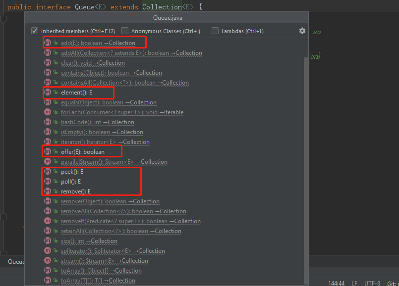

# Queue

# 重要的实现类

- AbstractQueue提供了Queue接口的骨干实现，以减少具体Queue实现的工作量
- BlockingQueue
- PriorityQueue：基于堆结构实现，可以用它来实现优先级队列
- LinkedList虽然是一种List,但是也实现了Queue接口

# 特点

7. BlockingQueues不接受null元素。 如果我们执行任何与null相关的操作，它将抛出NullPointerException。
9. BlockingQueues是线程安全的。
11. 所有Deques都不是线程安全的。
12. ConcurrentLinkedQueue is an unbounded thread-safe Queue based on linked nodes.
ConcurrentLinkedQueue是一个无界的线程安全的基于链接节点的Queue.
13. 除了Deques之外，所有队列都支持在队列尾部插入并在队列的头部删除。
14. Deques是队列，但它们支持两端的元素插入和移除。(Deques are queues but they support element insertion and removal at both ends.)

Deque:

	 (insert or remove)--rear-----------front--->(remove or insert)
