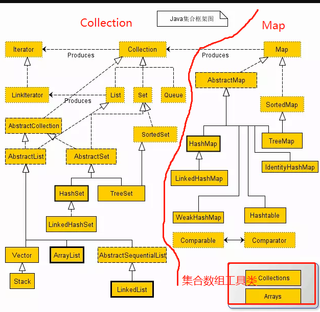
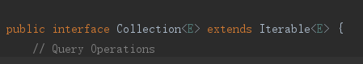
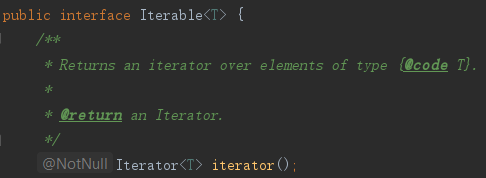
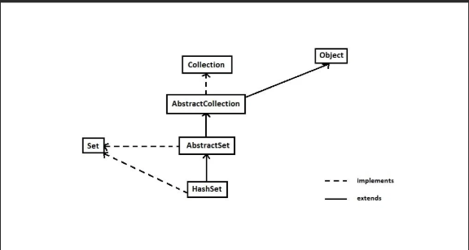
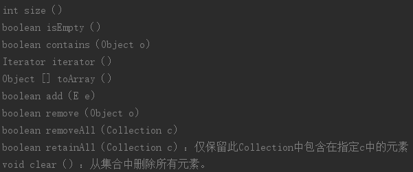

# 容器为什么会出现?

如果要存储一堆对象,其实最简单的首先我们能想到的是使用数组,但是数组存储对象有如下弊端：

1. 数组长度一旦初始化后,存储对象的容量就不能改变
2. 获取数组中真实存储的对象的个数也没有现成方法可用.只能获取数组的总长度.

>所以基于数组的缺陷,才出现了容器.(严格说,数组也是一种容器)

# 容器

Java中的容器包括 Collection 和 Map 两类，Collection 存储着对象的集合，而 Map 存储着键值对（两个对象）的映射表。这里主要讨论Collection.

>当然也可以换个角度分,把容器分为线程不安全的容器和并发容器(多线程安全的).

## Collection(集合)

`java.util.Collection`位于集合框架顶部的接口.不提供直接的实现，而是由子接口/子类来实现,以下是其重要子接口:

* `java.util.Set`
* `java.util.List`
* `java.util.Queue`

>注意jdk8中新特性: 接口中可以使用default关键字来实现一个方法.

## Collection重要的实现类(都是3大子接口的实现类)

* ArrayList(线程不安全的)
* LinkedList(线程不安全的)
* HashMap(线程不安全的)
* TreeMap(线程不安全的)
* HashSet(线程不安全的)
* TreeSet(线程不安全的)
* Vector(线程安全,因为内部的方法都使用了synchronized修饰)

## `java.util.Collection`接口中的方法

## Collection遍历

Collection 继承了 Iterable 接口，其中Iterable接口定义的 iterator() 方法能够产生一个 Iterator 对象，通过这个对象就可以迭代遍历 Collection 中的元素.(迭代器模式)