# ConcurrentModificationException(并发修改异常)详解

## 总结

防止多线程同时迭代一个集合的时候,其中一个线程修改了集合,但是其他线程没有发现,而引入的异常.主要还是为了防止多线程读到的数据不一致,当然单线程使用不当也会引发这个异常.

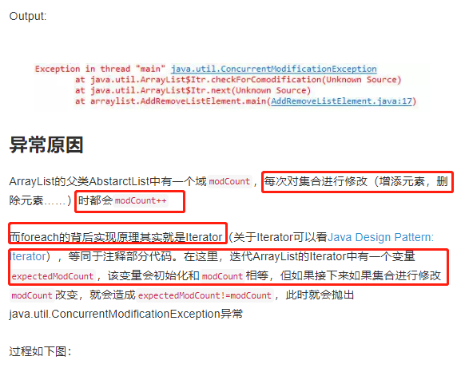

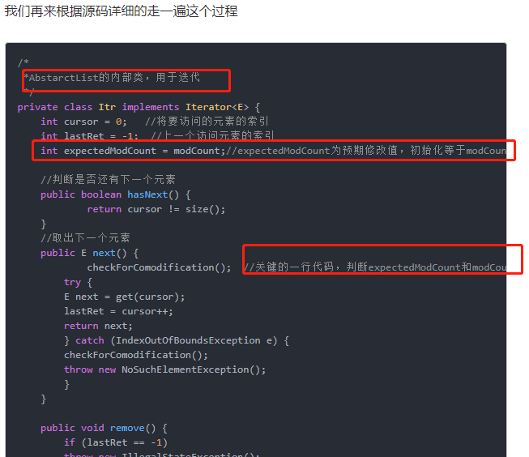
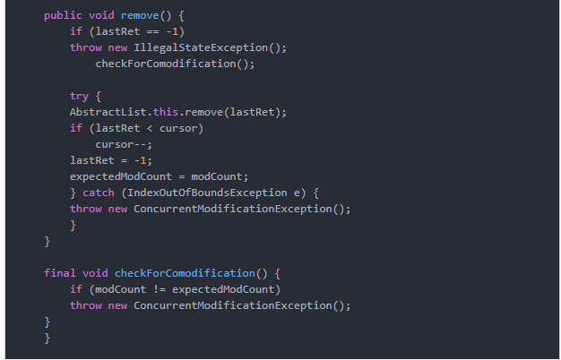

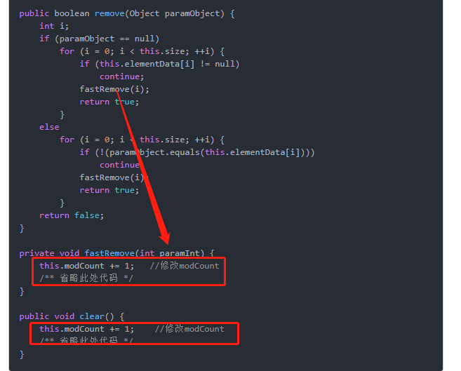

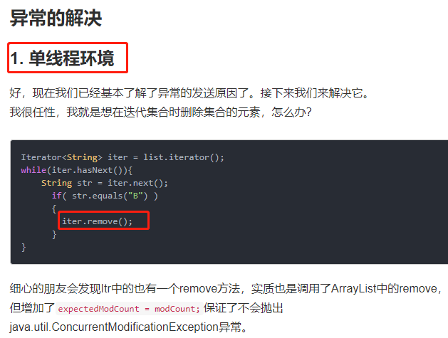
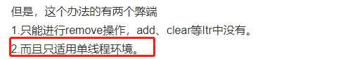

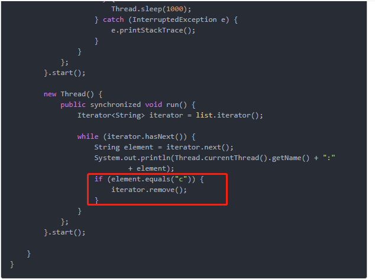
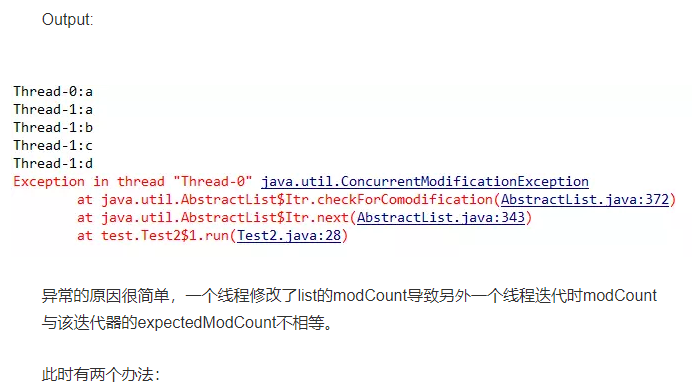
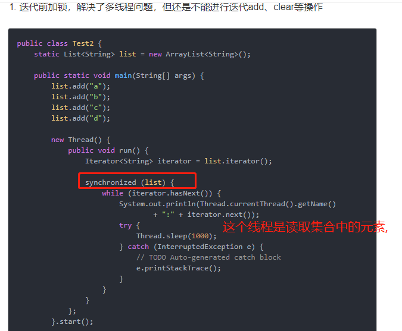
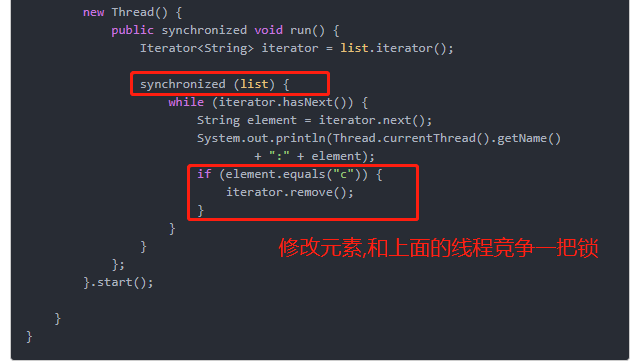
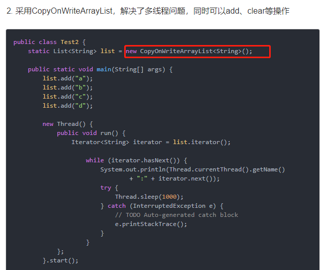
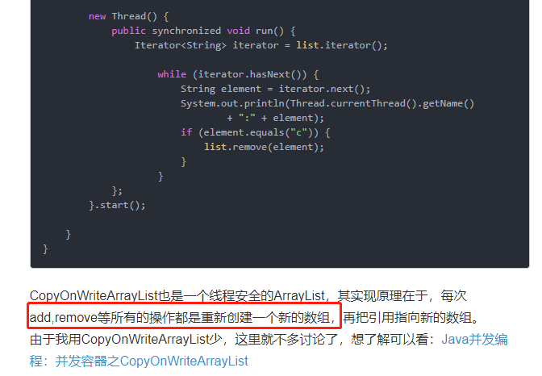
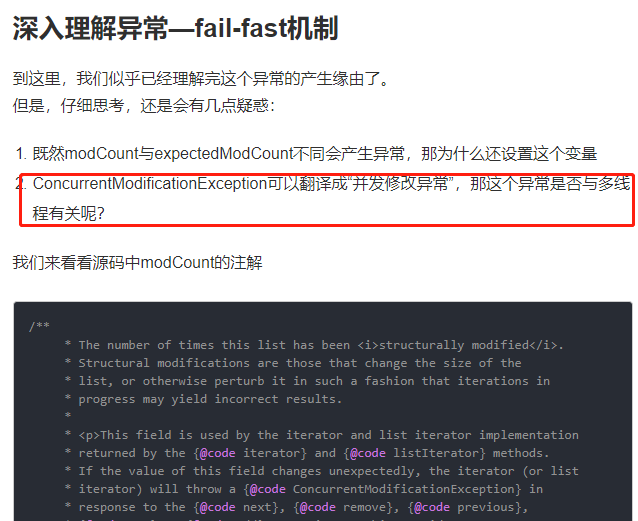

# 来源

- [https://www.jianshu.com/p/c5b52927a61a](https://www.jianshu.com/p/c5b52927a61a)