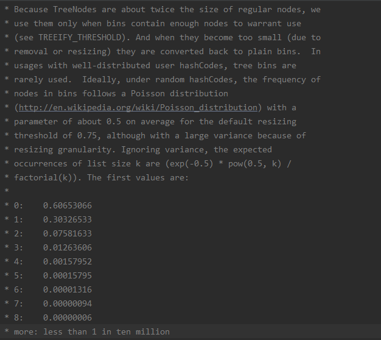

# 为什么加载因子默认是0.75?

    如果加载因子是1,虽然空间上利用的比较充分,但是这个时候哈希冲突比较严重,那么链表就比较长,查询效率就比较低.

    如果加载因子是0.5,虽然哈希碰撞没有那么严重,查询速度也还可以,但是此时空间利用率非常低.对内存是一种浪费.

    所以0.75是空间和时间的一个折中值.

# 为什么链表转成红黑树的阈值是8

当数组长度<64时,链表长度即使达到了8,也不会转换成红黑树,而是优先扩容.

当数组长度>=64时,并且链表长度达到了8,才会转换成红黑树.

    如果hashcode分布均匀的话,红黑树很少用到,理想情况下,在完全随机的hashcode的情况下,每个桶中的节点的个数服从泊松分布.

    根据泊松分布,当链表节点数超过8的时候,概率已经非常小了,接近于0,所以选择8作为阈值,这也是为什么hashcode分布均匀的话,红黑树很少用到.

