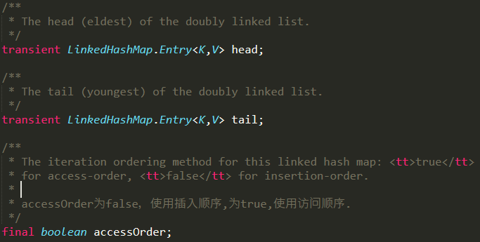
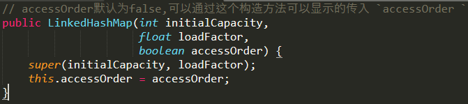
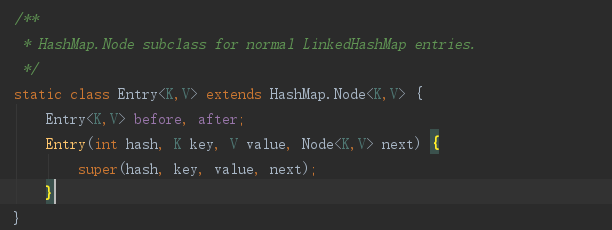
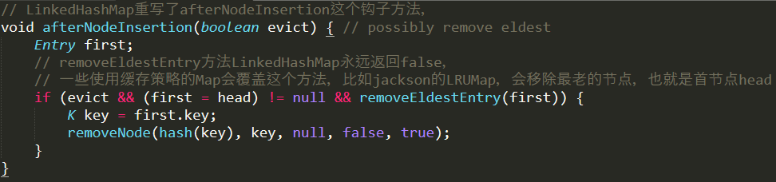
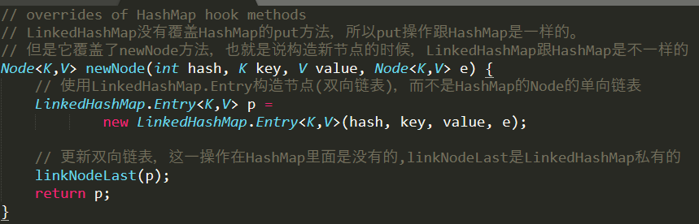
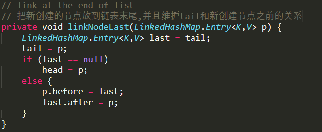
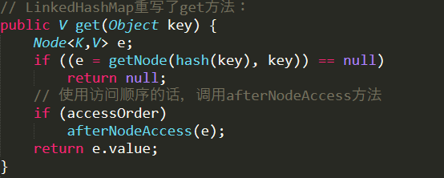
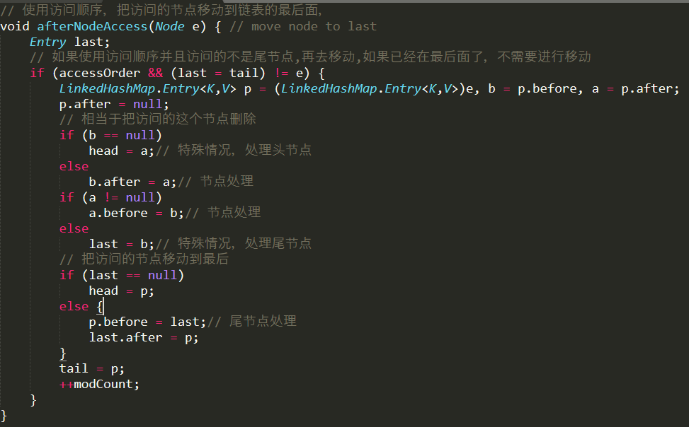
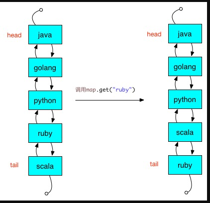

# 基于1.8的源码详解





# put方法解析

>先看1.8的HashMap的put方法:




    当 removeEldestEntry() 方法返回 true 时会移除最老的节点，也就是链表的首节点head
    
    removeEldestEntry() 默认为 false，如果需要让它为 true，需要继承 LinkedHashMap 并且覆盖
    这个方法的实现，这在实现 LRU 的缓存中特别有用，通过移除最近最久未使用的节点，
    从而保证缓存空间足够，并且缓存的数据都是热点数据。
    



# get方法




    如果accessOrder为true，也就是使用访问顺序，那么afterNodeAccess这个钩子方法内部的逻辑会被执行，
    将会修改双向链表的结构,将访问的节点移到链表尾部,也就是说指定为 LRU 顺序之后，在每次访问一
    个节点时，会将这个节点移到链表尾部，保证链表尾部是最近访问的节点，那么链表首部就是最近最久未使用的节点。
    
    afterNodeAccess在使用get方法或者put方法遇到key已经存在的情况下，会被触发

```java
Map<String, Integer> map = new LinkedHashMap<String, Integer>(5, 0.75f, true);
map.put("java", 1);
map.put("golang", 2);
map.put("python", 3);
map.put("ruby", 4);
map.put("scala", 5);
// 使用访问顺序，把访问的节点ruby移动到双向链表的最后面
System.out.println(map.get("ruby"));
``` 

   
   

# LRU实践

>com.java.algorithm.lru.cache.LRUCacheSimple