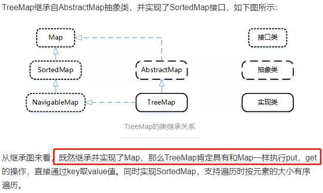
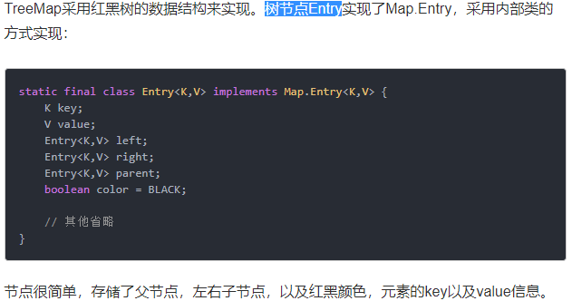
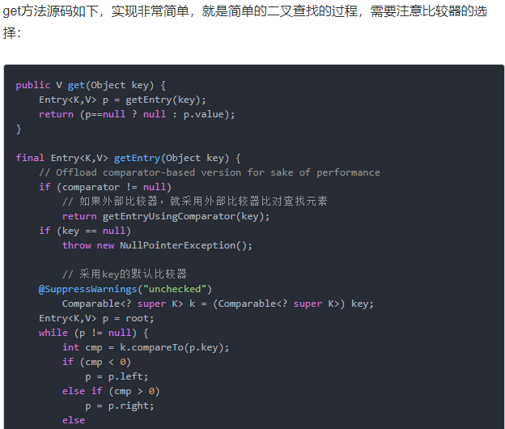

# TreeMap继承关系

# TreeMap的数据结构

# TreeMap是如何保证键的顺序的?(面试题)

    TreeMap 是通过实现 SortMap 接口，根据 key 进行排序，从而保证 TreeMap 中所有键值对处于有序状态.

要么key实现Comparable,创建TreeMap的时候提供Comparator,否则提示`java.lang.ClassCastException: org.java.core.base.map.core.HashMapAndTreeMapDiff$Student cannot be cast to java.lang.Comparable`

# get方法分析

# 何时在Java中使用TreeMap?

大多数情况下，HashMap足以在程序中用作Map实现。但是如果你有一些与排序相关的特殊要求，那么你可以使用TreeMap。
