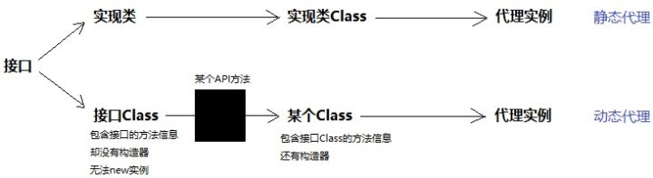
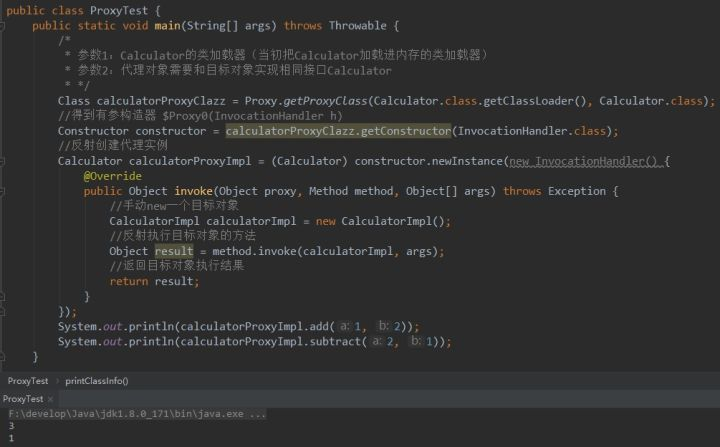
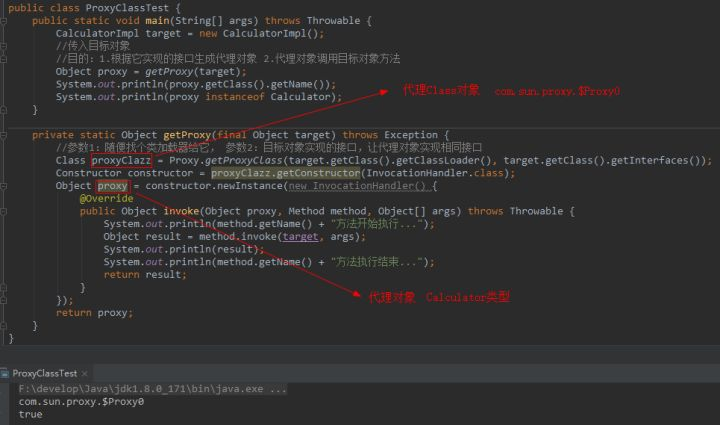

# 代理

代理分为: 静态代理和动态代理

>Spring的事务控制依赖于AOP，Spring 的 AOP 是基于动态代理实现的，谈到动态代理就不得不提下静态代理.

代理是一种设计模式，提供了对目标对象的间接访问方式，即通过代理对象访问目标对象。如此便于在目标对象功能的基础上增加额外的功能操作，前拦截，后拦截等.

# 静态代理

假设现在项目经理有一个需求：在项目现有所有类的方法前后打印日志。你如何在不修改已有代码的前提下(开闭原则,对扩展开放,对修改关闭)，完成这个需求？我首先想到的是静态代理。具体做法是：

1. 为现有的每一个类都编写一个对应的代理类，并且让它实现和目标类相同的接口（假设都有）
2. 在创建代理对象时，通过构造器塞入一个目标对象，然后在代理对象的方法内部调用目标对象同名方法，并在调用前后打印日志。也就是说，代理对象 = 增强代码 + 目标对象（原对象）。有了代理对象后，就不用原对象了


## 静态代理的缺陷

程序员要手动为每一个目标类编写对应的代理类。如果当前系统已经有成百上千个类，工作量太大了。所以，现在我们的努力方向是：如何少写或者不写代理类，却能完成代理功能？

>静态代理可以在不修改目标对象的前提下，对目标对象进行功能的扩展和拦截.符合开闭原则。对扩展开放，对修改关闭.

# 动态代理

从静态代理中可以看出: 静态代理只能代理一个具体的类，如果要代理多个类的话需要定义不同的代理类。

要创建代理对象这个实例,最关键的就是得到对应的代理Class对象,能否不写代理类，而直接得到代理Class对象，然后根据反射创建代理实例?

## 通过接口的Class对象,获取代理Class对象

Class对象包含了一个类的所有信息，比如构造器、方法、字段等。如果我们不写代理类，这些信息从哪获取呢？苦思冥想，突然灵光一现：代理类和目标类理应实现同一组接口。之所以实现相同接口，是为了保证代理对象的内部结构和目标对象一致，这样我们对代理对象的操作最终都可以转移到目标对象身上，代理对象只需专注于增强代码的编写:

所以，可以这样说：接口拥有代理对象和目标对象共同的类信息。

JDK的Proxy类有个静态方法：getProxyClass(ClassLoader, interfaces)，只要你给它传入类加载器和一组接口，它就给你返回代理Class对象。

getProxyClass()这个方法，会从你传入的接口Class中，“拷贝”接口的结构信息到一个新的Class对象中，但新的Class对象带有构造器，是可以创建对象的。

所以，一旦我们明确接口，完全可以通过接口的Class对象，创建一个代理Class，通过代理Class即可创建代理对象。




Proxy.getProxyClass()这个方法的本质就是：以Class(接口Class)造Class(代理对象Class)。

代理Class的构造器创建对象时，需要传入InvocationHandler。通过构造器传入一个引用，那么必然有个成员变量去接收,没错，代理对象的内部确实有个成员变量invocationHandler,每次调用代理对象的方法，代理对象的每个方法内部都会调用InvocationHandler.invoke(),InvocationHandler对象成了代理对象和目标对象的桥梁，不像静态代理这么直接。


仔细看上图右侧的动态代理，我在invocationHandler的invoke()方法中并没有写目标对象。因为一开始invocationHandler的invoke()里确实没有目标对象，需要我们手动new。



但这种写法不够优雅，属于硬编码。我这次代理A对象，下次想代理B对象还要进来改invoke()方法，太差劲了。改进一下，让调用者把目标对象作为参数传进来：

```java
public class ProxyTest {
	public static void main(String[] args) throws Throwable {
		CalculatorImpl target = new CalculatorImpl();
                //传入目标对象
                //目的：1.根据它实现的接口生成代理对象 2.代理对象调用目标对象方法
		Calculator calculatorProxy = (Calculator) getProxy(target);
		calculatorProxy.add(1, 2);
		calculatorProxy.subtract(2, 1);
	}

	private static Object getProxy(final Object target) throws Exception {
		//参数1：随便找个类加载器给它， 参数2：目标对象实现的接口，让代理对象实现相同接口
		Class proxyClazz = Proxy.getProxyClass(target.getClass().getClassLoader(), target.getClass().getInterfaces());
		Constructor constructor = proxyClazz.getConstructor(InvocationHandler.class);
		Object proxy = constructor.newInstance(new InvocationHandler() {
			@Override
			public Object invoke(Object proxy, Method method, Object[] args) throws Throwable {
				System.out.println(method.getName() + "方法开始执行...");
				Object result = method.invoke(target, args);
				System.out.println(result);
				System.out.println(method.getName() + "方法执行结束...");
				return result;
			}
		});
		return proxy;
	}
}
```

这样就非常灵活，非常优雅了。无论现在系统有多少类，只要你把实例传进来，getProxy()都能给你返回对应的代理对象。就这样，我们完美地跳过了代理类，直接创建了代理对象！

不过实际编程中，一般不用getProxyClass()，而是使用Proxy类的另一个静态方法：Proxy.newProxyInstance()，直接返回代理实例，连中间得到代理Class对象的过程都帮你隐藏：

```java
public class ProxyTest {
	public static void main(String[] args) throws Throwable {
		CalculatorImpl target = new CalculatorImpl();
		Calculator calculatorProxy = (Calculator) getProxy(target);
		calculatorProxy.add(1, 2);
		calculatorProxy.subtract(2, 1);
	}

	private static Object getProxy(final Object target) throws Exception {
		Object proxy = Proxy.newProxyInstance(
				target.getClass().getClassLoader(),/*类加载器*/
				target.getClass().getInterfaces(),/*让代理对象和目标对象实现相同接口*/
				new InvocationHandler(){/*代理对象的方法最终都会被JVM导向它的invoke方法*/
					public Object invoke(Object proxy, Method method, Object[] args) throws Throwable {
						System.out.println(method.getName() + "方法开始执行...");
						Object result = method.invoke(target, args);
						System.out.println(result);
						System.out.println(method.getName() + "方法执行结束...");
						return result;
					}
				}
		);
		return proxy;
	}
}
```


## 请区分两个概念：代理Class对象和代理对象




单从名字看，代理Class和Calculator的接口确实相去甚远，但是我们却能将代理对象赋值给接口类型：千万别觉得名字奇怪，就怀疑它不能用接口接收，代理对象的本质就是：和目标对象实现相同接口的实例。代理Class可以叫任何名字，whatever，只要它实现和目标对象同一个接口，就能成为该接口类型。

# java动态代理的实现有2种方式

* jdk自带的动态代理:使用jdk自带的动态代理需要了解InvocationHandler接口和Proxy类，
他们都是在java.lang.reflect包下。Proxy 类是用于创建代理对象，而 InvocationHandler 接口主要是来处理你的执行逻辑。
* 第三方库:如cglib，CGLIB是一个功能强大的，高性能、高质量的代码生成库，cglib 是对一个小而快的字节码处理框架 ASM 的封装， 他的特点是继承于被代理类,这就要求被代理类不能被 final 修饰。cglib用于在运行期extends Java类.

### cglib和JDK的动态代理的区别

>JDK动态代理是针对接口的，而cglib是针对类来实现代理的，cglib的原理是对指定的目标类生成一个子类，并覆盖其中方法实现增强，但因为采用的是继承，所以不能对final修饰的类进行代理。

# 参考

- 
- 