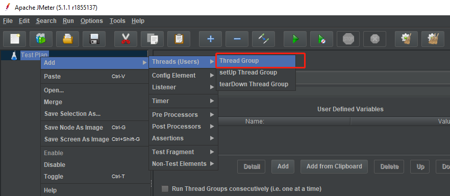
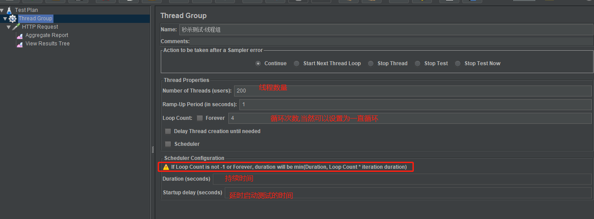
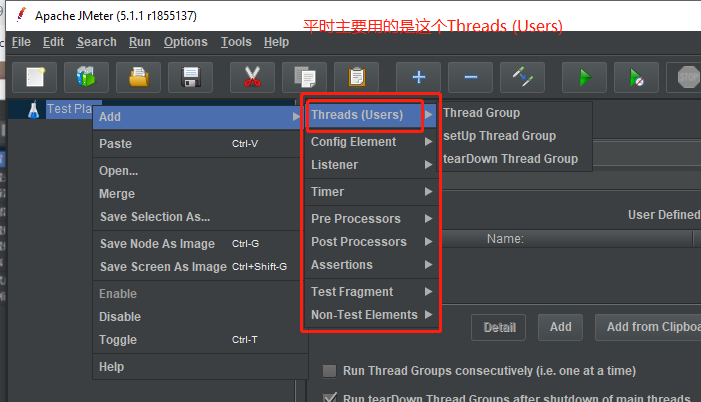
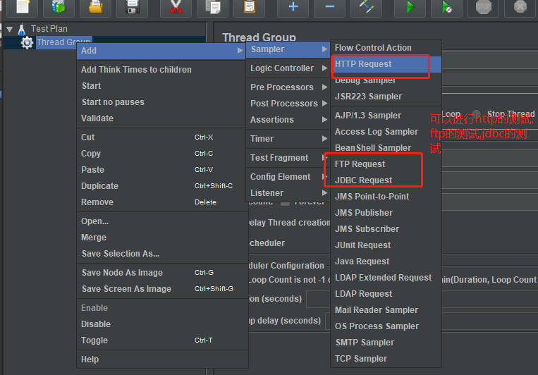
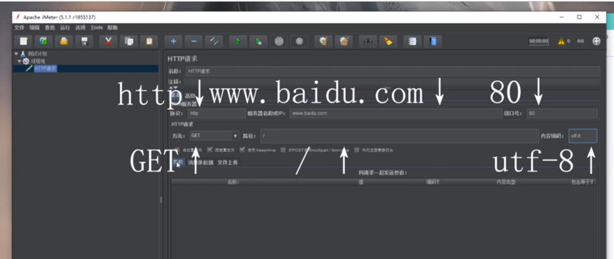
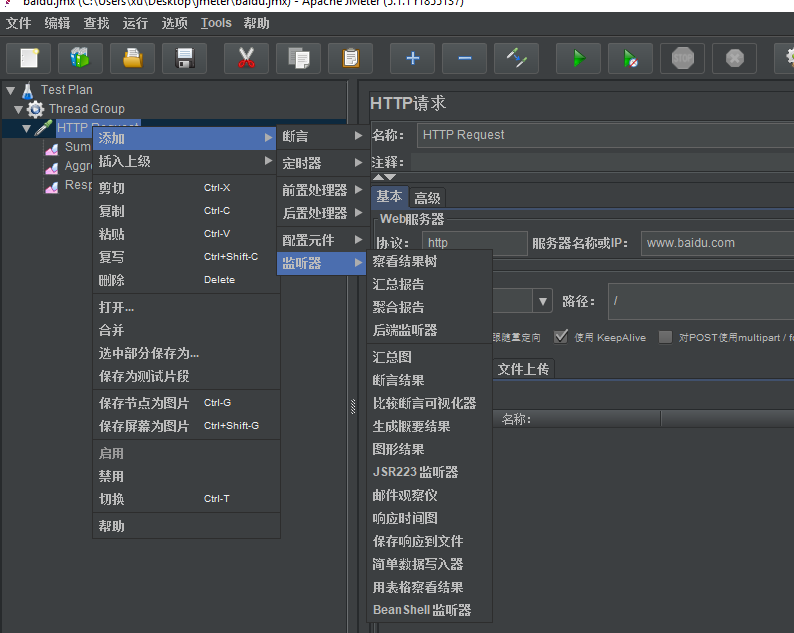
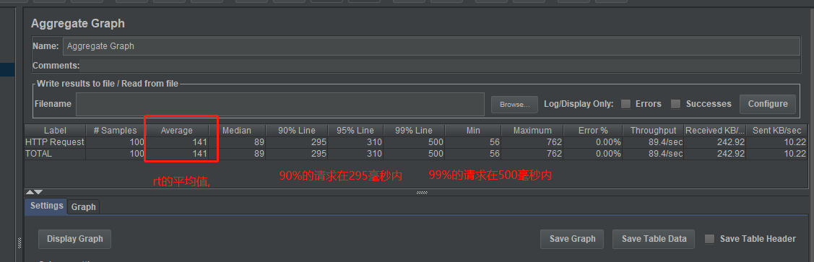
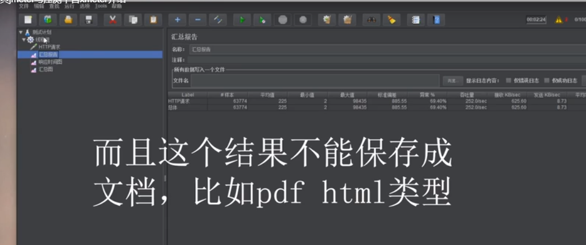
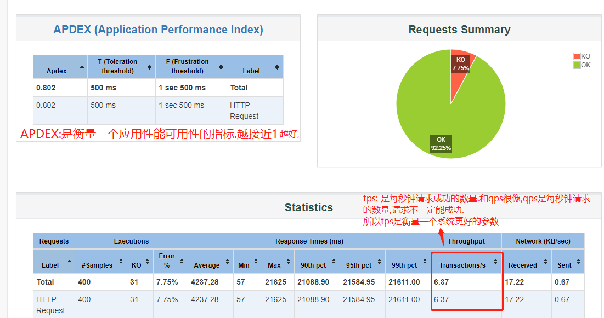
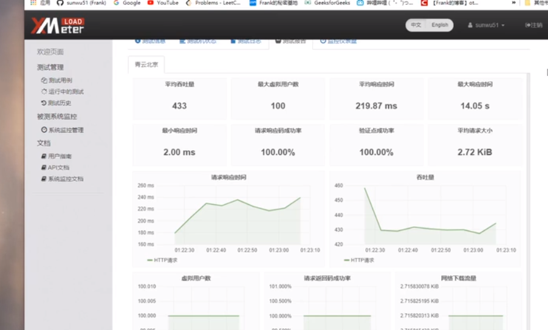

# jmeter

    怎么衡量当前的系统能够应对双11/秒杀等场景的的高并发量呢?
    
        压测工具一定是不能少的,比如,我们用去年的请求量,来进行今年的压测.按照去年的2倍,
        或者更高的并发的量对系统进行压测,看看系统是否能够抗住.压测工具还是比较重要的.

    启动:
    D:\programs\apache-jmeter-5.1.1\bin\jmeter.bat

# jmeter基本使用

    一个测试计划(TestPlan)可以有多个Thread Group(线程组),每个Thread Group可能是针对某一个项目做的测试.

    线程数很大程度上可以模拟用户数.

    Ramp-Up Period (in seconds): 在多少秒之内,能够将线程数达到我们期望的线程数.
    比如线程数为100, Ramp-Up Period为1,意思就是开始之后1秒就可以将线程数达到100

    线程组 -> 添加 -> 取样器(这个是比较重要的,相当于我们测试的内容)

# 测试结果

    如何看分析报告呢?

    

    吞吐量(Throughput): 每秒钟处理x个请求 

---
    qps是多少? qps: query per second --> 每秒钟去请求的次数
    
    rt: response time 响应时间

    qps和rt是衡量系统非常重要的指标
    
    tps: 是每秒钟请求成功的数量.和qps很像,qps是每秒钟请求的数量,请求不一定能成功.
    所以tps是衡量一个系统更好的参数
---

    如何去生成一个比较容易看懂的测试报告呢?

    这个是要通过jmeter的命令来生成,不能通过图形化界面来生成.
    jmeter也是建议你去使用命令来进行测试的运行.
    
    命令: jmeter -n -t 指定jmx文件 -l 指定输出的日志要保存在文件 -e -o 指定html报告输出的位置(是一个文件夹)
    
    jmeter -n -t C:\Users\xu\Desktop\jmeter\baidu.jmx -l C:\Users\xu\Desktop\jmeter\log.txt -e -o C:\Users\xu\Desktop\jmeter\t

    
    APDEX:是衡量一个应用性能可用性的指标.越接近1越好,

# 测试平台

    xmeter是一个测试平台,可以跑jmeter的测试脚本.xmeter可以提供施压的机器,这个平台是花钱的

