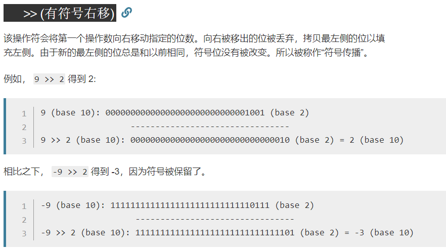
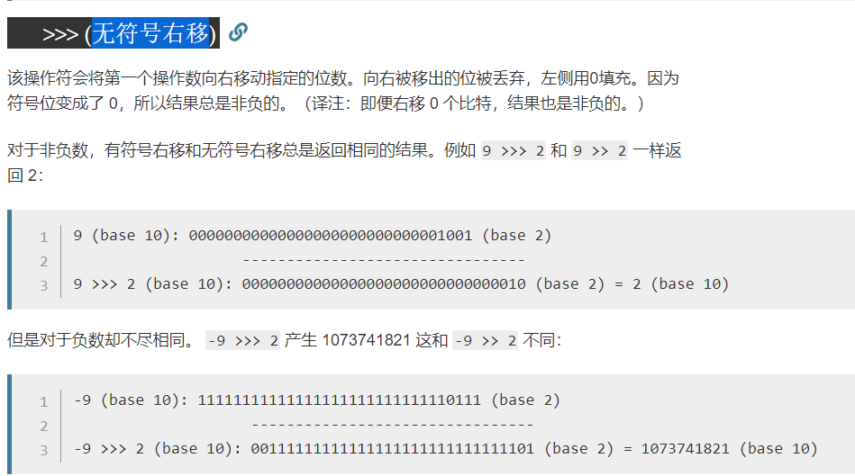

# 移位运算

按照平移的方向和填充数字的规则分为三种:

- "<<(左移)"

- ">>(带符号右移)"

- ">>>(无符号右移)"

对于大数据的2进制运算,位移运算符比那些普通运算符的运算要快很多,
　　
比如这里ArrayList中的扩容：`int newCapacity = oldCapacity + (oldCapacity >> 1);`,右移一位相当于除2，右移n位相当于除以 2 的 n 次方。这里 oldCapacity 明显右移了1位所以相当于oldCapacity /2。