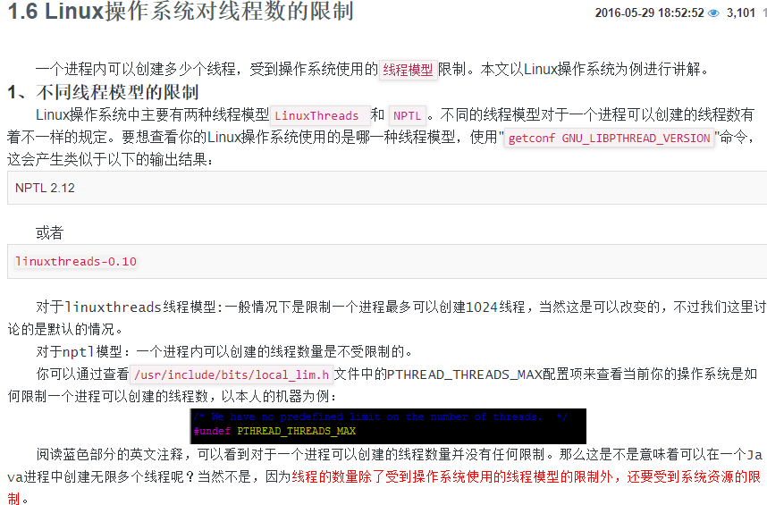

# Java并发编程基本知识介绍

# 什么是并发？

并发指的是在同一时刻执行多个任务.

# 进程与线程

线程称为轻量级进程,线程必须存在于进程中。但是创建一个线程要消耗的资源通常比创建进程少的多。

每个进程至少要有一个线程作为程序的入口(主线程)

# 单核cpu(即只有一个cpu)

一个cpu同一时刻只能处理一条指令.在任一时刻，只有一个进程的中一个线程在运行.

笔者就曾经遇到过这样的面试题，什么情况下，一个计算机中任一时刻只会有一个线程在运行。这个问题很简单，只要你的 "CPU是单核" 的就行了.在单核CPU上，因为两个线程从来不会得到真正的并行执行.

# 多核cpu(有多个cpu)

只有在有多个CPU的情况下，才能实现`真正意义上的并行执行`.

# 并发和并行

可以这样理解:并发指的是"同一时间段"内多个线程同时在运行，并行指的是在"同一时刻"多个线程在运行。 

## Linux操作系统对线程数的限制

