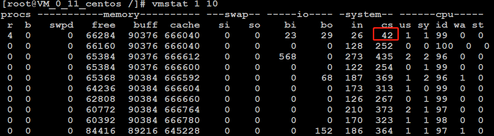

# 进程

    每个程序就是一个进程,比如qq,word,浏览器,各自都是一个进程.

# 线程

    线程是操作系统调度的基本单元.多个线程组成了一个进程.
    
    线程是抢占式的抢占cpu执行,CPU并不是按顺序来主义调度这些线程(不是交替运行的,是抢占式的).

## 主线程

    每个进程至少有一个线程，作为程序的入口,就是主线程

    如果需要创建自己的线程，必须在主线程中创建.

## 当前线程

    当前线程是不断的在变化的，因为CPU会一会执行这个线程，一会又去执行另外一个线程。因此当前线程并不是固定的

## 如果获取当前线程的信息？

    可以通过Thread的静态方法currentThread()获取当前线程的信息

# 一个Java程序至少会启动几个线程

    这是一个很常见的面试题。
    
    一个Java程序会启动一个jvm实例，每一个jvm实例在操作系统中对应一个进程
    java本身具备垃圾回收机制，所以每个java程序至少启动2个线程，一个main线程，另一个是垃圾回收线程.

>示例:org.java.core.base.concurrent.chapter1.ThreadNumDemo.java

# 多线程的优点

    资源利用率更好

    CPU能够在等待IO的时候做一些其他的事情。这个不一定就是磁盘IO。它也可以是网络的IO，或者用户输入。
    通常情况下，网络和磁盘的IO比CPU和内存的IO慢的多
    
    这里的资源包括: 磁盘(磁盘读取文件是不占用cpu时间的)/cpu(没有io的线程可以利用cpu)
    磁盘总是在繁忙地读取不同的文件到内存中。这会带来磁盘和CPU利用率的提升

>示例:org.java.core.base.concurrent.chapter1.ResourceThreadDemoImproved

# 多线程的缺点

1. 在多线程访问共享数据的时候，可能会引起数据不一致.
2. 线程上下文切换的开销
3. 增加内存的消耗

##  线程上下文切换的开销

当CPU从执行一个线程切换到执行另外一个线程的时候，它需要先保存当前线程的上下文，然后载入另一个线程的上下文，最后才开始执行。这种切换称为“上下文切换”(“context switch”)

多线程并不一定是要在多核处理器才支持的，就算是单核也是可以支持多线程的.CPU给每个线程分配一定的时间片，由于时间非常短通常是几十毫秒，所以 CPU 可以不停的切换线程执行任务从而达到了多线程的效果

    统计操作系统每秒的上下文切换次数

    如果你使用的是Linux操作系统，你可以通过vmstat命令查看当前操作系统每秒的上下文切换次数:
    命令"vmstat 1 10"     含义是：每1秒统计一次，统计10次后结束。
    其中cs那一列表示的就是上下文切换次数，cs是context switch的简写。
    可以看到目前操作系统系统上每秒上下文切换次数大致都在400-600之间(注意：第一次统计是不准的，而且这个统计是操作系统层面的)

## 增加内存的消耗

    每一个线程启动后，也要给线程分配一定的内存，让其来保存自己的私有数据。每个线程的内存区域称之为线程栈内存。
    默认情况下，栈内存的大小1M。也就是说，你每多启动一个线程，至少要多消耗1M的内存资源
