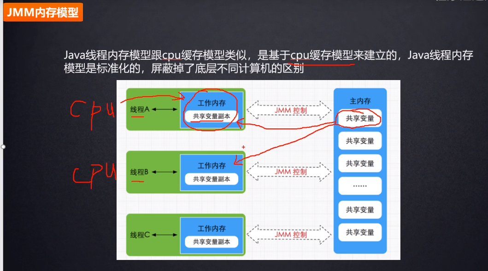
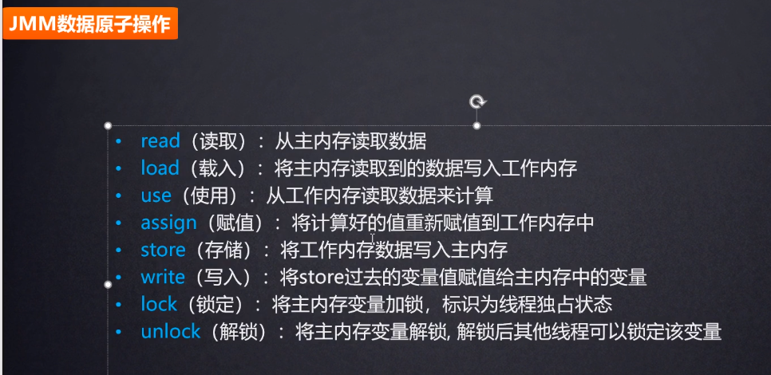
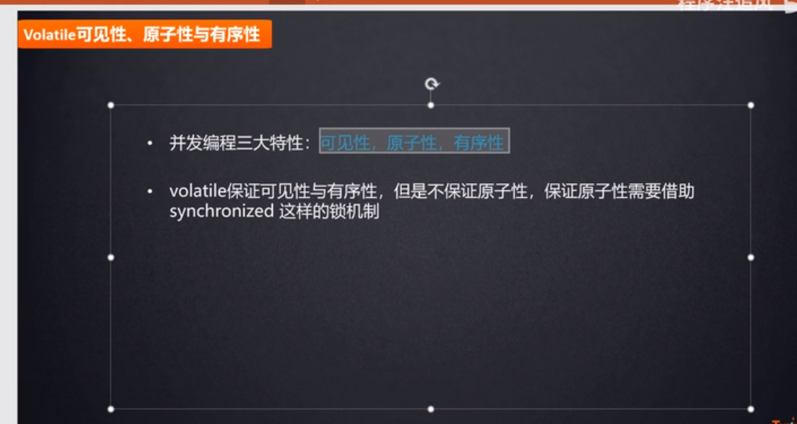

# cpu结构

    cpu的访问速度: cpu的寄存器 > cpu多级高速缓存 > 主主存 > 硬件

# 总线

总线: cpu中的数据和主内存中的数据怎么做交互呢?它们2个独立的硬件之间是怎么做交互呢?实际上2个硬件之间的交互就是通过物理的总线来交互的,就比如你打电话还需要电话线呢,cpu和物理内存之间也是有物理的线来做数据传输的.

# Java内存模型(jmm)和cpu结构之间的联系

    多个线程操作同一个共享变量,不能直接操作主内存中的共享变量,而是要把共享变量拷贝到线程自己的工作内存中,修改完之后,再写回到主内存中.

# volatile和并发编程的3大特性之间的关系

# 8 个操作

    Java 内存模型定义了 8 个操作来完成主内存和工作内存的交互操作

- read：把一个变量的值从主内存传输到工作内存中
- load：在 read 之后执行，把 read 得到的值放入工作内存的变量副本中
- use：把工作内存中一个变量的值传递给执行引擎
- assign：把一个从执行引擎接收到的值赋给工作内存的变量
- store：把工作内存的一个变量的值传送到主内存中
- write：在 store 之后执行，把 store 得到的值放入主内存的变量中
- lock：作用于主内存的变量
- unlock
