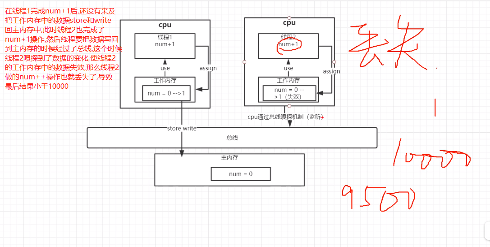

# 原子性(Atomicity)

    多个操作构成的一个整体 要么全部执行成功,要么就都不执行

# volatile为什么无法保证原子性



    示例: org.java.core.base.concurrent.chapter3.VolatileAtomicTest

# 什么操作是原子的,什么操作不是原子的?

    在Java中,对基本数据类型的变量的读取和赋值操作是原子性操作，即这些操作是不可被中断的，要么执行，要么不执行
    
    只有简单的读取、赋值（而且必须是将数字赋值给某个变量，变量之间的相互赋值不是原子操作）才是原子操作
 
```java
// 直接将数值10赋值给x，也就是说线程执行这个语句的会直接将主内存中的数值10写入到工作内存中,这个操作具备原子性
x = 10;
// 不是原子操作
y = x; 
// 不是原子的
x++;
```

# 如何保证原子性

    可以通过synchronized或者Lock，来保证语句执行的原子性
    
    如果是基础类的自增操作可以使用AtomicInteger这样的原子类来实现(其本质是利用了CAS来完成)
