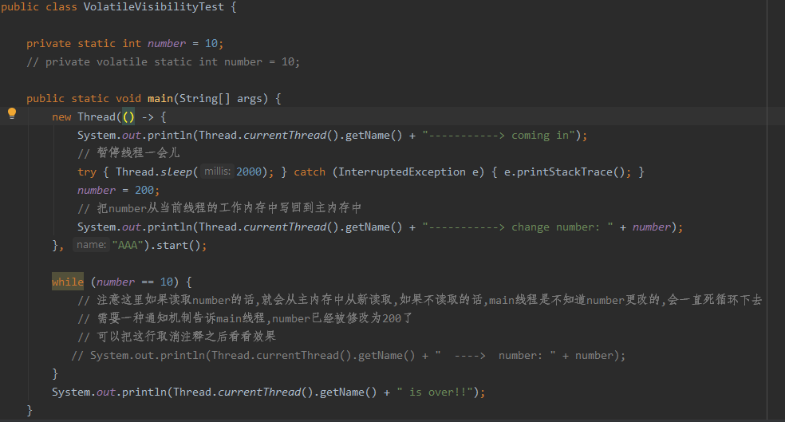
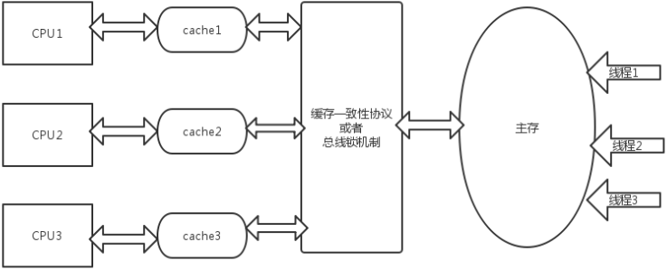
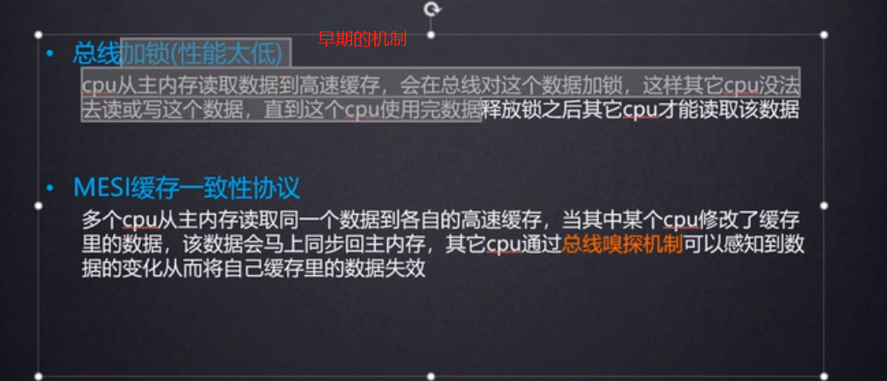
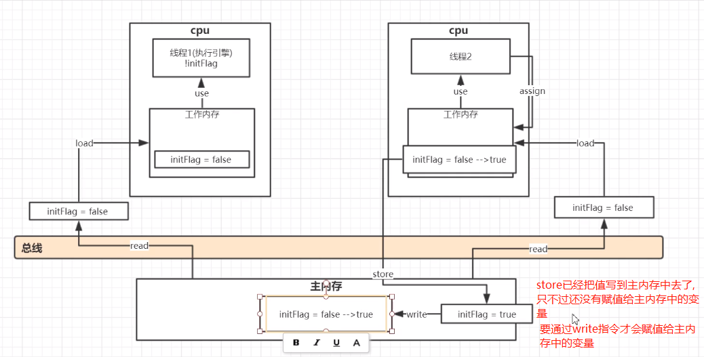
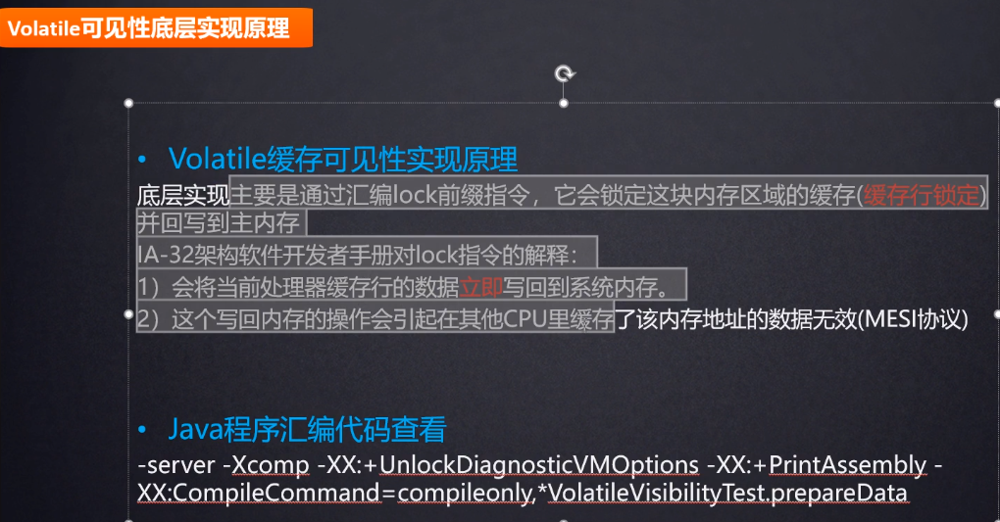
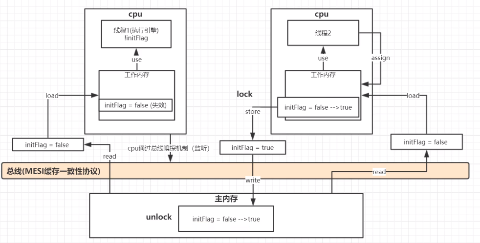

# 可见性定义

    有多个线程操作主内存中的同一个变量,当某一个线程在自己的工作内存中修改完成之后,去写回给主物理内存以后,
    能够及时通知其他线程,告诉它们这个值已经被修改了,这样及时通知的现象 就俗称jmm内存模型中的第一个重要特性: 可见性
    
    多个线程修改主内存中的一个值,一个线程修改了主内存中的值,其他线程马上获得通知,这个就是可见性.

    通过synchronized或者volatile可以保证可见性.

# volatile关键字是如何保证可见性的

    在单CPU的情况下，是不存在可见性问题的，如果是多CPU，可见性问题就会暴露出来

    共享变量加上volatile之后,在编译成汇编语言的时候,会在修改共享变量的语句前面加上lock前缀指令,
    这个lock指令就可以保证修改了共享变量后,会马上同步会主内存,同步回主内存的过程中会经过总线,
    进而触发cpu总线嗅探机制.进而让其他线程工作内存中的共享变量失效.
    
    如果不加volatile,那么在修改了initFlag这个共享变量之后,可能不会立刻把这个修改后的值写回到主内存中,
    就会导致其他线程不能及时感知到这个变量的更改.

    要理解的是store和write是2个cpu指令,store只是把值写入到主内存中,
    此时还没有赋值给主内存中的变量,write才会把主内存中的值赋值给主内存中的变量.
    

    在store之前lock,在线程write完了之后,也就是主内存中的值写完之后,才会去unlock.
    这样就可以让其他线程及时拿到主线程中最新的修改后的值.这个lock锁的粒度会小很多.

# volatile可见性的应用

    AQS中的state就是被定义为volatile
