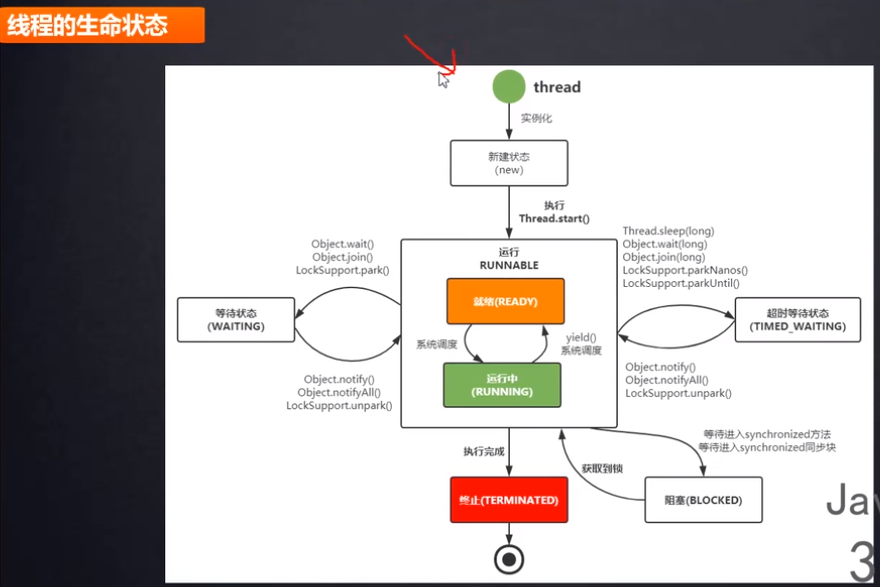

# 线程的状态




    在java.lang.Thread.State中，总共定义六种状态

    第一种: NEW: 线程刚刚被创建，也就是已经new过了，但是还没有调用start()方法

    第二种: RUNNABLE(可运行):调用Thread.start()之后，会从NEW变成RUNNABLE,这个状态只是表示线程是可运行的。
    RUNNABLE这个名字很具有欺骗性，很容易让人误以为处于这个状态的线程正在运行
    其实真正意思是: 可能正在运行，也可能正在等待 CPU 时间片,包含了操作系统线程状态中的 Running 和 Ready
    当我们调用了Thread.start()方法的时候,状态从NEW变成了RUNNABLE,控制权转移到了操作系统的线程调度器上,
    是否去立刻运行这个线程,还是运行它之前把它保留在可以运行的线程池中,
    依赖于具体操作系统的线程调度器的实现.

    第三种: BLOCKED(阻塞): 线程处于阻塞状态，正在等待获取一个排它锁，如果其线程释放了锁,这个线程抢到锁,就会结束此状态
    通常情况下，是因为本线程与其他线程抢一把导致这个状态

    第四种: WAITING(无限期等待):等待其它线程显式地唤醒，否则不会被分配 CPU 时间片,
    调用以下方法可能会导致一个线程处于这个状态
        a. Object.wait() with no timeout
        b. Thread.join() with no timeout
        c. LockSupport.park()
    一个线程处于这个等待状态，通常是在等待其他线程完成某个操作。本线程调用某个对象的wait()方法，
    其他线程处理完成之后，调用同一个对象的notify或者notifyAll()方法
    Object.wait()方法只能够在同步代码块中调用。调用了wait()方法后，会释放锁
    
    调用以下方法可能可以使一个线程从WAITING状态变成RUNNABLE状态
        Object.notify();
        Object.notifyAll();
        LockSupport.unpark(Thread)

    第五种: TIMED_WAITING(超时等待):线程等待指定的时间，调用以下方法，会导致线程处于这个状态：
        Thread.sleep(long)
        Object.wait(long) with timeout
        Thread.join(long) with timeout
        LockSupport.parkNanos()
        LockSupport.parkUntil()
    调用以下方法可能可以使一个线程从TIMED_WAITING状态变成RUNNABLE状态：
        Object.notify();
        Object.notifyAll();
        LockSupport.unpark(Thread);

    第六种: TERMINATED(终止):线程终止,这个线程已经执行完了任务

>这些状态中NEW状态是开始，TERMINATED时销毁，在整个线程对象的运行过程中，这个两个状态只能出现一次。其他任何状态都可以出现多次，彼此之间可以相互转换。

    一旦线程从BLOCKED/WAITING/TIMED_WAITING状态结束,状态就变为Runnable
    ,这个线程就会到等待队列中排队,等待cpu时间片
    
# 线程快照分析

```shell script
jps -l
jstack pid
```
