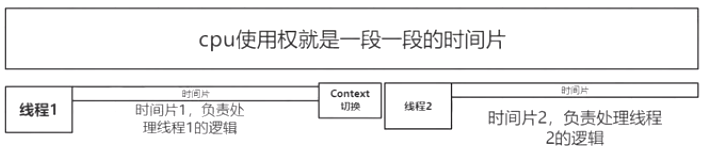

# 高并发场景

    秒杀,火车票抢票,抢红包.

# 变量与线程安全

- 基础类型的局部变量: 基础类型的局部变量存储在线程的私有栈中。永远也不会被其他线程共享.
- 引用类型的局部变量: 和基础类型的局部变量不一样。尽管引用本身没有被共享，但引用所指的对象并没有存储在线程的私有栈内。所有的对象都存在共享堆中.
- 对象的成员变量: 存储在堆上。这个对象就不是线程安全的.

# 同步方法与同步代码块的区别(使用同步代码块好，还是使用同步方法好?)

结论是很明显: 同步代码块比同步方法好:

1. 锁的粒度越小越好: 我们只需要对临界区的代码进行同步,如果使用的是同步方法，那么整个方法中的所有内容都会被当做一个原子操作。
2. 在同步代码块中，我们可以自由的选择锁

# 线程切换导致的系统开销

Java的线程是直接映射到操作系统的线程之上的，线程的阻塞、唤醒等都需要操作系统的参与，因此线程切换的过程中是有大量系统开销的

悲观锁中,没有拿到锁的线程会变为阻塞状态(BLOCKED),阻塞状态的线程不会再竞争cpu的时间片,相当于把cpu的使用权给别的线程使用.

注意: RUNNABLE这个名字很具有欺骗性，很容易让人误以为处于这个状态的线程正在运行,因为这线程也可能正在等待cpu的时间片.

    主内存 和 每个线程都有自己的工作内存.
