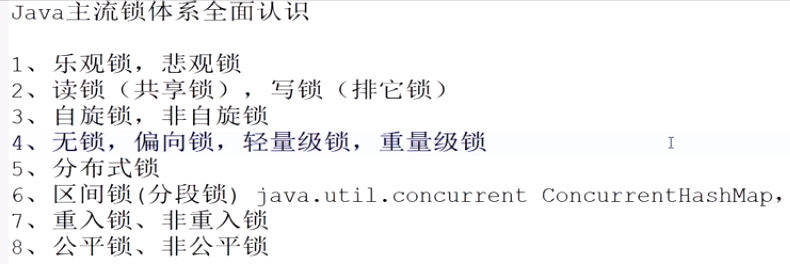

# 锁

锁是用来控制多线程对同一资源的并发访问的.

# 锁的分类

Java提供很多种锁，每种锁因其特性的不同，适用不同的场景.

# CAS与synchronized的使用情景

CAS适用于写比较少的情况下（多读场景，冲突一般较少）

synchronized适用于写比较多的情况下（多写场景，冲突一般较多）

1. 对于资源竞争较少（线程冲突较轻）的情况，使用synchronized同步锁进行线程阻塞和唤醒切换以及用户态内核态间的切换操作额外浪费消耗cpu资源；而CAS基于硬件实现，不需要进入内核，不需要切换线程，操作自旋几率较少，因此可以获得更高的性能。
2. 对于资源竞争严重（线程冲突严重）的情况，CAS自旋的概率会比较大，从而浪费更多的CPU资源，效率低于synchronized

# 死锁

线程 A 和线程 B 都在互相等待对方释放锁，或者是某个线程在临界区代码中出现死循环,导致永远不会释放锁

# 参考

[java锁事!!](https://tech.meituan.com/2018/11/15/java-lock.html)