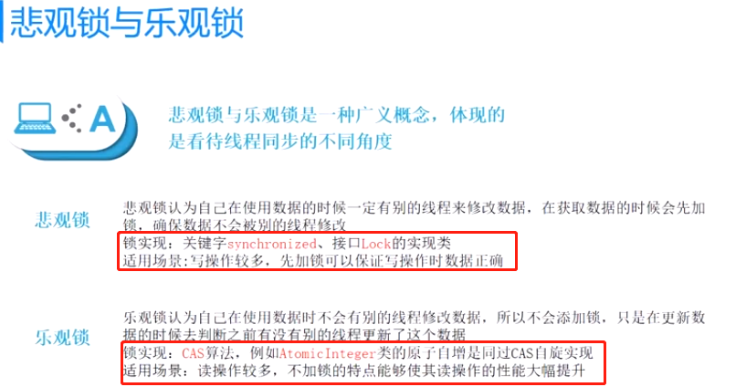
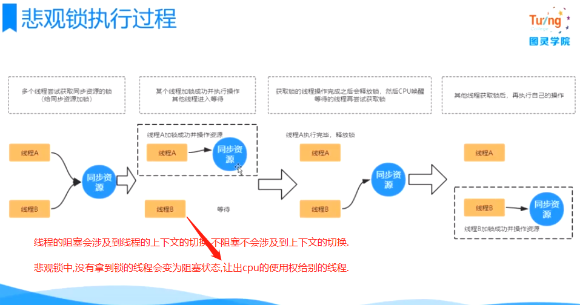
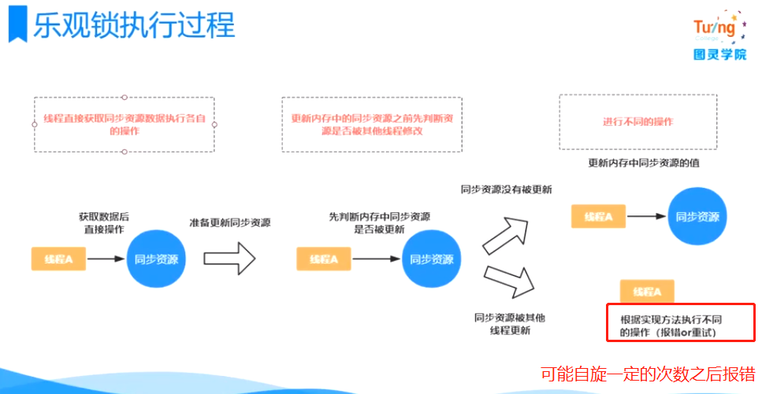

# 悲观锁和乐观锁

    悲观锁和乐观锁:体现一种看待事物的心态,是悲观还是乐观.

    悲观锁认为自己在使用数据的时候一定有别的线程来修改数据，因此在使用数据之前会先加锁，确保数据不会被别的线程修改.

    synchronized关键字和实现Lock接口的类都是悲观锁

    乐观锁认为自己在使用数据时不会有别的线程修改数据，所以不会添加锁，只是在更新数据的时候去判断之前有没有别的线程更新了这个数据。
    如果这个数据没有被更新，当前线程将自己修改的数据成功写入。如果数据已经被其他线程更新，
    则根据不同的实现方式执行不同的操作（例如报错或者自动重试）

    cas算法最常用的就是秒杀系统中,在减库存的一刹那,我们会在数据库的字段中加一个版本号,来实现cas算法.用版本号来做更新时的校对.

# 两种锁的使用场景

乐观锁适用于写比较少的情况下（多读场景），即冲突真的很少发生的时候，这样可以省去了锁的开销

多写的情况，一般会经常产生冲突，这就如果使用乐观锁的话,会导致上层应用不断的进行重试，这样反倒是降低了性能，所以一般多写的场景下用悲观锁就比较合适.
