# synchronized关键字的原理

    在多线程环境下调用Synchronized代码块，有可能需要线程上下文切换，因此可以说Synchronized是在Java语言中一个重量级操作
    
    synchronized代码块中的代码变成原子操作，只有等到同步代码块中的代码在执行完成的时候，CPU才会进行线程的上下文切换.(synchronized是悲观锁,在操作同步资源之前需要给同步资源先加锁)

    synchronized来做同步处理时，锁的获取和释放都是隐式的.

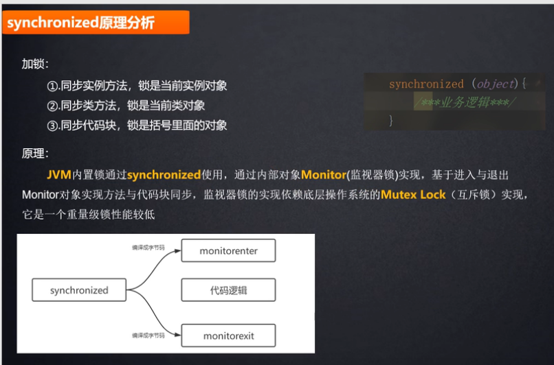

    javap -c XX.class
    
    synchronized是使用 monitorenter 和 monitorexit 指令来实现同步.
    
    当执行 monitorenter 指令时，线程试图获取锁对象的monitor,monitor对象存在于每个java对象的对象头中，
    synchronized 锁便是通过这种方式获取锁的

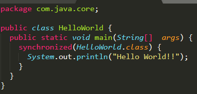

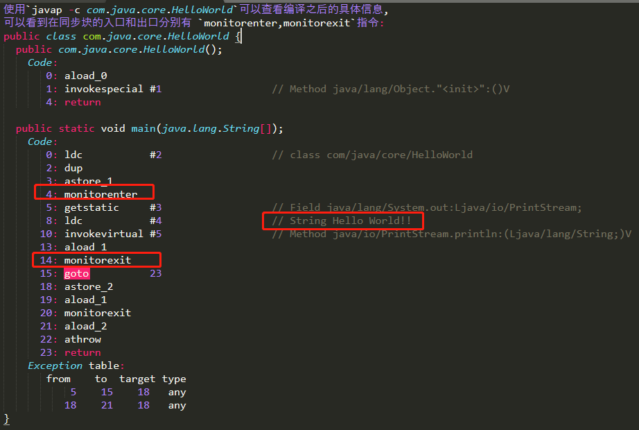

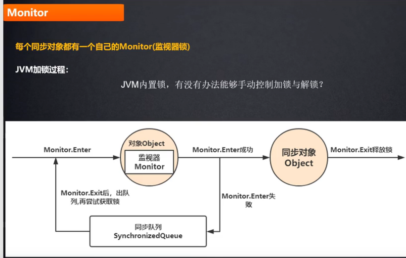

    当一个monitor被某一个线程持有后，这个线程就会持有这个monitor所对应的对象的的锁.

# 对象的内存结构

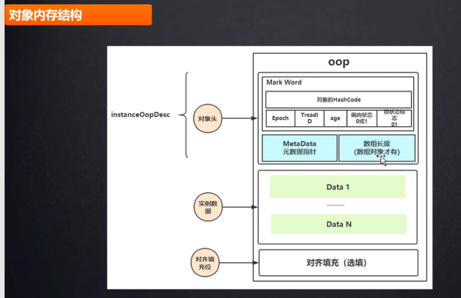

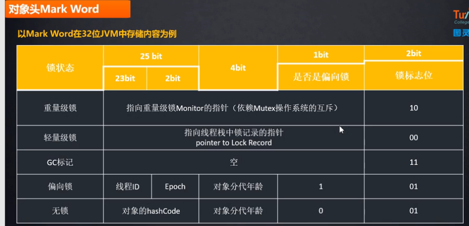

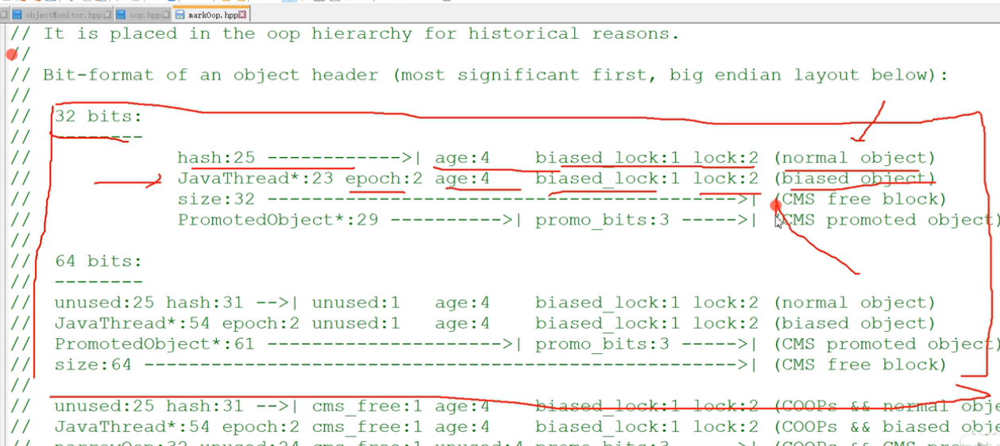

# synchronized4种锁状态 

Java并发编程这个领域中synchronized关键字一直都是元老级的角色，以前会称它为 **“重量级锁”** 。但是在1.6之后进行了优化,主要包括为了减少获得锁和释放锁带来的性能消耗而引入的 **偏向锁(biasble)** 和 **轻量级锁**.这四种锁是指synchronized锁的状态.

在线程冲突较少的情况下，可以获得和CAS类似的性能；而线程冲突严重的情况下，性能远高于CAS    

    synchronized不会一上来就是重量级锁,而是会逐步的从无锁变为重量级锁,有一个锁升级过程.

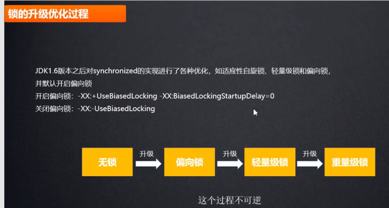

    偏向锁通过对比Mark Word中的线程id解决加锁问题，避免执行多次CAS操作(只有1次)。
    
    而轻量级锁是通过用CAS操作(多次)和自旋,来避免线程阻塞和唤醒而影响性能
    
    重量级锁是将除了拥有锁的线程以外的线程都阻塞。

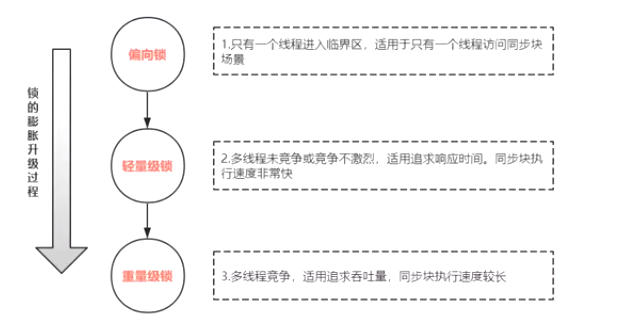

# 无锁(unlocked)

对象初始化后,是一个无锁的状态.

# 偏向锁

    偏向锁的思想是偏向于第一个获取锁的线程，这个线程在之后获取该锁就不再需要进行同步操作.
    
    当锁对象第一次被线程获得的时候，进入偏向状态，偏向锁的标记设置为 1。同时使用 CAS 操作将线程 ID 记录到锁对象头的 Mark Word 中，
    如果 CAS 操作成功，这个线程以后每次进入这个锁相关的同步块就不需要再进行任何同步操作。
    
    当有另外一个线程去尝试获取这个锁对象时，偏向状态就宣告结束，此时撤销偏向（Revoke Bias）后升级为轻量级锁状态

    在访问同步代码块的时候,会检查对象头mark word中,的锁标记位,
    如果为01(看上图),就去判断是不是偏向锁,如果不是偏向锁,使用 CAS 将线程 ID 更新到锁对象的 Mark Word 中，如果更新成功则获得偏向锁.
    并且之后每次进入这个对象锁相关的同步块时都不需要再次获取锁了,只需要看mark word中的线程id是不是当前线程即可.

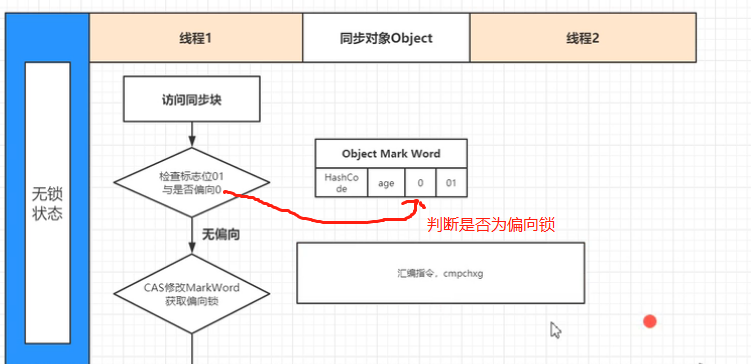

    偏向锁适用于同一个线程反复的进入同一代码块的场景.(这种场景几乎不存在),同一线程执行同步资源时自动获取锁,
    其目标就是同一个线程执行同步代码块时能够提高性能,降低获取锁的代价.

    引入偏向锁是为了在无多线程竞争的情况下尽量减少不必要的轻量级锁执行路径，
    因为轻量级锁的获取及释放依赖多次CAS原子指令，而偏向锁只需要在置换ThreadID的时候依赖一次CAS原子指令即可
    
    如果业务场景是: 锁总是由同一线程多次获得，不存在多线程竞争，就会启用偏向锁. 
    
>偏向锁在JDK 6及以后的JVM里是默认启用的。偏向锁可以提高带有同步却没有竞争的程序性能，但如果程序中大多数锁都存在竞争时，那偏向锁就起不到太大作用。可以通过JVM参数关闭偏向锁：-XX:-UseBiasedLocking=false，关闭之后程序默认会进入轻量级锁状态.

# 轻量级锁(lightweight locked)

    轻量级锁是相对于重量级锁而言，它使用 CAS 操作来避免重量级锁使用互斥量的开销。
    对于绝大部分的锁，在整个同步周期内都是不存在竞争的，因此也就不需要都使用互斥量进行同步，
    可以先采用 CAS 操作进行同步，如果 CAS 失败了再改用互斥量进行同步。
    
    当尝试获取一个锁对象时，如果锁对象的锁标记尾是 01，说明锁对象的锁未锁定（unlocked）状态。
    此时jvm会在当前线程的虚拟机栈中创建Lock Record，然后使用 CAS 操作将锁对象的 Mark Word 更新为当前线程的 Lock Record 指针。
    如果 CAS 操作成功了，那么线程就获取了该对象上的锁，并且对象的 Mark Word 的锁标记位变为 00，表示该对象处于轻量级锁状态
    
    如果 CAS 操作失败了，虚拟机首先会检查锁对象的 Lock Record 是否指向当前线程的虚拟机栈，如果是的话说明当前线程已经拥有了这个锁对象，
    那就可以直接进入同步块继续执行，否则说明这个锁对象已经被其他线程线程抢占了。
    如果有两条以上的线程争用同一个锁，那轻量级锁就不再有效，要膨胀为重量级锁。

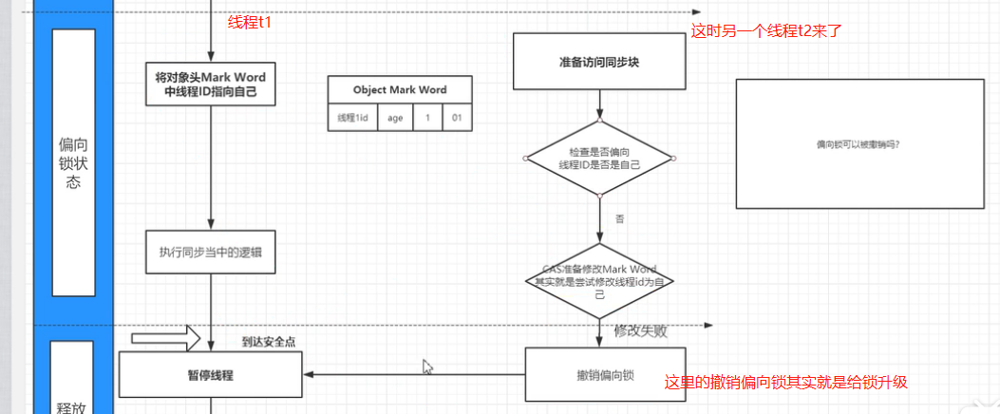

>偏向锁遇到其他线程尝试竞争偏向锁时，其他t2线程会等到安全点（在这个时间点上没有字节码正在执行,这个时候拥有锁的线程t1不一定执行完同步代码块了）,然后jvm会暂停拥有偏向锁的线程t1

>然后t2会判断t1是否已经释放了锁,则t2会把线程id写入mark word,t2此时拥有偏向锁.

>如果此时t1如果没有释放锁,此时就会升级为轻量级锁(通过cas更新mark Word的锁标志位设置为00以及Lock Record),t2就会通过自旋的形式尝试获取锁，不会阻塞，从而提高性能,如果t2自旋超过一定的次数,或者又有第三个线程,轻量级锁升级为重量级锁.

    轻量级锁适用于线程交替执行的场景(注意,不是高并发场景,是交替执行),如果锁竞争激烈，轻量锁就不但有互斥的开销，还有 CAS 的开销，这时比重量锁更慢

# 重量级锁

    重量级锁(性能相对于低)适用于高并发的场景.没有获取资源的线程被阻塞(放在管程队列中等待被唤醒),等待被唤醒(涉及上下文切换)
    
    如果是重量级锁,涉及到从用户态到内核态的转换,系统开销比较大.(系统会分成用户态和内核态,为了保证安全,所以划分)

    如果你的项目天然是海量级的访问,可以根据实际情况关闭锁的升级优化,因为这会涉及大量偏向锁的撤销,偏向锁的升级等,这会造成锁的升级步骤有些多余.因为会造成额外的操作,还不如直接一上来就是重量级锁.
    
    如果你的项目不是一上来就是高并发场景,建议把锁的升级过程开启来.

# 说说 synchronized 关键字和 volatile 关键字的区别

- volatile关键字能保证数据的可见性，但不能保证数据的原子性,synchronized关键字两者都能保证
- volatile关键字用于解决变量在多个线程之间的可见性，而synchronized关键字解决的是多个线程之间访问资源的安全.
