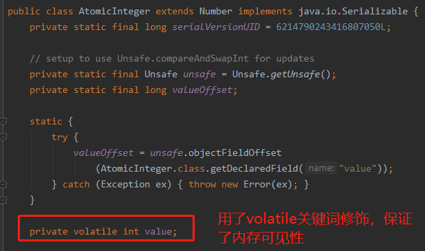
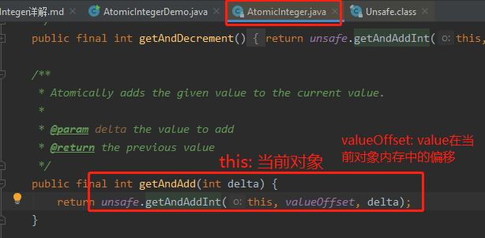
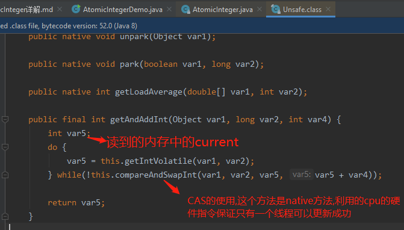

# AtomicInteger

    AtomicInteger这个类用的非常多,所以是面试的重点.

# AtomicInteger为什么是使用CAS实现的,为什么不用synchronized?

    使用synchronized后,能保证数据一致性,同一时间只能有一个线程来访问临界区代码,并发性会下降
    
    cas不加锁,能保证数据一致性,有较高的并发性,但是可能会自旋时间很长,导致给cpu带来很大开销.
