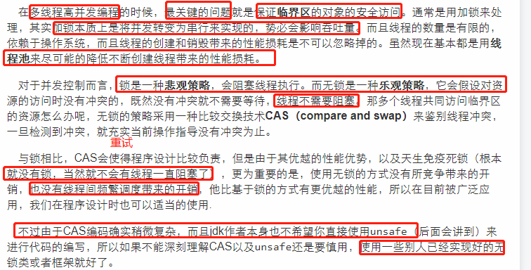
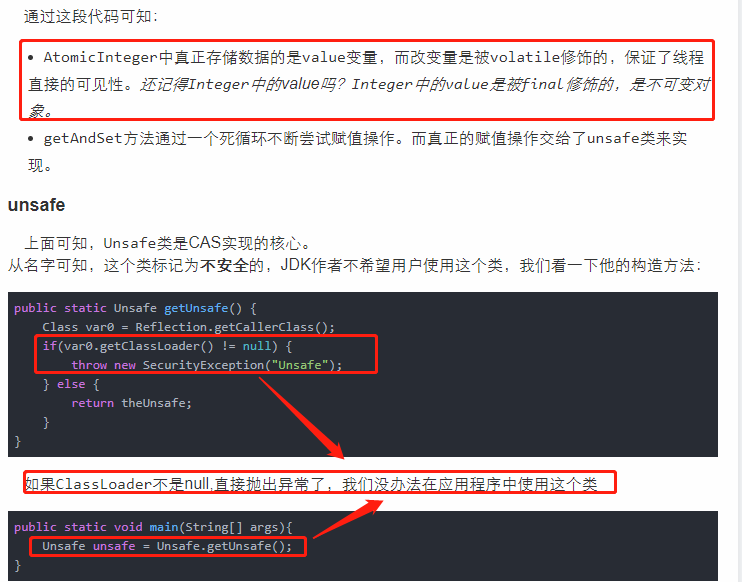
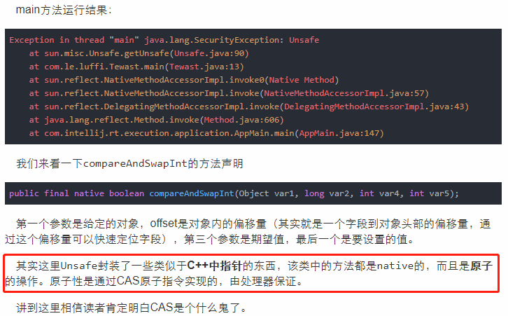
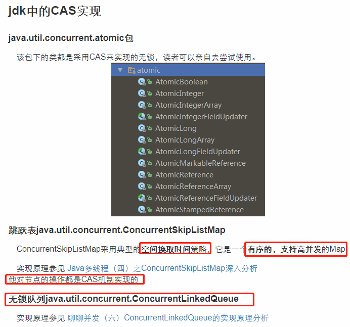

# CAS(Java中的非阻塞线程同步策略)









# volatile关键字

>volatile在多线程环境下保证了共享变量内存可见性。意思是线程A修改了volatile修饰的共享变量，线程B能够感知修改。如果volatile合理使用的话，将会比Synchronized的执行成本更低。从底层的角度来说，为了提高处理速度，`CPU不直接和内存进行通信`，而是先将数据读入到CPU缓存后在进行操作，但不知何时将会更新到内存。声明变量加入volatile关键字后，每次修改该变量，JVM就会通知处理器将CPU缓存内的值强制更新到内存中，这就是所谓的“可见性”.

# CAS存在三大问题

>CAS虽然很高效，但是它也存在三大问题:

1. ABA问题。CAS需要在操作值的时候检查内存值是否发生变化，没有发生变化才会更新内存值。但是如果内存值原来是A，后来变成了B，然后又变成了A，那么CAS进行检查时会发现值没有发生变化，但是实际上是有变化的。ABA问题的解决思路就是在变量前面添加版本号，每次变量更新的时候都把版本号加一，这样变化过程就从“A－B－A”变成了“1A－2B－3A”。
JDK从1.5开始提供了AtomicStampedReference类来解决ABA问题，具体操作封装在compareAndSet()中。compareAndSet()首先检查当前引用和当前标志与预期引用和预期标志是否相等，如果都相等，则以原子方式将引用值和标志的值设置为给定的更新值。
2. 循环时间长开销大。CAS操作如果长时间不成功，会导致其一直自旋，给CPU带来非常大的开销。
3. 只能保证一个共享变量的原子操作。对一个共享变量执行操作时，CAS能够保证原子操作，但是对多个共享变量操作时，CAS是无法保证操作的原子性的。Java从1.5开始JDK提供了AtomicReference类来保证引用对象之间的原子性，可以把多个变量放在一个对象里来进行CAS操作。

## ABA问题描述以及解决方案

线程1从内存位置V取出 A，这时候线程2也从内存位置 V 取出 A，此时线程1处于挂起状态，线程2将位置V的值改成 B，最后再改成 A，这时候线程1再执行，发现位置 V 的值没有变化，尽管线程 1 也更改成功了，但是不代表这个过程就是没有问题的。

>举例分析:现有一个用单向链表实现的栈，栈顶元素为 A，A.next 为 B，期望用 CAS 将栈顶替换成 B。
有线程 1 获取了元素 A，此时线程 1 被挂起，线程 2 也获取了元素 A，并将 A、B 出栈，再 push D、C、A，这时线程 1 恢复执行 CAS，因为此时栈顶元素依然为 A，线程 1 执行成功，栈顶元素变成了 B，但 B.next 为 null，这就会导致 C、D 被丢掉了。
通常，我们的乐观锁实现中都会带一个version字段来记录更改的版本，避免并发操作带来的问题。在 Java 中，AtomicStampedReference 也实现了这个处理方式。

```java
// AtomicStampedReference 的内部类 Pair：
// 每个 Pair 维护一个值，其中 reference 维护对象的引用，stamp 维护修改的版本号。
private static class Pair<T> {
  final T reference;
  final int stamp;
  private Pair(T reference, int stamp) {
    this.reference = reference;
    this.stamp = stamp;
  }
  static <T> Pair<T> of(T reference, int stamp) {
    return new Pair<T>(reference, stamp);
  }
}
```

```java
// 从 compareAndSet 方法得知，如果要更改内存中的值，不但要值相同，还要版本号相同。
public boolean compareAndSet(V   expectedReference,V   newReference,int expectedStamp,int newStamp) {
  Pair<V> current = pair;
  return
    expectedReference == current.reference &&
    expectedStamp == current.stamp &&
    ((newReference == current.reference &&
      newStamp == current.stamp) ||
     casPair(current, Pair.of(newReference, newStamp)));
}
```

# 好文

- [java高并发：CAS无锁原理及广泛应用](https://www.jishuwen.com/d/2BtD)