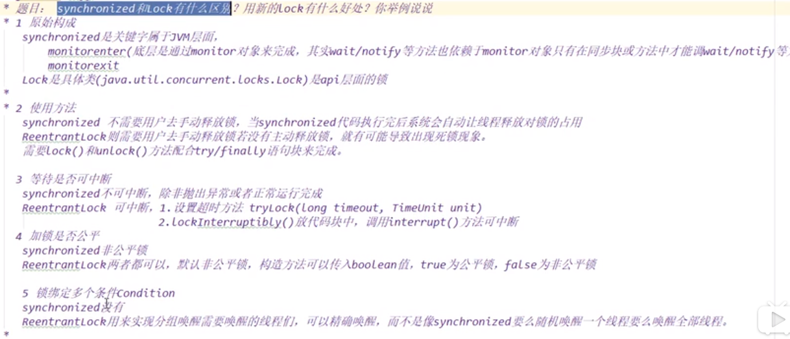

# synchronized与ReentrantLock的区别，用Lock有什么好处？

- 原始构成
- 使用方法
- 中断
- 加锁是否公平
- 锁可以绑定多个条件Condition,可以实现唤醒指定线程

    两者都是可重入锁
    
    synchronized需要依赖wait()/notify/notifyAll()方法相结合可以实现等待-通知机制
    
    ReentrantLock可以可以实现唤醒指定线程
    