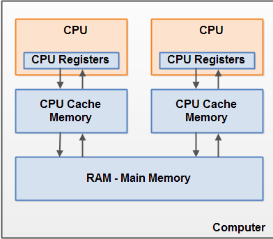
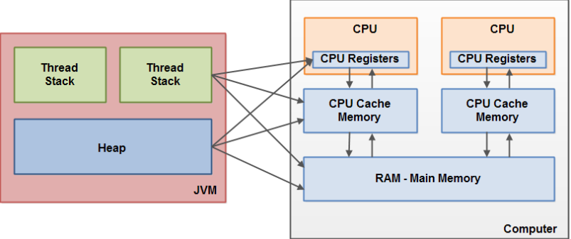
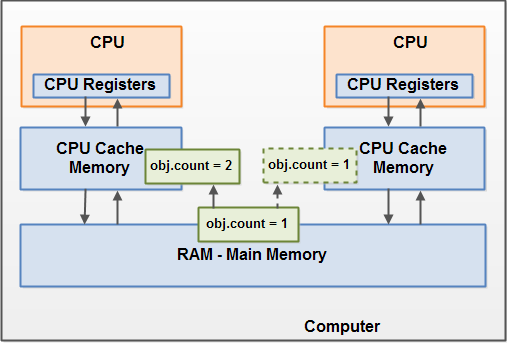
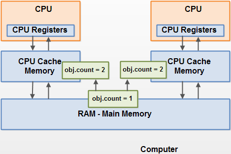

见classpath: `JVM/1.1_Java代码说明JVM内存布局.md`

## 硬件内存架构

现代`硬件内存模型`与`Java内存模型`有一些不同。`理解硬件内存模型架构`以及`Java内存模型`如何与它协同工作也是非常重要的。这部分描述了通用的硬件内存架构，下面的部分将会描述Java内存是如何与它“联手”工作的。

>

现代计算机通常由两个或者多个CPU,所以如果你的程序是多线程的，在你的Java程序中每个CPU上一个线程可能同时（并发）执行。

`每个CPU`都包含一系列的`寄存器`，`每个CPU`可能还有一个`CPU缓存层`，一个计算机还包含一个主存，所有的CPU都可以访问主存.

>cpu访问速度: 访问寄存器 > 缓存 > 主存.

通常情况下，当一个CPU需要`读取主存时`，它会将`主存`的部分`读到CPU缓存`中。它甚至可能`将缓存中的部分内容读到它的内部寄存器中`，然后在寄存器中执行操作。当CPU需要`将结果写回到主存`中去时，它会将内部寄存器的值刷新到缓存中，然后在某个时间点将值刷新回主存。

## Java内存模型和硬件内存架构之间的桥接

Java内存模型与硬件内存架构之间存在差异。硬件内存架构没有区分线程栈和堆。线程栈和堆有时候会出现在硬件的主存中,有时候会出现在硬件的CPU缓存中和硬件的CPU内部寄存器中，见:

当对象和变量被存放在计算机中各种不同的内存区域中时引发的问题:

1. 线程对共享变量修改的可见性
2. 当读，写和检查共享变量时出现race conditions

#### 共享对象可见性

>如果两个或者更多的线程`在没有正确的使用volatile声明`或者`同步`的情况下`共享一个对象`，一个线程更新这个共享对象可能对其它线程来说是不可见的.

想象一下，`共享对象被初始化在主存中`。跑在CPU上的一个线程将这个共享对象读到CPU缓存中。然后修改了这个对象。`只要CPU缓存没有被刷新会主存`，对象修改后的版本对跑在其它CPU上的线程都是不可见的。这种方式可能导致每个线程拥有这个共享对象的私有拷贝，每个拷贝停留在不同的CPU缓存中。

>下图示意了这种情形: 

跑在左边CPU的线程拷贝这个共享对象到它的CPU缓存中，然后将count变量的值修改为2。这个修改对跑在右边CPU上的其它线程是不可见的，因为修改后的count的值还没有被刷新回主存中去。

解决这个问题你可以使用Java中的volatile关键字。volatile关键字可以保证直接从主存中读取一个变量，如果这个变量被修改后，总是会被写回到主存中去。

#### Race Conditions

想象一下，如果线程A读一个共享对象的变量count到它的CPU缓存中。线程B也做了同样的事情，但是往一个不同的CPU缓存中。现在线程A将count加1，线程B也做了同样的事情。现在count已经被增在了两个，每个CPU缓存中一次。

如果这些增加操作被顺序的执行，变量count应该被增加两次，然后原值+2被写回到主存中去。
然而，如果2个线程同时在2个cpu上执行，那么修改后的值仅会被原值大1.

解决这个问题可以使用Java同步块。一个同步块可以保证在同一时刻仅有一个线程可以进入代码的临界区。同步块还可以保证代码块中所有被访问的变量将会从主存中读入，当线程退出同步代码块时，所有被更新的变量都会被刷新回主存中去，不管这个变量是否被声明为volatile。