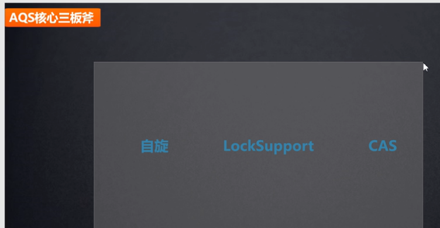
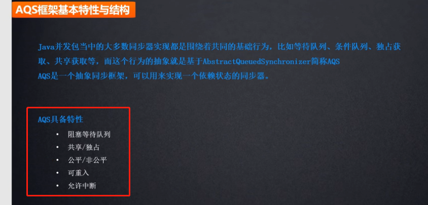
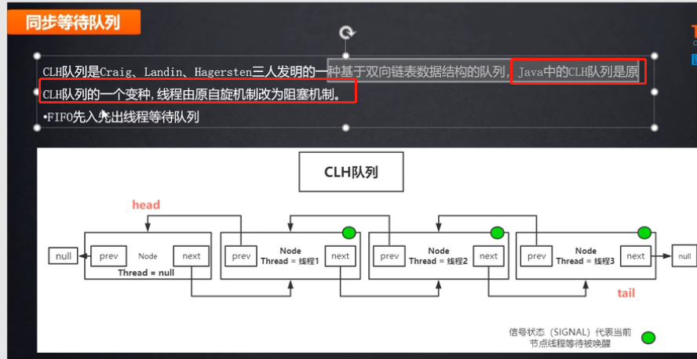
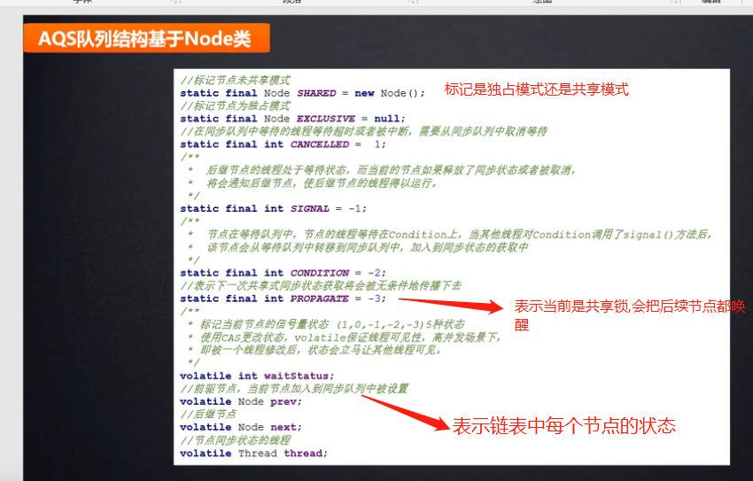
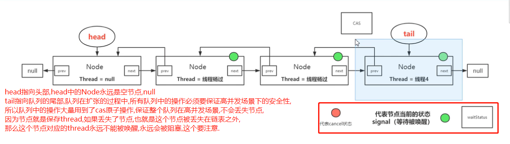

# AQS(抽象队列同步器)

- AQS是在LockSupport和Unsafe类的基础上实现的
- AQS的使用方式: 在同步组件内部定义一个静态内部类继承AQS，并重写其特定的方法，来实现具有不同功能的同步组件
- Java中信号量（Semaphore）、读写锁（ReadWriteLock）、计数器（CountDownLatch）以及FutureTask等都是基于AQS实现的，可见这个抽象类的地位多么不一般

# AQS对资源的共享方式

    AQS定义两种资源共享方式:

    Exclusive（独占）：只有一个线程能执行，其他线程被阻塞进入等待队列,
     类似于synchronized,如ReentrantLock就是基于AQS的独占锁实现。又可分为公平锁和非公平锁：
        - 公平锁：按照线程在队列中的排队顺序，先到者先拿到锁
        - 非公平锁：当线程要获取锁时，无视队列顺序直接去抢锁，谁抢到就是谁的
        
    **Share**（共享）：多个线程可同时执行,如果共享锁已经没有许可，那么该线程进入等待队列.
    如Semaphore/CountDownLatch都是基于AQS的共享锁的实现.

    注意: LockSupport都不是基于AQS的.
    
    ReentrantReadWriteLock可以看成是基于AQS的组合式实现，因为ReentrantReadWriteLock允许多个线程同时对某一资源进行读,
    这种情况相当于是共享锁,但是只允许一个线程来写,所以这种情况就是独占锁.

不论独占还是共享,在获取许可和释放许可的过程中，都有两个非常重要的基本内容要维护：

1. 可用许可的数量
2. 等待队列

# AQS提供的模板方法

    见: org.java.core.base.concurrent.chapter5.CustomAQSComponent.AQSTemplateMethod

# 构建自己独占锁

    org.java.core.base.concurrent.chapter5.CustomAQSComponent.Exclusive.MutexImpl.java

# 构建自己共享锁

    org.java.core.base.concurrent.chapter5.CustomAQSComponent.Share.Share