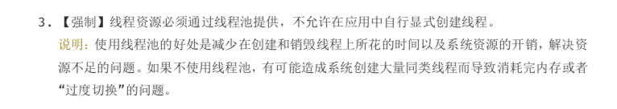
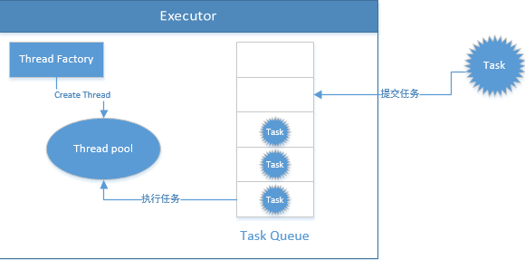

# 为什么引入线程池



    线程的上下文切换以及线程的创建与销毁，都会消耗大量的资源.所以引入线程池来管理、创建、销毁线程

`线程的管理、创建、销毁等操作`与`线程要执行的任务隔离开来(Runnable/Callable)`

# Executor

起到线程管理作用的类称之为Executor。Executor相关的3个主要接口:


- `java.util.concurrent.Executor`是顶级接口，其只定义了一个`void execute(Runnable command)`方法，用于接受可以执行的任务
- `public interface ExecutorService extends Executor {}`接口在Executor的基础上添加了一些生命周期方法，例如shutdown等.
- `public interface ScheduledExecutorService extends ExecutorService {}`进一步扩展，添加了周期性运行任务的方法

我们向executors中提交任务(Runnable或者Callable接口的实现类)，executors会将提交的任务放入任务队列中。然后会从池中选择一个空闲的线程来处理队列中的任务



    线程池的相关概念：线程工厂，线程池以及任务队列


# 线程池的状态

```java
// 线程池中所定义的状态，这些状态都和线程的执行密切相关:
public class ThreadPoolExecutor extends AbstractExecutorService {
    private static final int RUNNING    = -1 << COUNT_BITS;
    private static final int SHUTDOWN   =  0 << COUNT_BITS;
    private static final int STOP       =  1 << COUNT_BITS;
    private static final int TIDYING    =  2 << COUNT_BITS;
    private static final int TERMINATED =  3 << COUNT_BITS;
    
    public void execute(Runnable command) {
        if (command == null)
                 throw new NullPointerException();
            // 获取当前线程池的状态
             int c = ctl.get();
             // 当前线程数量小于 coreSize 时创建一个新的线程运行
             if (workerCountOf(c) < corePoolSize) {
                 if (addWorker(command, true))
                     return;
                 c = ctl.get();
             }
             if (isRunning(c) && workQueue.offer(command)) {// 如果当前线程处于运行状态，并且写入阻塞队列成功
                 int recheck = ctl.get();
                 // 双重检查，再次获取线程池状态；如果线程池状态变了（非运行状态）就需
                 // 要从阻塞队列移除任务，并尝试判断线程是否全部执行完毕。同时执行拒绝策略
                 if (! isRunning(recheck) && remove(command))
                     reject(command);
                 else if (workerCountOf(recheck) == 0) // 如果当前线程池为空就新创建一个线程并执行
                     addWorker(null, false);
             }
             else if (!addWorker(command, false))//如果在第三步的判断为非运行状态，尝试新建线程，如果失败则执行拒绝策略
                 reject(command);
         }
}
```

- `RUNNING` 自然是运行状态，指可以接受任务执行队列里的任务
- `SHUTDOWN` 指调用了 `shutdown()` 方法，不再接受新任务了，但是队列里的任务得执行完毕,调用shutdown()内部其实是去中断线程了.
- `STOP` 指调用了 `shutdownNow()` 方法，不再接受新任务，同时抛弃阻塞队列里的所有任务,并中断所有正在执行任务。
- `TIDYING` 所有任务都执行完毕，在调用 `shutdown()/shutdownNow()` 中都会尝试更新为这个状态。
- `TERMINATED` 终止状态，当执行 `terminated()` 后会更新为这个状态。


# 线程池到底应该配置多少线程

>通常我们是需要根据任务的性质来确定的，当然这些都是经验值，最好的方式还是根据实际情况测试得出最佳配置:

- IO 密集型任务：由于线程并不是一直在运行，所以可以尽可能的多配置线程，比如 CPU 个数 * 2 
- CPU 密集型任务（大量复杂的运算）应当分配较少的线程，比如 CPU 个数相当的大小。

# 优雅的关闭线程池

- `shutdown()` 执行后停止接受新任务，会把队列的任务执行完毕。
- `shutdownNow()` 也是停止接受新任务，但会中断所有的任务，将线程池状态变为 stop。

> 两个方法都会中断线程，用户可自行判断是否需要响应中断。

```java
    long start = System.currentTimeMillis();
    for (int i = 0; i <= 5; i++) {
        pool.execute(new Job());
    }

    pool.shutdown();

    while (!pool.awaitTermination(1, TimeUnit.SECONDS)) {
        LOGGER.info("线程还在执行。。。");
    }
    long end = System.currentTimeMillis();
    LOGGER.info("一共处理了【{}】", (end - start));
```

`pool.awaitTermination(1, TimeUnit.SECONDS)` 会每隔一秒钟检查一次是否执行完毕（状态为 `TERMINATED`），当从 while 循环退出时就表明线程池已经完全终止了。

