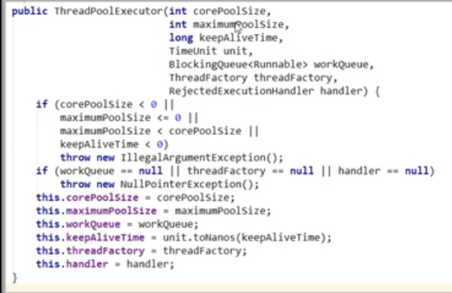
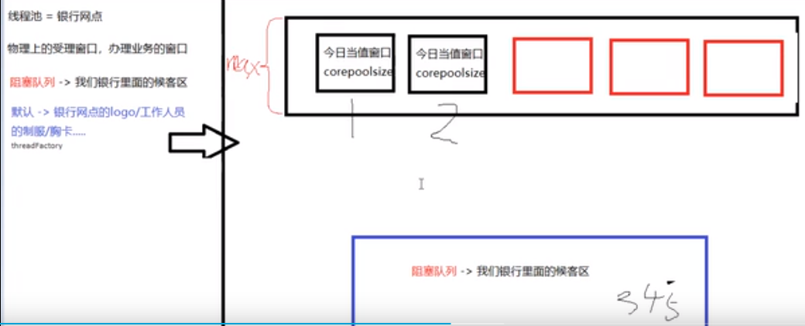
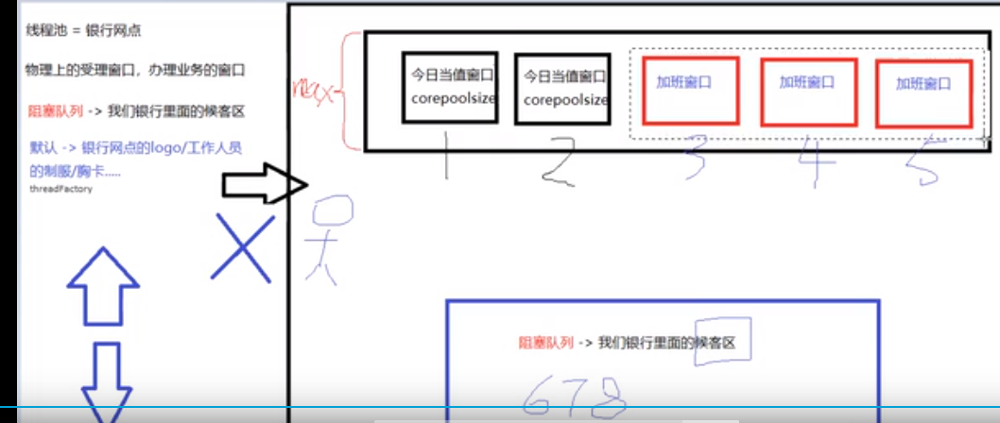

# 线程池的7大参数

    线程池的核心类: ThreadPoolExecutor

# 线程池的7大参数的理解

# 7大参数的动态修改方法

    在大多数情况下7大参数是在初始化ThreadPoolExecutor的时候基于构造函数来设置,当然也可以通过方法动态更改

    setCorePoolSize(int)/getCorePoolSize()
    setMaximumPoolSize(int)/getMaximumPoolSize()
    setKeepAliveTime(long, java.util.concurrent.TimeUnit)
    setRejectedExecutionHandler
    
    getPoolSize()

# 问题

## 当运行线程少于 corePoolSize时,此时有新任务在execute方法中提交,会怎么办,排队还是?

    线程池刚刚创建的时候，是不会初始化所有线程的。只有等到有任务进来的时候，才会创建线程.
    当新任务在execute方法中提交时，如果运行的线程少于corePoolSize，则创建新线程来处理请求，即使其他线程是空闲的

## 如果运行的线程等于或多于corePoolSize，则再向线程池提交任务,会怎么样?
    
    如果运行的线程等于或多于corePoolSize，则始终首选将请求加入队列，而不创建新的线程 

## 线程工厂用哪个?

    创建线程的工厂,一般使用默认的Executors.defaultThreadFactory()即可

## 如何将keepAliveTime的保持活动策略应用到corePoolSize呢?

    1. 默认情况下，保持活动策略只在有多于corePoolSize的线程时应用
    2. 如果 keepAliveTime>0,可以通过allowCoreThreadTimeOut(boolean)方法设置为true,将超时策略应用于核心线程

## 实际生产中,如何配置线程池的最大数量?你是怎么考虑的?

    根据你的业务是cpu密集型还是IO密集型来决定.

    cpu密集: 类似于 while(true)死循环一直占用cpu,大型队列和小型池可以最大限度地降低操作系统上下文切换开销,适用于cpu密集型业务
    io密集: 有很多io操作,比如去数据库的磁道上取数据,如果任务频繁阻塞（I/O操作比较多）,比较适合使用小型队列和较大的池

## 线程池常用任务队列(workQueue)的种类和特点
    
    有界队列有助于防止资源耗尽

    LinkedBlockingQueue默认大小为Integer.MAX_VALUE

    SynchronousQueue队列的特点: 只要一有任务进入队列，就立马要找一个空闲的线程来运行这个任务,
    如果没有线程来执行,就要按照Rejection策略来处理
    它将任务直接提交给线程而不存它们
