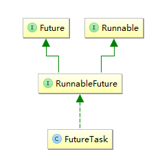

# FutureTask源码分析

## FutureTask引入

通过ExecutorService的submit方法向线程池中提交一个任务(Callable、Runnable)，并且获取一个Future对象，以等待或者取消任务执行的结果.

```java
public interface ExecutorService extends Executor {
    <T> Future<T> submit(Callable<T> task);
    <T> Future<T> submit(Runnable task, T result);
    Future<?> submit(Runnable task);
}
```

Future只是一个接口，其所有功能都是通过其实现类FutureTask来提供的，FutureTask对象实现了RunnableFuture接口，而RunnableFuture接口又继承了Runnable和Future接口:



## FutureTask的构造过程

```java
// 事实上，通过ExecutorService接口的相关submit方法，
// 实际上都是将提交的Callable或者Runnable，包装成一个FutureTask对象。

// 论我们通过submit方法提交的是Runnable还是Callable，首先都会调用一个newTaskfor方法，
// 将其构造成一个FutureTask对象，然后再调用execute方法。

// 需要注意的是，AbstractExecutorService中只实现了相关submit方法，
// 而真正运行任务的总是调用execute方法，这个方法是在父类Executor中定义的，AbstractExecutorService并没有实现这个方法，这个方法是由子类ThreadPoolExecutor实现的。
public abstract class AbstractExecutorService implements ExecutorService {
    
    //将Runable包装成FutureTask之后，再调用execute方法
    public Future<?> submit(Runnable task) {
        if (task == null) throw new NullPointerException();
        RunnableFuture<Void> ftask = newTaskFor(task, null);
        execute(ftask);
        return ftask;
    }
    
    //将Runable和返回结果T result包装成FutureTask之后，再调用execute方法
    public <T> Future<T> submit(Runnable task, T result) {
        if (task == null) throw new NullPointerException();
        RunnableFuture<T> ftask = newTaskFor(task, result);
        execute(ftask);
        return ftask;
    }
    
    //调用newTaskFor方法，利用Runnable和value构造一个FutureTask对象
    protected <T> RunnableFuture<T> newTaskFor(Runnable runnable, T value) {
        return new FutureTask<T>(runnable, value);//针对Runnable创建FutureTask
    }
     
    //将Callable对象构造成一个FutureTask对象
    public <T> Future<T> submit(Callable<T> task) {
        if (task == null) throw new NullPointerException();
        RunnableFuture<T> ftask = newTaskFor(task);
        execute(ftask);
        return ftask;
    }
    //调用newTaskFor方法，利用Callable构造一个FutureTask对象
    protected <T> RunnableFuture<T> newTaskFor(Callable<T> callable) {
        return new FutureTask<T>(callable);
    }
    
}
```

## 来看看FutureTask的两个构造方法：

>在内部实现中，无论是使用Runnable还是Callable，最终都会转成一个Callable对象，然后创建FutureTask实例，然后再调用execute方法执行

```java
// 接受Callable对象作为参数
public FutureTask(Callable<V> callable) {
    if (callable == null)
        throw new NullPointerException();
    this.callable = callable;
    this.state = NEW;    
}

//接受Runnable对象作为参数
public FutureTask(Runnable runnable, V result) {
    // 这是通过工具类Executors的callable方法实现将Runnable对象转为Callable对象
    this.callable = Executors.callable(runnable, result);//将Runnable转为Callable对象
    this.state = NEW;     
}
```

## 看一下将Runnable对象转为Callable对象的源码

```java
//callable方法，将Runnable转为一个Callable对象，包装设计模式
public static <T> Callable<T> callable(Runnable task, T result) {
    if (task == null)
        throw new NullPointerException();
    return new RunnableAdapter<T>(task, result);
}
 
//RunnableAdapter是Executors的一个内部类，实现了Callable接口
static final class RunnableAdapter<T> implements Callable<T> {
    final Runnable task;
    final T result;
    //  从RunnableAdapter的名字上，可以看到，其是一个适配器，实现了Callable接口，
    //  当其call方法被调用的时候，实际上内部也是调用了Runnable的run方法，典型的包装设计模式
    RunnableAdapter(Runnable task, T result) {
        this.task = task;
        this.result = result;
    }
    public T call() {
        task.run();
        return result;
    }
}
```

## FutureTask的执行过程

```java
// submit相关方法的作用实际上就是将Callable或者Runnable转为一个FutureTask对象，
// 然后再调用execute(Runable task)方法，来真正执行这个任务。
   
// 其中submit方法是在AbstractExecutorService中实现的，但是对于execute(Runable task)方法，是留给子类实现的，ThreadPoolExecutor对execute方法提供了真正的实现。
   
// 但是在这里我们并不会尝试去分析ThreadPoolExecutor是如何执行一个FutureTask的，
// 因为execute方法接受的是一个Runnable对象，所以我们知道其在执行的时候，肯定执行的是run方法，
// 而此处我们传递的是一个FutureTask对象，因此调用的肯定就是FutureTask的run，只需要看明白FutureTask的run方法的实现源码即可，
// 因为run方法中使用到了一些字段，并且调用了一些其他方法，在这里一并列出：
public class FutureTask<V> implements RunnableFuture<V> {
     /*
     * FutureTask中定义了一个state变量，用于记录任务执行的相关状态 ，状态的变化过程如下
     * NEW -> COMPLETING -> NORMAL
     * NEW -> COMPLETING -> EXCEPTIONAL
     * NEW -> CANCELLED
     * NEW -> INTERRUPTING -> INTERRUPTED
     */
    private volatile int state;
    //主流程状态
    private static final int NEW = 0; //当FutureTask实例刚刚创建到callbale的call方法执行完成前，处于此状态
    private static final int COMPLETING  = 1; //callable的call方法执行完成或出现异常时，首先进行此状态
    private static final int NORMAL    = 2;//callable的call方法正常结束时，进入此状态，将outcom设置为正常结果
    private static final int EXCEPTIONAL = 3;//callable的call方法异常结束时，进入此状态，将outcome设置为抛出的异常
    //取消任务执行时可能处于的状态
    private static final int CANCELLED= 4;// FutureTask任务尚未执行，即还在任务队列的时候，调用了cancel方法，进入此状态
    private static final int INTERRUPTING = 5;// FutureTask的run方法已经在执行，收到中断信号，进入此状态
    private static final int INTERRUPTED  = 6;// 任务成功中断后，进入此状态
    
    private Callable<V> callable;//需要执行的任务，提示：如果提交的是Runnable对象，会先转换为Callable对象，这是构造方法参数
    private Object outcome; //任务运行的结果
    private volatile Thread runner;//执行此任务的线程
 
    ...
    //取消任务，mayInterruptIfRunning表示如果FutureTask已经在执行，即run方法已经被调用的时候，是否可以继续取消任务
    //mayInterruptIfRunning主要是考虑，我们可能是希望FutureTask在没有执行的情况下，才取消，如果已经执行了，就不取消
    
    //返回boolean值表示任务取消成功还是失败
    
    //需要说明的是,FutureTask处于NEW状态的情况下，才能取消：
    //关于NEW状态的说明：FutureTask从构建时，一直到其包装的Callable对象的call方法被调用完成之前，一直处于NEW状态，
    //因此NEW状态如果继续细分的话，可以划分为2个阶段：
    //1、FutureTask的run方法尚未调用，此时FutureTask的runner==null，表示没有线程在运行此任务
    //2、FutureTask的run方法已经被调用，此时FutureTask的runner!=null，表示已经有线程在执行此任务
    
    //如果任务callable的call方法已经执行完成，FutureTask进入COMPLETING阶段或者之后，则cancel总是返回false
   public boolean cancel(boolean mayInterruptIfRunning) {
        ：
        //1、如果mayInterruptIfRunning=false，那么FutureTask只有在还未执行，即runner==null时，才能取消，进入CANCELLED状态
        //即从NEW->CANCELLED
        //2、如果mayInterruptIfRunning=true，不论runner是否为null，都可以中断
        //状态总是这样变化：NEW -> INTERRUPTING -> INTERRUPTED
        //2.1 runner==null，不会中断，仅仅是状态变化而已
        //2.1 runner!=null，NEW -> INTERRUPTING后，会调用runner.interrupt()，最后进入INTERRUPTED
        if (!(state == NEW &&
              UNSAFE.compareAndSwapInt(this, stateOffset, NEW,
                  mayInterruptIfRunning ? INTERRUPTING : CANCELLED)))
            return false;
        try {    // in case call to interrupt throws exception
            if (mayInterruptIfRunning) {
                try {
                    Thread t = runner;
                    if (t != null)//任务在任务队列中的时候，没有执行时t=runner为空
                        t.interrupt();//任务已经在执行，t已经不为空，调用其interrupt进行中断
                } finally { // final state
                    UNSAFE.putOrderedInt(this, stateOffset, INTERRUPTED);
                }
            }
        } finally {
            finishCompletion();
        }
        return true;
    }
    
 public void run() {
    if (state != NEW ||//任务执行前，首先判断state是否是NEW，并且尝试给runner字段赋值，如果都成功了，才继续往下执行
        !UNSAFE.compareAndSwapObject(this, runnerOffset,null, Thread.currentThread()))
        return;
    try {
        Callable<V> c = callable;
        if (c != null && state == NEW) {
            V result;//任务执行的结果
            boolean ran;//表示任务是否正常结束
            try {
                result = c.call();//执行任务
                ran = true;//任务正常结束
            } catch (Throwable ex) {
                result = null;
                ran = false;//任务异常结束
                setException(ex);//设置任务执行状态从NEW -> COMPLETING -> EXCEPTIONAL
            }
            if (ran)//任务常常结束
                set(result);//设置任务执行状态从NEW -> COMPLETING -> NORMAL，并给outcome字段赋值
        }
    } finally {
        // runner must be non-null until state is settled to
        // prevent concurrent calls to run()
        runner = null;
        // state must be re-read after nulling runner to prevent
        // leaked interrupts
        int s = state;
        if (s >= INTERRUPTING)
        //如果FutureTask在callable的call方法执行完成之前，由于cancel方法被调用，收到了中断信号，则执行这个方法
        //如果已经调用了set(V v)或者setException方法，则此方法不会执行
            handlePossibleCancellationInterrupt(s);
    }
   }
    //callable的call方法异常结束时，调用此方法,状态：NEW -> COMPLETING -> EXCEPTIONAL
    protected void setException(Throwable t) {
        if (UNSAFE.compareAndSwapInt(this, stateOffset, NEW, COMPLETING)) {
            outcome = t;
            UNSAFE.putOrderedInt(this, stateOffset, EXCEPTIONAL); // final state
            finishCompletion();
        }
    }
   
     //callable的call方法正常结束时，调用此方法,状态：NEW -> COMPLETING -> NORMAL
    protected void set(V v) {
        if (UNSAFE.compareAndSwapInt(this, stateOffset, NEW, COMPLETING)) {
            outcome = v;
            UNSAFE.putOrderedInt(this, stateOffset, NORMAL); // final state
            finishCompletion();
        }
    }
    //无论任务是正常结束还是异常结束，或者任务被取消，都调用此方法，将等待结果的线程即调用了future.get的线程移出等待队列
    private void finishCompletion() {
        // assert state > COMPLETING;
        for (WaitNode q; (q = waiters) != null;) {
            if (UNSAFE.compareAndSwapObject(this, waitersOffset, q, null)) {
                for (;;) {
                    Thread t = q.thread;
                    if (t != null) {
                        q.thread = null;
                        LockSupport.unpark(t);//使得等待获取结果的线程可以继续执行下去
                    }
                    WaitNode next = q.next;
                    if (next == null)//所有等待获取结果的线程都已经移除等待队列
                        break;
                    q.next = null; // unlink to help gc
                    q = next;
                }
                break;
            }
        }
    
        done();
    
        callable = null;        // to reduce footprint
    }
    protected void done() { }
    
    private void handlePossibleCancellationInterrupt(int s) {
        // It is possible for our interrupter to stall before getting a
        // chance to interrupt us.  Let's spin-wait patiently.
        if (s == INTERRUPTING)
            while (state == INTERRUPTING)//通过自旋锁，不断的等待状态从INTERRUPTING变为其他(即：INTERRUPTED)
                Thread.yield(); //在等待过程中，总是礼让，让其他线程获得优先执行的机会
    
        // assert state == INTERRUPTED;
    
        // We want to clear any interrupt we may have received from
        // cancel(true).  However, it is permissible to use interrupts
        // as an independent mechanism for a task to communicate with
        // its caller, and there is no way to clear only the
        // cancellation interrupt.
        //
        // Thread.interrupted();
    }
   
    // Unsafe mechanics
    private static final sun.misc.Unsafe UNSAFE;
    private static final long stateOffset;
    private static final long runnerOffset;
    private static final long waitersOffset;
    static {
        try {
            UNSAFE = sun.misc.Unsafe.getUnsafe();
            Class<?> k = FutureTask.class;
            stateOffset = UNSAFE.objectFieldOffset
                (k.getDeclaredField("state"));
            runnerOffset = UNSAFE.objectFieldOffset
                (k.getDeclaredField("runner"));
            waitersOffset = UNSAFE.objectFieldOffset
                (k.getDeclaredField("waiters"));
        } catch (Exception e) {
            throw new Error(e);
        }
    }
}
```

## FutureTask结果获取过程

```java
// 可以通过get方法来等待获取任务的执行结果
public class FutureTask<V> implements RunnableFuture<V> {
    
    /**
     * 无限等待，一直到任务执行结束(不管是正常结束，还是异常结束)
     *如果在等待过程中，任务被取消，收到InterruptedException 异常，如果是异常结束，收到ExecutionException 
     */
    public V get() throws InterruptedException, ExecutionException {
        int s = state;
        if (s <= COMPLETING)
            s = awaitDone(false, 0L);//注意false参数，说明不指定等待时间
        return report(s);
    }
    /**
     * 指定时间内，等待任务执行结束(不管是正常结束，还是异常结束)：
    1、如果指定时间内没有返回结果，抛出TimeoutException 
    2、如果在等待过程中，任务被取消，抛出InterruptedException 异常
    3、如果是等待时间内，有了结果，即outcome值不为null，但是其类型是Throwable，抛出ExecutionException
    4、如果是等待时间内，有了结果，即outcome值不为null，其类型也不是Throwable，即正常执行完的结果，则返回结果
     */
    public V get(long timeout, TimeUnit unit)
        throws InterruptedException, ExecutionException, TimeoutException {
        if (unit == null)
            throw new NullPointerException();
        int s = state;
    //如果get方法被调用时，FutureTask还未执行结束，则调用awaitDone进行等待任务执行完成
        if (s <= COMPLETING &&
            (s = awaitDone(true, unit.toNanos(timeout))) <= COMPLETING)//注意true参数，表示指定等待时间
            throw new TimeoutException();
        return report(s);//任务执行完成之后，通过调用report方法返回结果
    }
     
    //等待任务执行的结果，其实就是通过自旋锁，不断的检测任务的执行状态，以判断是否执行完成，并没有使用锁
    private int awaitDone(boolean timed, long nanos)
        throws InterruptedException {
        final long deadline = timed ? System.nanoTime() + nanos : 0L;
        WaitNode q = null;//代表当前等待结果线程的等待节点
        boolean queued = false;//当前等待节点是否已经加入等待队列
        for (;;) {//通过自旋锁，不断循环进行等待
            if (Thread.interrupted()) {//每次循环都判断有中断信号
                removeWaiter(q);//如果被中断了，移除带等待队列中的所有的
                throw new InterruptedException();
            }
     
            int s = state;
            if (s > COMPLETING) {//如果任务已经执行完成，不管是正常结束还是异常结束，都返回
                if (q != null)
                    q.thread = null;
                return s;
            }
            else if (s == COMPLETING) // 如果任务已经执行结束，但是还没有给outcome赋值，继续等待，让其他线程优先执行
                Thread.yield();
            else if (q == null)//如果q为null，构造一个等待节点，WaitNode中包含了当前等待线程的字段
                q = new WaitNode();
            else if (!queued)//如果代表当前等待线程代表的等待节点还没有加入队列中，那么就加入
                queued = UNSAFE.compareAndSwapObject(this, waitersOffset,
                                                     q.next = waiters, q);
            else if (timed) {//如果指定了等待时间
                nanos = deadline - System.nanoTime();
                if (nanos <= 0L) {//如果等待超时，直接返回当前状态，get方法中会将当前状态和COMPLETING进行比较
                    removeWaiter(q);
                    return state;
                }
                //如果等待没有超时，直接将当前线程阻塞指定时间
                //回顾之前run方法执行完成之后，调用finishCompletion方法，会调用每个等待节点代表的线程unpark方法，以解除阻塞状态
                LockSupport.parkNanos(this, nanos);
            }
            else 
           //如果没有指定等待时间，直接阻塞当前线程
           //回顾之前run方法执行完成之后，调用finishCompletion方法，会调用每个等待节点代表的线程unpark方法，以解除阻塞状态
                LockSupport.park(this);
        }
    }
     
    private V report(int s) throws ExecutionException {
        Object x = outcome;
        if (s == NORMAL)//如果任务正常结束，直接返回任务的结果
            return (V)x;
        if (s >= CANCELLED)//如果任务被取消了，注意INTERRUPTING、INTERRUPTED都大于CANCELLED，抛出取消异常
            throw new CancellationException();
            //既没有正常结束，也没有取消，说明call方法在执行的时候出现了异常，抛出ExecutionException异常，
            //注意其构造参数x，就是在setException方法给outcome设置的异常实例
        throw new ExecutionException((Throwable)x);
    }
    
}
```

