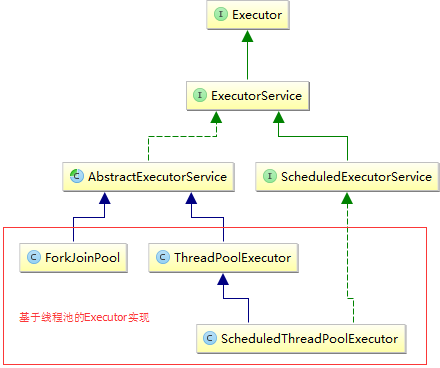

# executors相关类继承结构图



# Executor

```java
/**
  * @since 1.5
  */
public interface Executor {

    /**
     * 在将来的某个时间执行提供的command,这个command可能会在一个新的线程中执行.
     * 或者在一个线程池中执行，或者在调用线程(the calling thread)中执行.取决于具体的实现
     *
     * @throws RejectedExecutionException 如果这个task不可以被接受执行的话.
     * @throws NullPointerException if command is null
     */
    void execute(Runnable command);
}
```

# ExecutorService

```java
public interface ExecutorService extends Executor {
    
        void shutdown();
    
        List<Runnable> shutdownNow();
    
        boolean isShutdown();
    
        boolean isTerminated();
    
        boolean awaitTermination(long timeout, TimeUnit unit)
            throws InterruptedException;
    
        <T> Future<T> submit(Callable<T> task);
    
        <T> Future<T> submit(Runnable task, T result);
    
        Future<?> submit(Runnable task);
}
```

# ScheduledExecutorService

```java
public interface ScheduledExecutorService extends ExecutorService {

    public ScheduledFuture<?> schedule(Runnable command,
                                       long delay, TimeUnit unit);

    public <V> ScheduledFuture<V> schedule(Callable<V> callable,
                                           long delay, TimeUnit unit);

    public ScheduledFuture<?> scheduleAtFixedRate(Runnable command,
                                                  long initialDelay,
                                                  long period,
                                                  TimeUnit unit);

    public ScheduledFuture<?> scheduleWithFixedDelay(Runnable command,
                                                     long initialDelay,
                                                     long delay,
                                                     TimeUnit unit);
}
```

# AbstractExecutorService

```java
/**
  * @since 1.5
  */
public abstract class AbstractExecutorService implements ExecutorService {}
```

# ThreadPoolExecutor

```java
/*
 * @since 1.5
 */
public class ThreadPoolExecutor extends AbstractExecutorService {
    
    // 用给定的初始参数和默认的线程工厂及默认的被拒绝的执行处理程序创建新的 ThreadPoolExecutor 
    public ThreadPoolExecutor(int corePoolSize, int maximumPoolSize, long keepAliveTime,
                                  TimeUnit unit,BlockingQueue<Runnable> workQueue) {}
    
    //  用给定的初始参数和给定的线程工厂，默认的被拒绝的执行处理程序以及创建新的 ThreadPoolExecutor
    public ThreadPoolExecutor(int corePoolSize,int maximumPoolSize,long keepAliveTime,
                              TimeUnit unit,BlockingQueue<Runnable> workQueue,ThreadFactory threadFactory) {}
    
    //  用给定的初始参数和默认的线程工厂，以及给定的被拒绝的执行处理程序以及创建新的 ThreadPoolExecutor
    public ThreadPoolExecutor(int corePoolSize,int maximumPoolSize,long keepAliveTime,
                              TimeUnit unit,BlockingQueue<Runnable> workQueue,RejectedExecutionHandler handler) {
    }
    
    // 用给定的初始参数创建新的 ThreadPoolExecutor。 
    public ThreadPoolExecutor(int corePoolSize,int maximumPoolSize,long keepAliveTime,
                              TimeUnit unit,BlockingQueue<Runnable> workQueue,ThreadFactory threadFactory,
                              RejectedExecutionHandler handler) {
    }

}
```

# ScheduledThreadPoolExecutor

```java
// @since 1.5
public class ScheduledThreadPoolExecutor
    extends ThreadPoolExecutor
    implements ScheduledExecutorService {}
```

# Callable

```java
@FunctionalInterface
public interface Callable<V> {
    /**
     * Computes a result, or throws an exception if unable to do so.
     */
    V call() throws Exception;
}

```