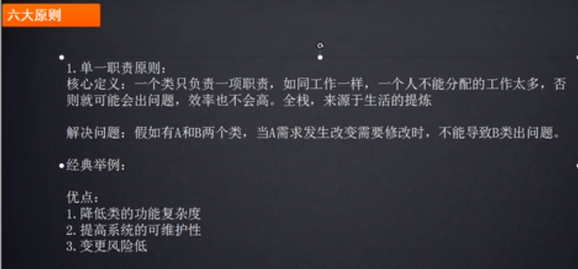

# 设计模式6大核心原则

- 职责单一原则
- 里氏替换原则
- 开闭原则

# 职责单一原则

>做一个类/方法,尽量让这个方法/类职责单一,一个方法,一坨,百十来行代码,改都不敢改.

    方法里面处理的功能职责单一,就不太容易出错.否则方法里面一堆if-else,时间长了,容易出错.
    一个方法里面有几百行代码,从头看到尾, 这样很容易出问题,

    一个方法几百行代码, 要拆分成一个个的子方法, 这是面向对象的非常重要的思想,不要在一个方法中做过多的事情.

