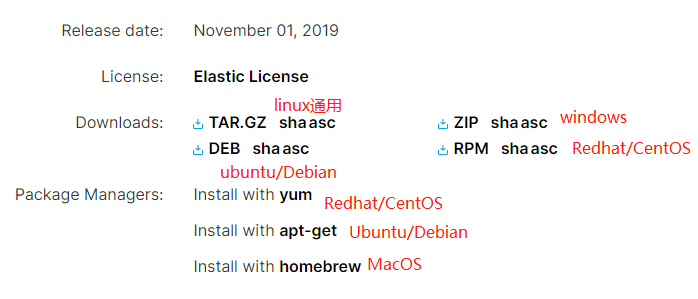

# LINUX常用命令



- [Linux命令大全](http://man.linuxde.net/)

```shell script
# 可以查看当前活跃的用户列表
w

# 查看java的位置
whereis java

# recursively create directory.
mkdir -p dirname

# 创建符号链接,create a symlink at /usr/bin/bar which references the original file /opt/foo
ln -s /opt/foo /usr/bin/bar

# c是压缩compress, z表示gzip格式的压缩,v表示显示文件目录,f表示显示文件名
tar -czvf myshop.tar.gz .
tar -zxvf aaa.tar.gz -C /usr/local

# 查看linxu系统的版本
cat /etc/os-release

# 查看Linux内核版本命令
cat /proc/version

uname -a

lsb_release -a

cat /etc/issue

# 这种方法只适合Redhat系的Linux(可以看到Centos的版本是哪个)
cat /etc/redhat-release

# 查找文件,注意有的linux版本后面的关键字如果是模糊匹配，需要加引号，有的不用
# 所以我们统一使用引号包裹关键字.
find ./ -name "config*"
find . -name "*.xml"

# 递归查找所有包含hello的xml文件
find . -name "*.xml" | xargs grep "hello"

# 查找当前目录中的"文件名"包含所有sh文件.
ls -l | grep 'sh'

# 建立链接
ln

# 列出所有信号名称：
kill -l

# 终止进程,只有第9种信号(SIGKILL-强制终止)
# 才可以无条件终止进程，其他信号进程都有权利忽略
kill -9 [pid] [pid]

# 查看所有的环境变量值
env

printenv

# windows下查看环境变量PATH:
echo %PATH%

# 指定现在立即关机
`shutdown -h now`

# 指定5分钟后关机，同时送出警告信息给登入用户
`shutdown +5 "System will shutdown after 5 minutes"`

# 重开机
reboot

# 做个重开机的模拟（只有纪录并不会真的重开机）
reboot -w

# 修改域名和ip的映射
vi /etc/hosts

# java.net.InetAddress获取的主机名称是从
/etc/sysconfig/network中读取,然后会连接这个主机名称对应的域名(/etc/hosts)

#如果需要永久修改hostname可通过如下命令
vi /etc/sysconfig/network
修改其中的HOSTNAME项，不过此种方法需要重启后生效.

# 查看文件，包括隐藏文件
ls -alh

# 切换用户
su - username

tail -f filename
```

# curl

```shell script
# 使用cURL命令(catch url)来测试
curl -X POST url;
curl -X GET url;
curl -H "name:xzj" -H "id:1" http://localhost:9090/mvc/headers
curl -H "Content-Type:text/html" http://127.0.0.1:9090/mvc/produceConsumer
curl -H "Content-Type:text/html" -H "Accept:application/json" -i http://127.0.0.1:9090/mvc/produceConsumer
curl -H "Content-Type:text/html" -H "Accept:application/xml" -i http://127.0.0.1:9090/mvc/produceConsumer
curl http://localhost:9090/mvc/pathVar/10/Lisa;
curl http://localhost:9090/mvc/obj?id=20;
```