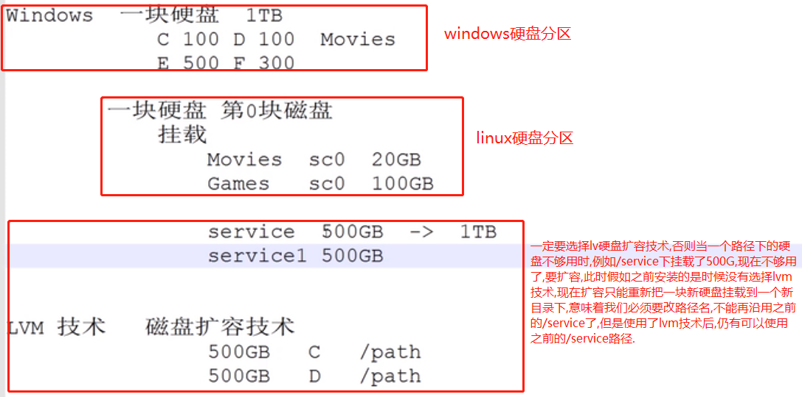

# 虚拟机的安装注意事项

磁盘分区的时候,一定要选择LVM技术,叫磁盘扩容技术.



安装的时候一定不要配置自动更新软件,否则一旦你配置了自动更新,一旦你更新了软件,你就要重启机器,而且自动更新的频率是很高的,你的机器就要不断重启,一重启就要停止服务,这个是很可怕的.

- [虚拟机安装ubuntu server视频](https://www.bilibili.com/video/av29384041/?p=9)

# Ubuntu常用命令

```shell script
apt-get install nginx

# 卸载一个软件(以下这个命令会连同依赖一起卸载,这叫干净卸载)
apt-get autoremove nginx
```

# Ubuntu数据源

	/etc/apt/sources.list

# Ubuntu安装jdk

```shell script
tar -zxvf jdk-8u152-linux-x64.tar.gz
mkdir -p /usr/local/java

# 移动安装包
mv jdk1.8.0_152/ /usr/local/java/

# 设置所有者
chown -R root:root /usr/local/java/

# 配置系统环境变量
vim /etc/environment
# 添加如下语句
PATH="/usr/local/sbin:/usr/local/bin:/usr/sbin:/usr/bin:/sbin:/bin:/usr/games:/usr/local/games"
export JAVA_HOME=/usr/local/java/jdk1.8.0_152
export JRE_HOME=/usr/local/java/jdk1.8.0_152/jre
export CLASSPATH=$CLASSPATH:$JAVA_HOME/lib:$JAVA_HOME/jre/lib

# 配置用户环境变量
vim /etc/profile
# 在中间加入
export JAVA_HOME=/usr/local/java/jdk1.8.0_152
export JRE_HOME=/usr/local/java/jdk1.8.0_152/jre
export CLASSPATH=$CLASSPATH:$JAVA_HOME/lib:$JAVA_HOME/jre/lib
export PATH=$JAVA_HOME/bin:$JAVA_HOME/jre/bin:$PATH:$HOME/bin

# 使用户环境变量生效
source /etc/profile

# 为其他用户更新用户环境变量
su lusifer
source /etc/profile
```

- [视频演示](https://www.bilibili.com/video/av27165645/)

## /etc/profile.d和/etc/profile的关系

在/etc/profile.d/创建java.sh，然后输入:

```shell
export JAVA_HOME=/usr/java/jdk-8u101-linux-x64
export CLASSPATH=.:$JAVA_HOME/jre/lib/rt.jar:$JAVA_HOME/lib/dt.jar:$JAVA_HOME/lib/tools.jar
export PATH=$PATH:$JAVA_HOME/bin
```

在/etc/profile中会遍历/etc/profile.d下的sh，然后自动source.
