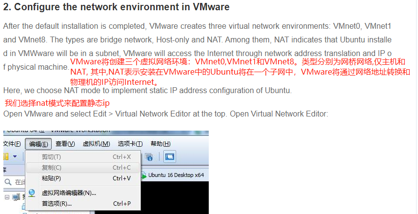
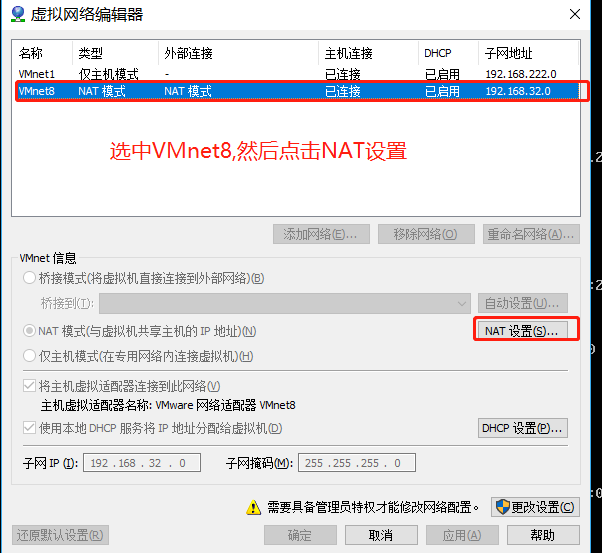
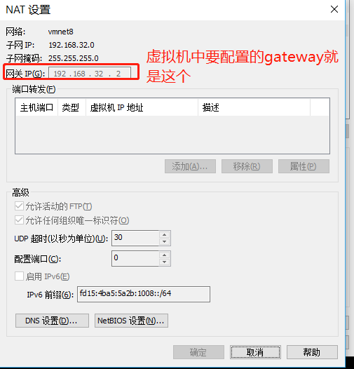
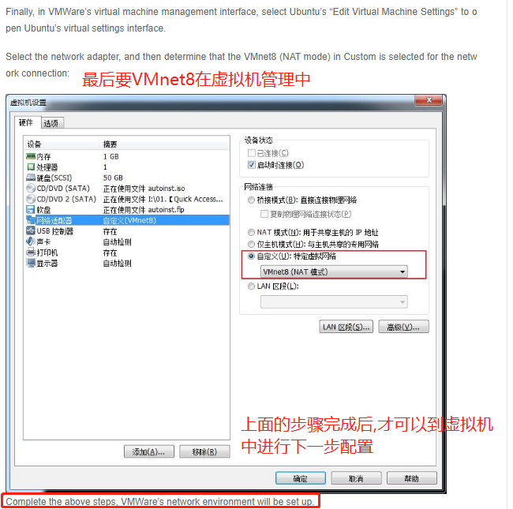
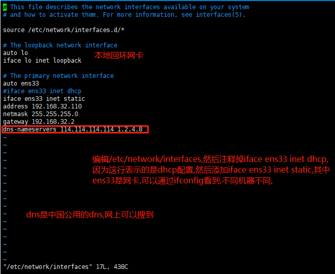
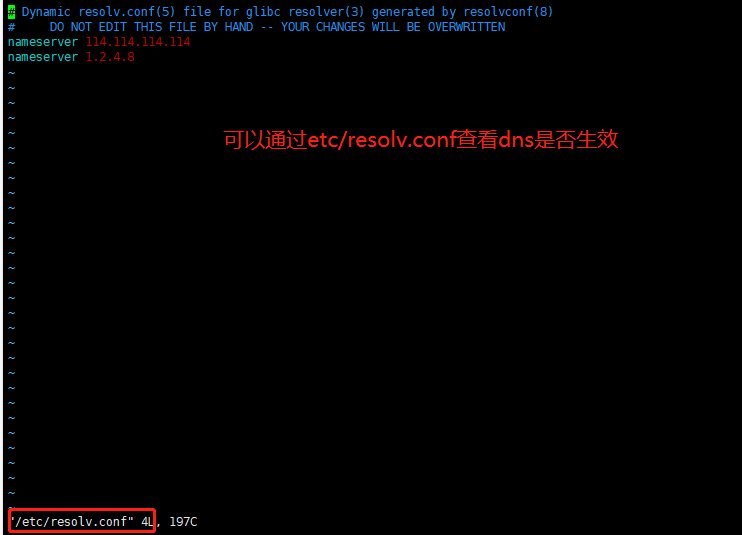

# ubuntu 16.04 虚拟机设置静态ip













```shell script
# 网卡重启
ifconfig eth0 down (可能需要把eth0改为ens33)
ifconfig eth0 up (可能需要把eth0改为ens33)
```



# 遇到虚拟机开机由于无法连接网络而无法启动该怎么办?

    一直等到检测网络的时间过去之后,开机起来,按照上面的步骤修改ip和dns即可.
    
    其次要注意: windows上要把VMWare DHCP Service和VMWare NAT Service开启,否则会连不上网络.
    