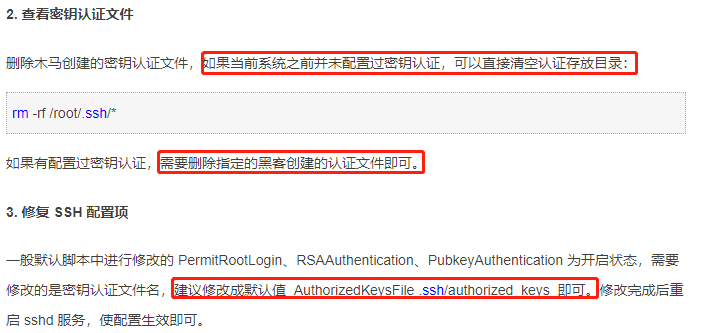
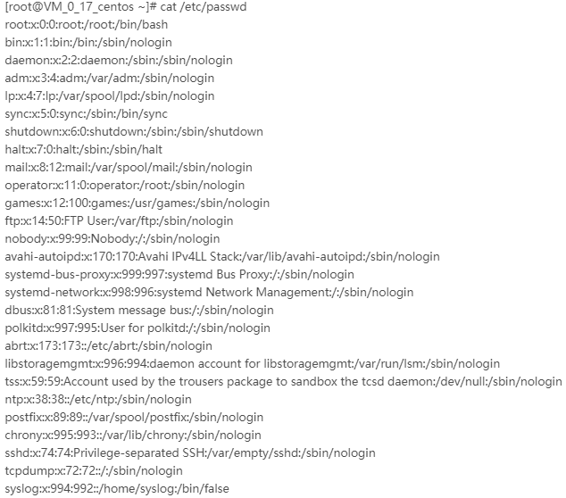
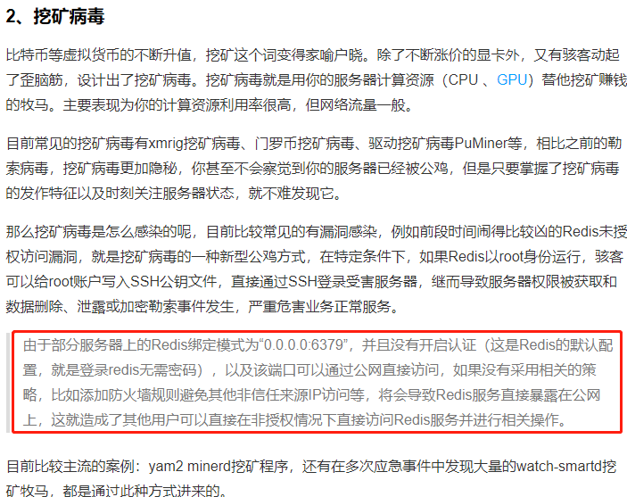
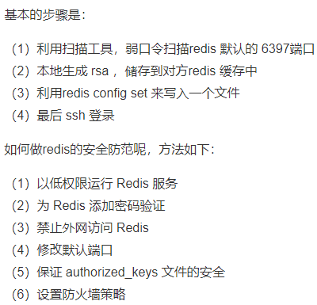
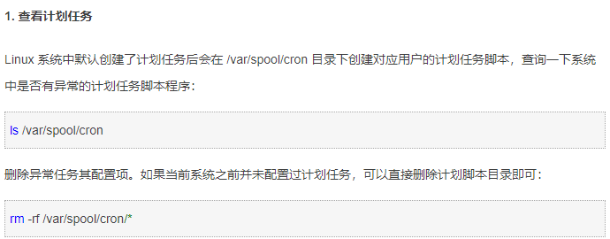

# 免密登录

# /etc/passwd下的常见账户

# 挖矿病毒

# 自己的云服务中挖矿病毒经历

由于redis没有设置连接密码,导致中挖矿病毒: xmrig-notls.

可以将22端口改成其它的端口更保险

# 如何解决: There were 49 failed login attempts？

目前已有的解决办法如下：

1. 使用 ssh-keygen，禁用密码登陆
2. 使用PAM模块，参考HowTo: Configure Linux To Track and Log Failed Login Attempt Records，其实就是登陆尝试次数设置和延时

我的解决思路如下：

1. 通过脚本获取尝试登陆失败的IP
2. 将获取的IP写入到/etc/hosts.deny文件，进行屏蔽
3. 使用inotify-tools，监控/var/log/secure文件，来实时更新/etc/hosts.deny文件

- [http://www.novicex.cn/post/y20.html](http://www.novicex.cn/post/y20.html)

总结：生产环境再怎么注重安全都不为过，下面给出几条自己总结的建议

.在生产环境中建议修改ssh的默认远程端口。

2.用户的密码尽量设置的复杂

3.root用户尽量不要允许直接登陆操作系统

 4.启用防火墙

修改ssh端口

编辑/etc/ssh/sshd_config文件中的Port 22将22修改为其他端口

2
禁止root用户登陆

编辑/etc/ssh/sshd_config文件中的PermitRootLogin 修改为no

9.Linux后门入 侵检测工具chkrootkit、RKHunter应用案例

crontab -l