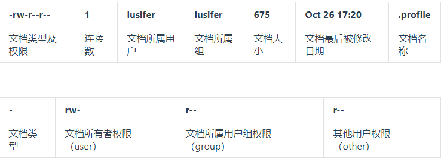
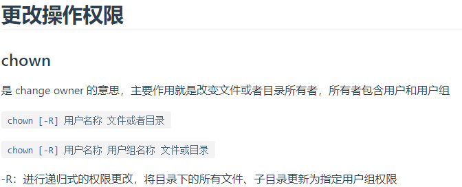
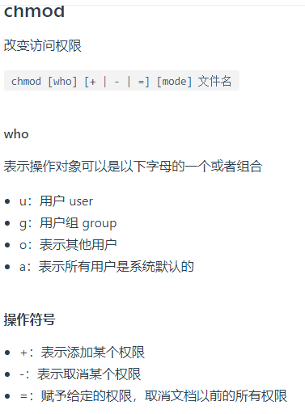
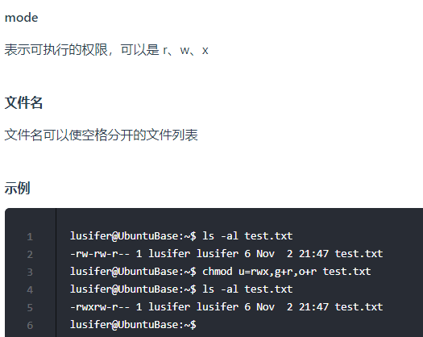
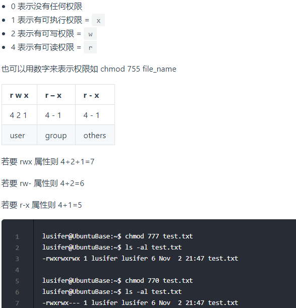

# Linux的文件权限

在Linux中文件的权限分为读(readable)、写(writable)和执行(excutable).

每个文件都有3个组,分别是文件的所属用户(owner)，所属组(group)和其他用户(other)，通过这样的机制来限制哪些用户、哪些组可以对特定的文件进行什么样的操作。

通过 **`ls -l`** 命令我们可以  查看某个目录下的文件的权限

示例：在随意某个目录下`ls -l`

第一列的内容的信息解释如下：

# 文件的类型、Linux中权限以及文件有所有者、所在组、其它组具体是什么？

**Linux支持5种文件类型:**

- 普通文件,使用-表示
- 链接文件,使用l表示（可以认为是window中的快捷方式）
- 目录文件,使用d表示
- 设备文件(包括硬盘，打印机等)
- 命名管道(可以通过该文件完成进程间通信)

**Linux中权限分为以下几种：**

- r：代表权限是可读，r也可以用数字4表示
- w：代表权限是可写，w也可以用数字2表示
- x：代表权限是可执行，x也可以用数字1表示

**文件和目录权限的区别：**

 对文件和目录而言，读写执行表示不同的意义。
 
 对于文件：

| 权限名称      |   可执行操作  | 
| :-------- | --------:|
|  r | 可以使用cat查看文件的内容 |  
|w  |   可以修改文件的内容 | 
| x     |    可以将其运行为二进制文件 |

 对于目录：

| 权限名称      |   可执行操作  | 
| :-------- | --------:|
|  r | 可以查看目录下的文件列表 |  
|w  |   可以创建和删除目录下的文件 | 
| x     |    可以使用cd进入目录 |

**需要注意的是超级用户可以无视普通用户的权限，即使文件目录权限是000，依旧可以访问。**

**在linux中的每个用户必须属于一个组，不能独立于组外。在linux中每个文件都有有所有者、所在组、其它组的概念。**

- **所有者**

  一般为文件的创建者，谁创建了该文件，就天然的成为该文件的所有者，用ls ‐ahl命令可以看到文件的所有者 也可以使用chown 用户名  文件名 来修改文件的所有者 。

- **文件所在组**
 
  当某个用户创建了一个文件后，这个文件的所在组就是该用户所在的组 用ls ‐ahl命令可以看到文件的所有组 也可以使用chgrp  组名  文件名 来修改文件所在的组。 
  
- **其它组**

  除开文件的所有者和所在组的用户外的组 

# 如何修改文件/目录的权限:

**修改文件/目录的权限的命令：`chmod`**

示例：修改/test下的aaa.txt的权限为属主有全部权限，属主所在的组有读写权限，
其他用户只有读的权限

**`chmod u=rwx,g=rw,o=r aaa.txt`**

上述示例还可以使用数字表示：

chmod 764 aaa.txt

>给用户的所有者,所在组,以及其他组`增加可执行权限: chomd +x file`

- [来源](https://www.funtl.com/zh/linux/Linux-%E6%96%87%E4%BB%B6%E6%9D%83%E9%99%90%E7%AE%A1%E7%90%86.html#%E6%9B%B4%E6%94%B9%E6%93%8D%E4%BD%9C%E6%9D%83%E9%99%90)

# 补充一个比较常用的东西

假如我们装了一个zookeeper，我们每次开机到要求其自动启动该怎么办？

1. 新建一个脚本zookeeper
2. 为新建的脚本zookeeper添加可执行权限，命令是:`chmod +x zookeeper`(3个组都会添加上可执行权限)
3. 把zookeeper这个脚本添加到开机启动项里面，命令是：` chkconfig --add  zookeeper`
4. 如果想看看是否添加成功，命令是：`chkconfig --list`
