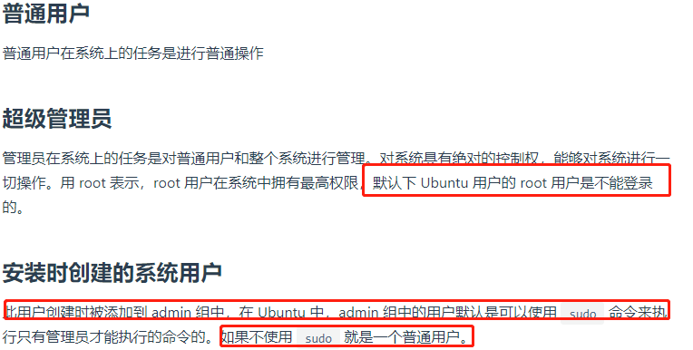
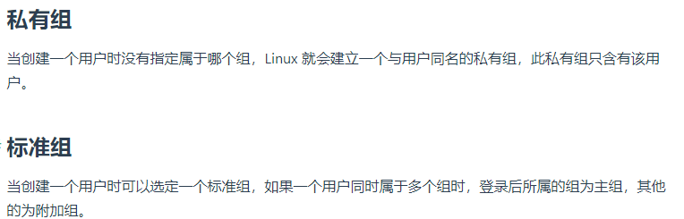
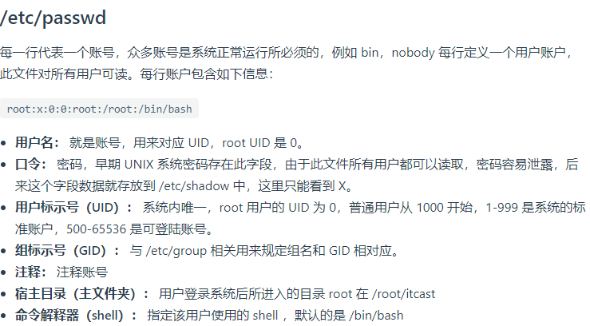
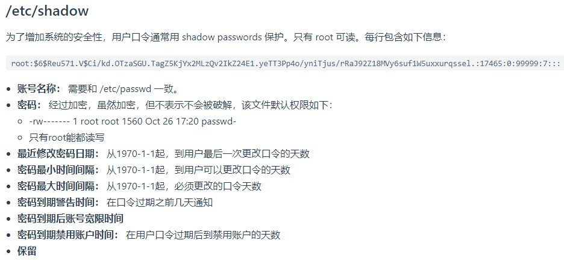
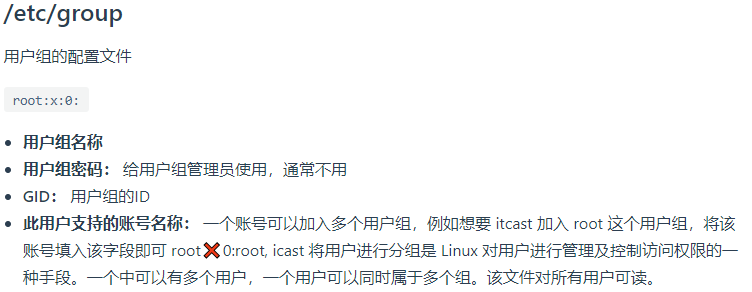
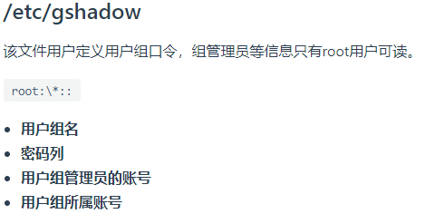
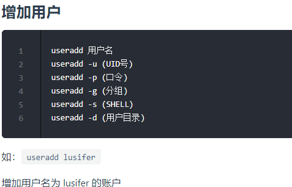
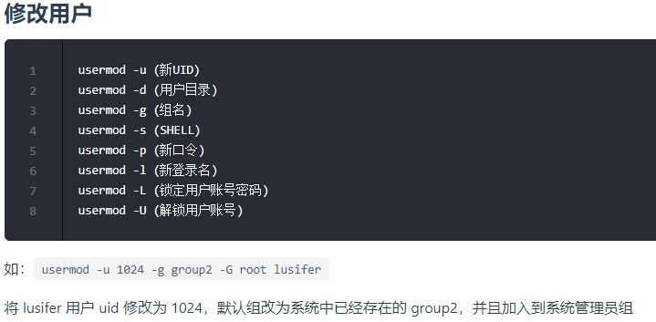
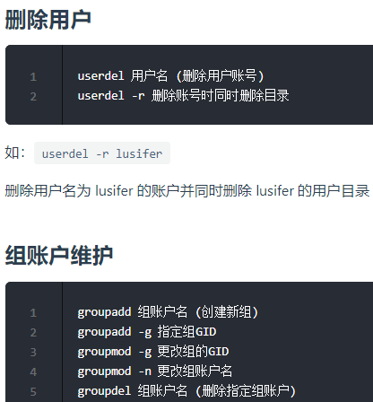
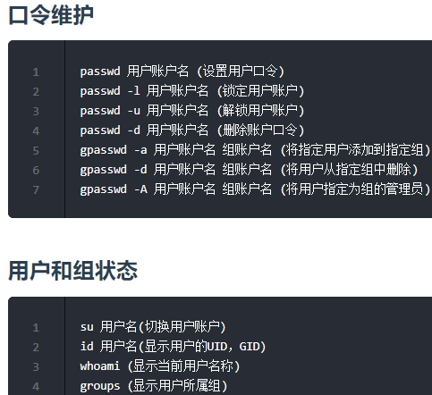

# 使用root用户

```shell script
# Linux 系统默认是关闭 Root 账户的,也就是默认root是没有密码的
# linux下登录一个账户必须要秘密,没有密码无法登录,这种是最安全的,因为外界不可能登录root账户
# 我们需要为 Root 用户设置一个初始密码才可以使用:
sudo passwd root

# 切换到root用户
su

# linux默认不允许远程登录root账号,所以要修改配置允许远程登录 Root
vim /etc/ssh/sshd_config
# 注释此行: # PermitRootLogin without-password
# 加入此行: PermitRootLogin yes   

# 重启服务
service ssh restart
```

>按照系统运维管理的规范,是不可以直接使用超级管理员的,必须使用代理账户或指定的权限账户.

    tips: guests: 来宾,客户,只能看,其他的删除,创建都没有权限.

# Linux用户账户说明

一个用户必须隶属于一个组,不然这个用户什么权限都没有,因为权限是赋予组的,一个用户属于这个组,就拥有了这个组的所有权限.当然一个用户可以属于多个组,这样这个 用户就拥有了这些组的所有权限.

当一个用户同时属于多个组中时，在/etc/passwd 文件中记录的是用户所属的主组，也就是登录时所属的默认组

用户的账号可以帮助系统管理员对使用系统的用户进行跟踪，并控制他们对系统资源的访问.








---
    /etc/group 中的每条记录分四个字段：
    
    1. 第一字段：用户组名称
    2. 第二字段：用户组口令，一般不用,一般为空
    3. 第三字段：GID(组标识号)
    4. 第四字段：组内的用户列表.
---







