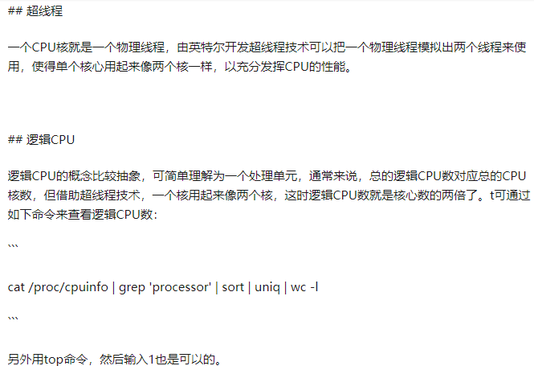
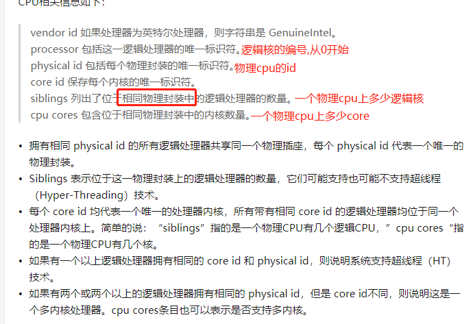
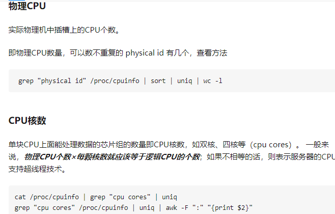
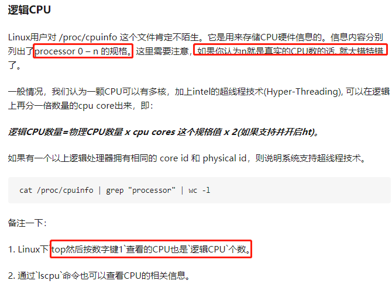
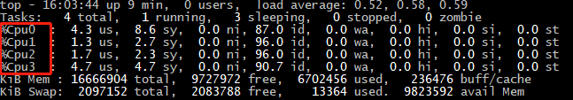

# Linux查看物理CPU个数、核数、逻辑CPU个数




    物理cpu个数：主板上实际插入的cpu数量，也就是不重复的 physical id 有几个
    cat /proc/cpuinfo| grep "physical id"| sort| uniq| wc -l

    每个物理cpu中core的个数(核数)：单块CPU上面能处理数据的芯片组的数量，如双核、四核等 （cpu cores）
    cat /proc/cpuinfo| grep "cpu cores"| uniq
    
    每个core中逻辑cpu的个数,也就是每个core超线程的个数,假设每个核超线程的个数为2
    也就是这两个超线程共享一个core的资源.
    cat /proc/cpuinfo | grep 'processor' | sort | uniq | wc -l

    逻辑CPU数 = 物理CPU个数 X 每个物理的核数 X 超线程数
    
    查看cpu信息（型号）
    cat /proc/cpuinfo | grep name | cut -f2 -d: | uniq -c

>可以在自己的windows上查看,我自己的电脑是1个物理cpu,2个cpu core,4个逻辑cpu.









```shell script
cat /proc/cpuinfo

processor       : 0
vendor_id       : GenuineIntel
cpu family      : 6
model           : 69
model name      : Intel(R) Core(TM) i5-4258U CPU @ 2.40GHz
stepping        : 1
microcode       : 0xffffffff
cpu MHz         : 2401.000
cache size      : 256 KB
physical id     : 0
siblings        : 4
core id         : 0
cpu cores       : 2
apicid          : 0
initial apicid  : 0
fpu             : yes
fpu_exception   : yes
cpuid level     : 6
wp              : yes
flags           : fpu vme de pse tsc msr pae mce cx8 apic sep mtrr pge mca cmov pat pse36 clflush dts acpi mmx fxsr sse sse2 ss ht tm pbe syscall nx pdpe1gb rdtscp lm pni pclmulqdq dtes64 monitor ds_cpl vmx est tm2 ssse3 fma cx16 xtpr pdcm pcid sse4_1 sse4_2 x2apic movbe popcnt tsc_deadline_timer aes xsave osxsave avx f16c rdrand
bogomips        : 4802.00
clflush size    : 64
cache_alignment : 64
address sizes   : 36 bits physical, 48 bits virtual
power management:

processor       : 1
vendor_id       : GenuineIntel
cpu family      : 6
model           : 69
model name      : Intel(R) Core(TM) i5-4258U CPU @ 2.40GHz
stepping        : 1
microcode       : 0xffffffff
cpu MHz         : 2401.000
cache size      : 256 KB
physical id     : 0
siblings        : 4
core id         : 0
cpu cores       : 2
apicid          : 0
initial apicid  : 0
fpu             : yes
fpu_exception   : yes
cpuid level     : 6
wp              : yes
flags           : fpu vme de pse tsc msr pae mce cx8 apic sep mtrr pge mca cmov pat pse36 clflush dts acpi mmx fxsr sse sse2 ss ht tm pbe syscall nx pdpe1gb rdtscp lm pni pclmulqdq dtes64 monitor ds_cpl vmx est tm2 ssse3 fma cx16 xtpr pdcm pcid sse4_1 sse4_2 x2apic movbe popcnt tsc_deadline_timer aes xsave osxsave avx f16c rdrand
bogomips        : 4802.00
clflush size    : 64
cache_alignment : 64
address sizes   : 36 bits physical, 48 bits virtual
power management:

processor       : 2
vendor_id       : GenuineIntel
cpu family      : 6
model           : 69
model name      : Intel(R) Core(TM) i5-4258U CPU @ 2.40GHz
stepping        : 1
microcode       : 0xffffffff
cpu MHz         : 2401.000
cache size      : 256 KB
physical id     : 0
siblings        : 4
core id         : 1
cpu cores       : 2
apicid          : 0
initial apicid  : 0
fpu             : yes
fpu_exception   : yes
cpuid level     : 6
wp              : yes
flags           : fpu vme de pse tsc msr pae mce cx8 apic sep mtrr pge mca cmov pat pse36 clflush dts acpi mmx fxsr sse sse2 ss ht tm pbe syscall nx pdpe1gb rdtscp lm pni pclmulqdq dtes64 monitor ds_cpl vmx est tm2 ssse3 fma cx16 xtpr pdcm pcid sse4_1 sse4_2 x2apic movbe popcnt tsc_deadline_timer aes xsave osxsave avx f16c rdrand
bogomips        : 4802.00
clflush size    : 64
cache_alignment : 64
address sizes   : 36 bits physical, 48 bits virtual
power management:

processor       : 3
vendor_id       : GenuineIntel
cpu family      : 6
model           : 69
model name      : Intel(R) Core(TM) i5-4258U CPU @ 2.40GHz
stepping        : 1
microcode       : 0xffffffff
cpu MHz         : 2401.000
cache size      : 256 KB
physical id     : 0
siblings        : 4
core id         : 1
cpu cores       : 2
apicid          : 0
initial apicid  : 0
fpu             : yes
fpu_exception   : yes
cpuid level     : 6
wp              : yes
flags           : fpu vme de pse tsc msr pae mce cx8 apic sep mtrr pge mca cmov pat pse36 clflush dts acpi mmx fxsr sse sse2 ss ht tm pbe syscall nx pdpe1gb rdtscp lm pni pclmulqdq dtes64 monitor ds_cpl vmx est tm2 ssse3 fma cx16 xtpr pdcm pcid sse4_1 sse4_2 x2apic movbe popcnt tsc_deadline_timer aes xsave osxsave avx f16c rdrand
bogomips        : 4802.00
clflush size    : 64
cache_alignment : 64
address sizes   : 36 bits physical, 48 bits virtual
power management:
```

    如果逻辑核数和cpu cores相等,说明不支持超线程技术.(也就是看siblings和cpu cores值是否相等)

# 什么是并发？

    并发指的是在同一时刻执行多个任务.

# 进程与线程

线程称为轻量级进程,线程必须存在于进程中。但是创建一个线程要消耗的资源通常比创建进程少的多。

每个进程至少要有一个线程作为程序的入口(主线程)

# 单核cpu

    一个物理cpu只有一个core
    
    一个物理cpu同一时刻只能处理一条指令.在任一时刻，只有一个进程的中一个线程在运行.

    笔者就曾经遇到过这样的面试题，什么情况下，一个计算机中任一时刻只会有一个线程在运行。
    这个问题很简单，只要你的 "CPU是单核" 的就行了.在单核CPU上，因为两个线程从来不会得到真正的并行执行.

# 多核cpu

    一个物理cpu只有多个core
    
    只有在有多个CPU的情况下，才能实现真正意义上的并行执行
