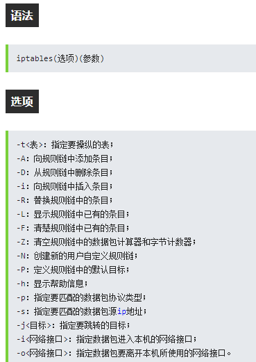
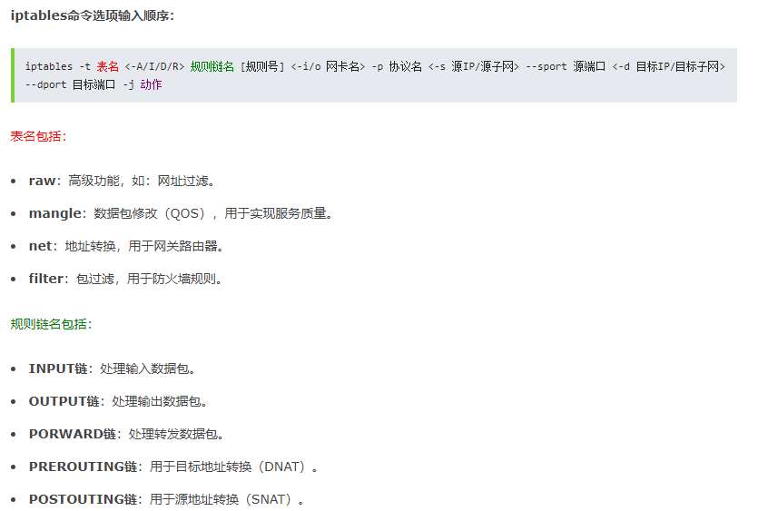
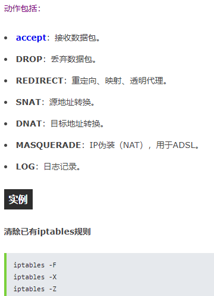
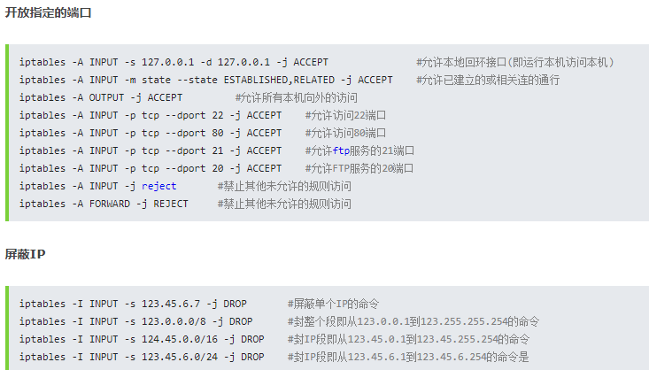
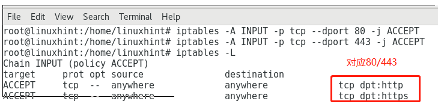

# 防火墙

- firewalld
- iptables

# firewall常用命令

Firewalld是CentOS 7，Red Hat Enterprise Linux 7（RHEL 7），Fedora 18+以及其他一些流行的Linux发行版的默认防火墙程序。它对于管理IPv4和IPv6网络非常有用。 它易于使用命令行界面（CLI），是iptables的绝佳替代品。

在本文中，我将向您展示如何列出Firewalld中的开放端口。 我将使用CentOS 7.4进行演示，但是相同的命令应该适用于安装了Firewalld的任何Linux发行版。 让我们开始吧。

CentOS中常用的防火墙程序主要是firewall和iptables，CentOS7中firewall服务已经默认安装好了，而iptables服务需要自己用yum  install  iptabes-services来安装。

配置防火墙程序后，默认情况下会阻止所有端口。 因此，即使service在服务器上的特定port上运行，client计算机也无法连接到该服务器。

```shell
systemctl status firewalld # 检查firewalld service是否在允许

systemctl start firewalld # 开启firewalld

systemctl disable firewalld # 禁用

systemctl stop firewalld 

# 开启firewalld之后,就可以使用firewall-cmd

# 查看防火墙状态
firewall-cmd  --state

# 打印所有的Firewalld配置
$ sudo firewall-cmd --list-all
# The open ports and services are listed in the services: and ports
# 开放的端口和服务列出来了

# 在services中,dhcpv6-client services are enabled. It means the ports corresponding to these services are also open.

# You can find out what ports these services open with the following command:
$ grep SERVICE_NAME /etc/services
$ grep ssh /etc/services
# 如你所看到的, the ssh service打开了tcp的22端口和udp的22端口.

# 只列出什么services有开放的端口
$ firewall-cmd --list-services

# 只看开放的端口(不包括services的端口)
$ firewall-cmd --list-ports

# 打开6379
firewall-cmd --permanent --add-port=6379/tcp

# 重新加载
firewall-cmd --reload

# 列出打开的端口(不包括services的端口)
firewall-cmd --list-ports

firewall-cmd --remove-port=6379/tcp
```

# iptables常用命令

>centos需要没有安装iptables,需要安装

我们在某一个时刻只能运行firewalld或者iptables,所以使用iptables之前,要先把firewalld给彻底disable了.而且不能让firewalld开机启动.等切换回firewalld的时候,也要把iptables给彻底关闭了,不能开机启动.

```shell script
# Disable FirewallD
# 禁止开机启动(注意此命令没有停止当前正在running的firewalld)
sudo systemctl disable firewalld

# 停止当前正在允许的firewalld
sudo systemctl stop firewalld

# 阻止其他服务启动firewalld,也包括阻止从命令行启动.
sudo systemctl mask --now firewalld

# Install and Enable Iptables
# 默认是没有/etc/sysconfig/iptables这个文件的.安装后才有
sudo yum install iptables-services

# 使用systemctl命令查看状态
systemctl status iptables
systemctl enable iptables
systemctl status iptables
systemctl restart iptables

# 或者使用service命令
service iptables status    #查看iptables状态
service iptables restart   #iptables服务重启
service iptables stop      #iptables服务禁用

# check the current iptables rules use the following commands(查看已添加的iptables规则):
iptables -nvL
# lists all iptables loaded rules
Iptables -L
#  the same with verbosity.
Iptables -L -v

# 将所有iptables以序号标记显示，执行：
iptables -L -n --line-numbers [-t 表名]

# -m = means “match”
```






## iptables增删改查

```shell script
# 比如要删除INPUT里序号为8的规则，执行：
iptables -D INPUT 8  

# 让所有的主机都可以通过tcp访问80/443
iptables -A INPUT -p tcp --dport 80 -j ACCEPT
iptables -A INPUT -p tcp --dport 443 -j ACCEPT
```



```shell script
# 我们告诉Iptables可以接收协议是TCP,访问端口80或443的流量

# 我们可以通过添加参数“-s”来更改命令以仅接受来自特定IP的连接：
iptables -A INPUT -s 127.0.0.1 -p tcp --dport 80 -j ACCEPT

# 现在,在结尾，让我们拒绝所有未接受的连接：
iptables -P OUTPUT ACCEPT
iptables -P INPUT DROP

# 其中-P用来定义规则链(如INPUT)的默认目标(或者说动作)，也就是这个规则链的默认策略，ACCEPT，DROP，QUEUE或RETURN。
# 在这种情况下，我们说OUTPUT的默认策略是接受，INPUT的默认策略是拒绝，除非我们在之前的规则中指定了不同的内容。这是一个非常基本的防火墙，它不包括许多攻击的规则，用于学习目的而不是用于生产.
```

```shell script
# 方式2: 永久添加iptable rule
vi /etc/sysconfig/iptables
```

## 参考

- [https://linuxhint.com/list_open_ports_firewalld/](https://linuxhint.com/list_open_ports_firewalld/)
- [https://linuxhint.com/open-port-80-centos7/](https://linuxhint.com/open-port-80-centos7/)
- [https://www.dreamvps.com/tutorials/open-port-in-centos-7-firewalld/](https://www.dreamvps.com/tutorials/open-port-in-centos-7-firewalld/)
- [https://www.codero.com/knowledge-base/content/10/377/en/how-to-manage-firewall-rules-in-centos-7.html](https://www.codero.com/knowledge-base/content/10/377/en/how-to-manage-firewall-rules-in-centos-7.html)
- [iptables](https://man.linuxde.net/iptables)
- [iptables](https://www.rootusers.com/how-to-install-iptables-firewall-in-centos-7-linux/)
- [iptables](https://linuxhint.com/iptables_for_beginners/)
- [iptables](http://www.zsythink.net/archives/1199)