# iptables详解

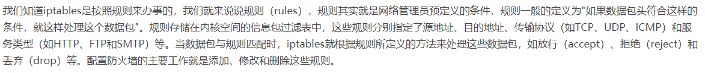

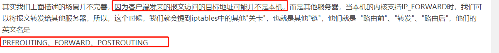
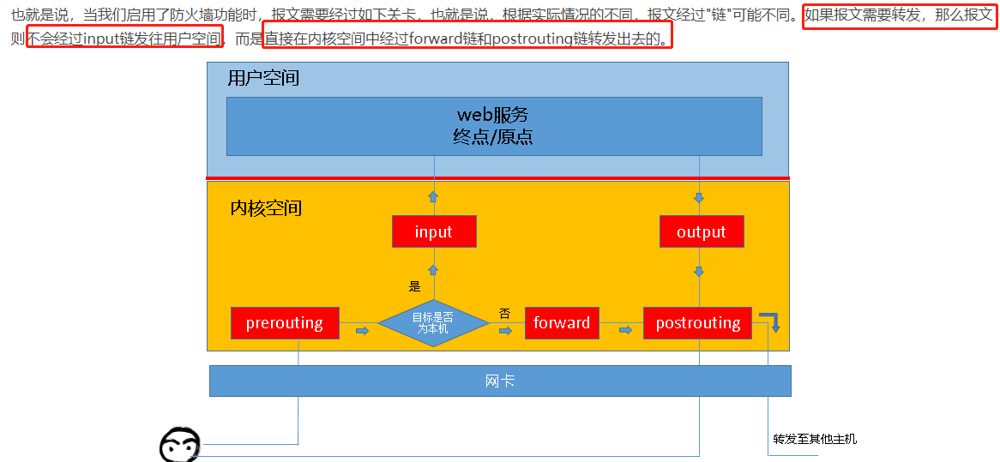
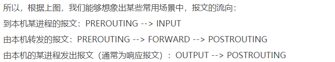
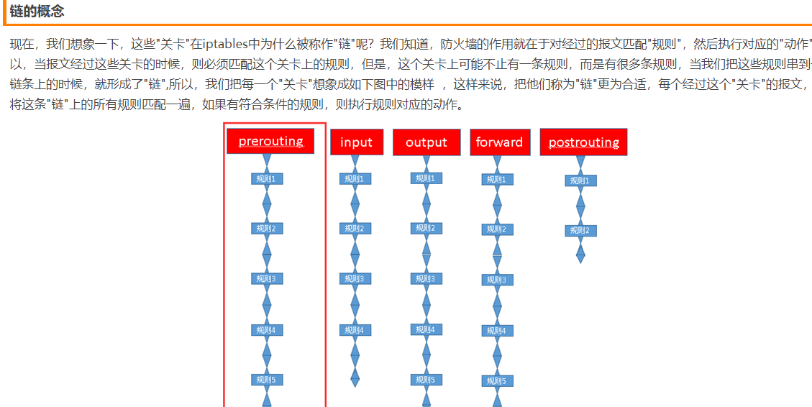
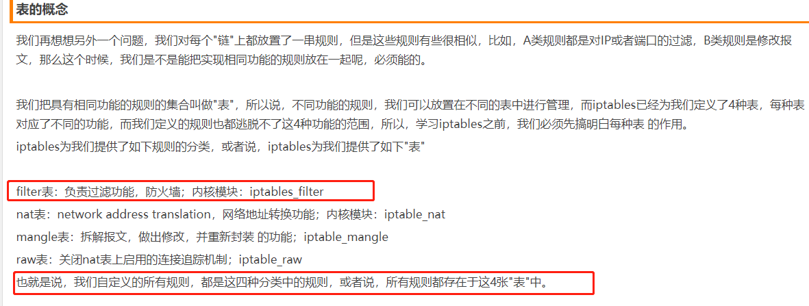
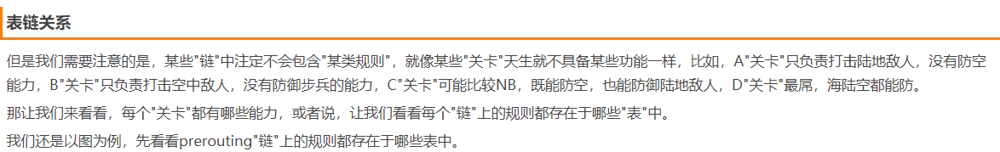
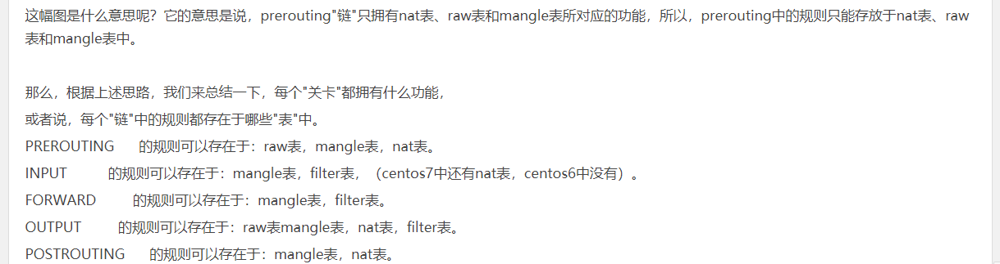
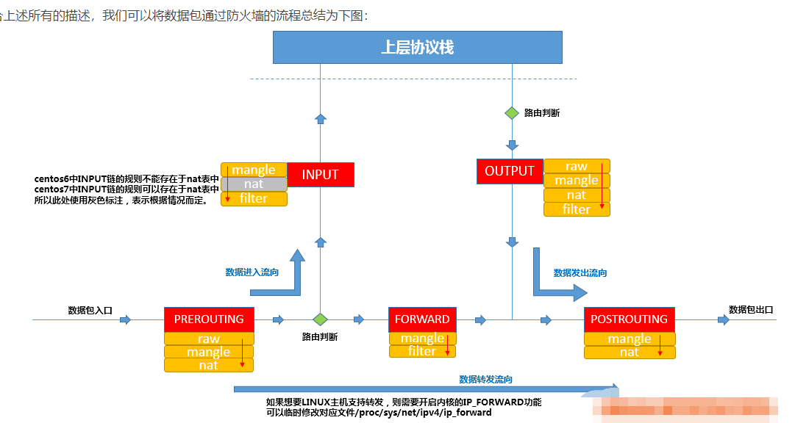
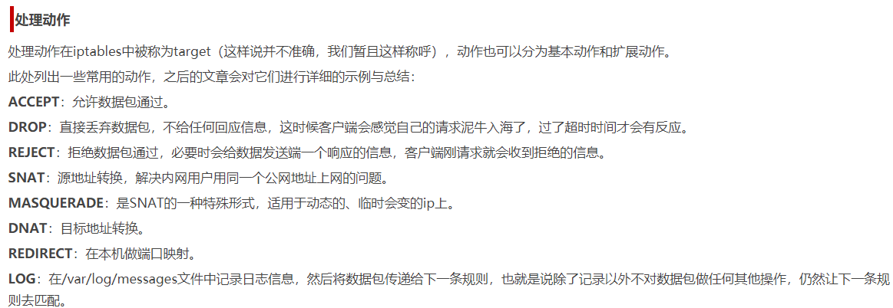

# iptabels实际操作之规则查询

```shell script
# 查看对应表的所有规则,省略-t 表名的时候表示操作的是filter表.
iptables -t 表名 -v -L

# 查看指定表的指定链中的规则
iptables -t 表名 -L 链名

# 查看对应表的所有规则,并在显示规则的时候,不对规则中的ip进行名称的反解析(显示的地址为0.0.0.0/0),-n选项表示不解析ip地址.
iptables -t 表名 -n -L

# 只查看某张表中的某条链
iptables -t filter -nvL INPUT
```

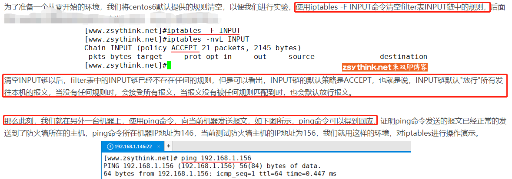
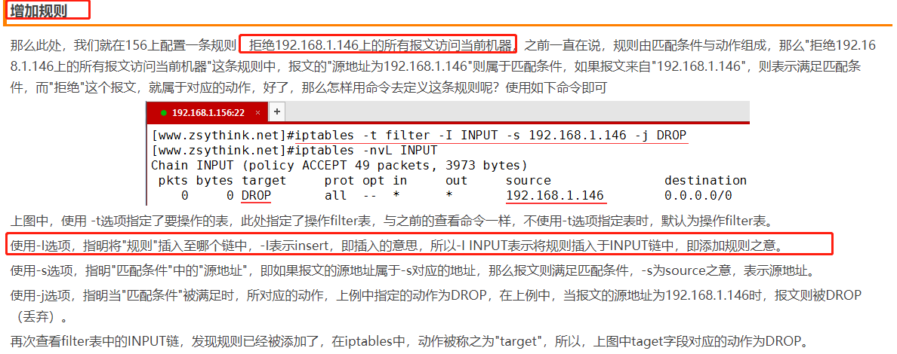
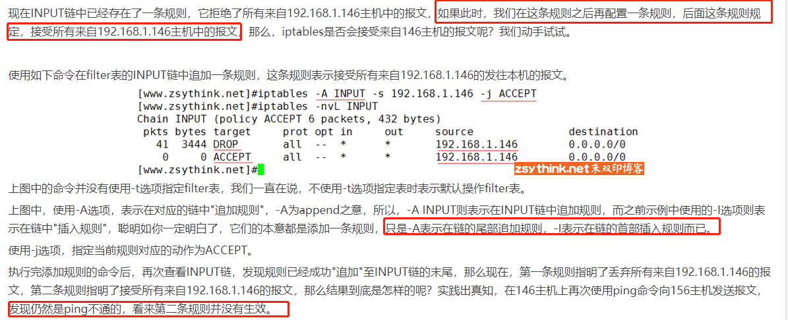
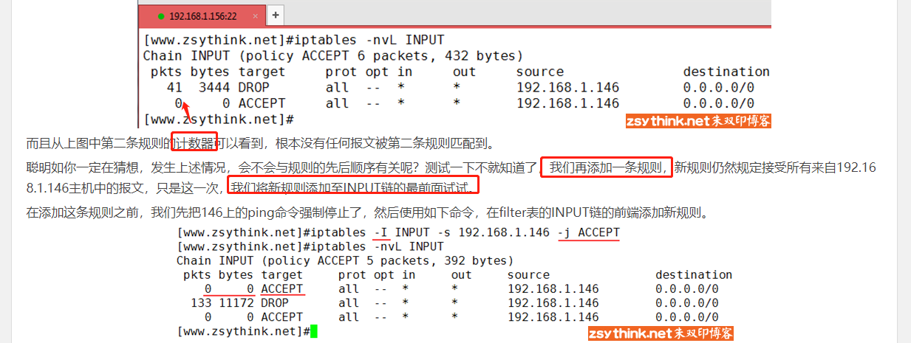
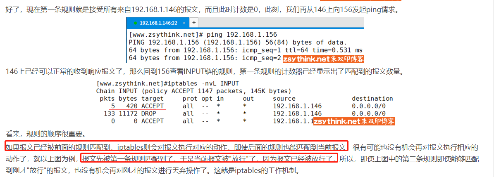
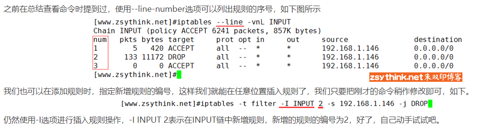

- [参考](http://www.zsythink.net/archives/1493)
- [参考](http://www.zsythink.net/archives/1517)
