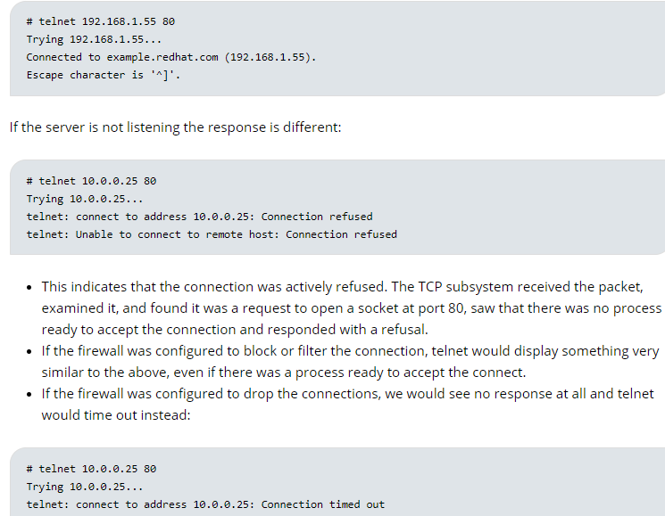

# 查看端口状态

```shell
netstat -tlpn | grep 800 # Check that the chosen port is already in use.

# To see if a program or process is listening on a port, ready to accept a packet, use the netstat command.
netstat -tulnp

t – Show TCP
u – Show UDP
l – Show only listening processes (netstat can show both listening and all established connections, i.e. as a client too)
n – Do not resolve network IP address names or port numbers
p – Show the process name that is listening on the port

# To see if a program or process is listening on a port, ready to accept a packet, use the ss program.
ss -nutlp

t – Display TCP sockets.
u – Display UDP sockets.
l – Display listening sockets
n – Do now try to resolve names
p – Show process using socket

#  查看当前系统的端口使用：
netstat -an

# 通过netstat命令观察tcp的socket连接信息
netstat -an | grep 220.181.57.216

# 查找某个文件相关的进程
lsof /bin/bash

# 列出某个用户打开的文件信息
lsof -u username

# 列出某个程序进程所打开的文件信息
# -c 选项将会列出所有以mysql这个进程开头的程序的文件
lsof -c mysql

# 通过某个进程号显示该进程打开的文件
lsof -p pid

# To list all the open ports on a system, use the following command to list the process name and number that has opened the ports.
lsof -i

# 列出所有tcp 网络连接信息
lsof -i tcp

# 列出谁在使用某个端口
#see what application is listening on port 80
lsof -i:3306

# 列出某个用户的所有活跃的网络端口
lsof -a -u test -i
```

# telnet使用

```shell
# 查看host的port端口
# The telnet application can be used for testing simple network socket 
# connectivity, but only for TCP connections, not UDP. For example, if 
# I wish to see if TCP port 80 on a system is ready to accept a # connection, I specify the IP address and the port for telnet:
telnet host port

telnet -help
telnet -e host port
```



## windows上解决SpringBoot内嵌服务器端口占用的问题

1. netstat  -ano|findstr  8080(查看占用8080端口的进程）
2. taskkill  /pid  6856  /f (运行windows自带taskkill命令，结束掉进程)