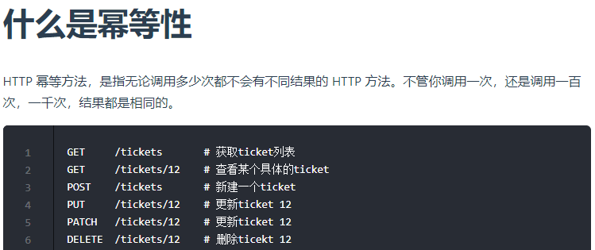
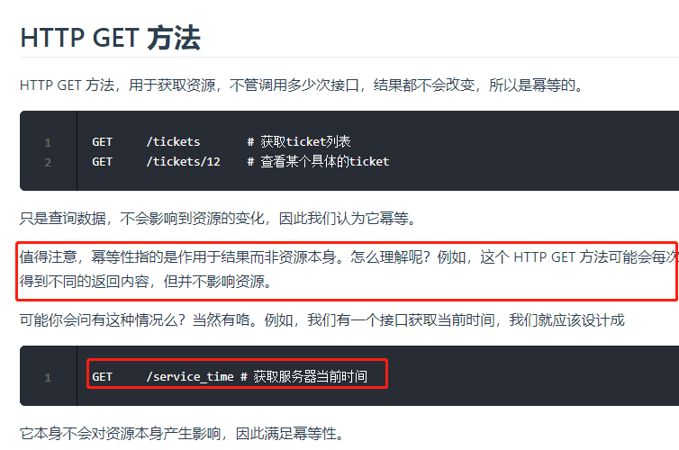
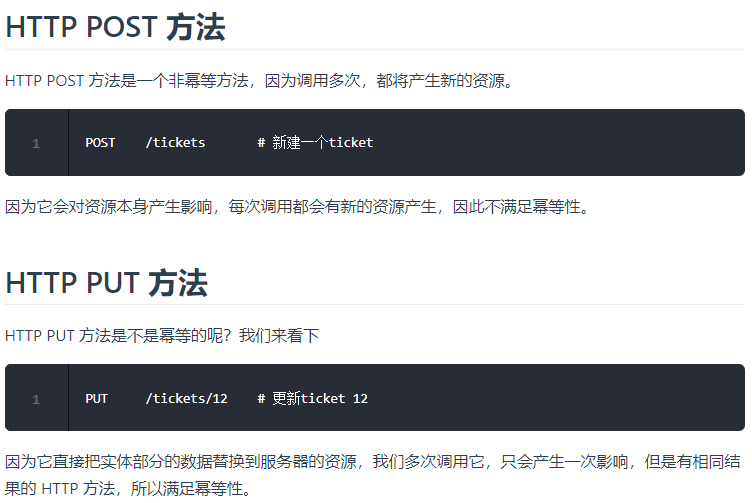
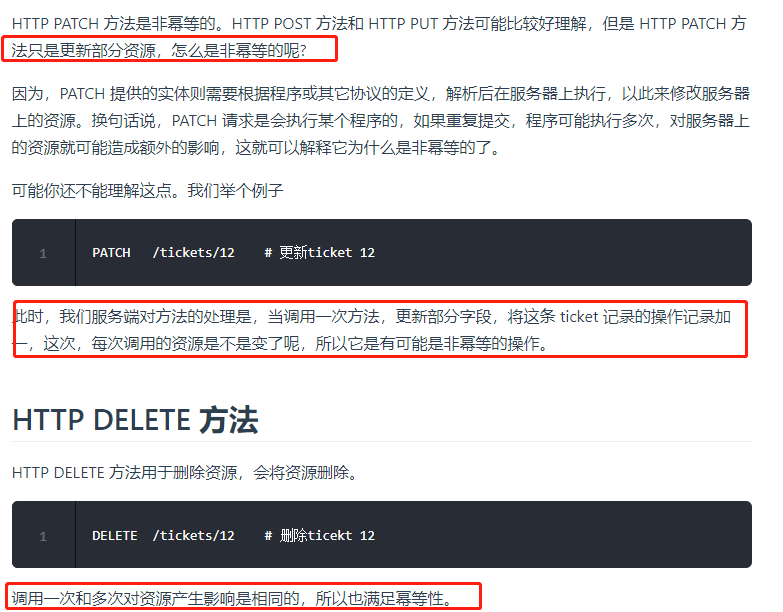
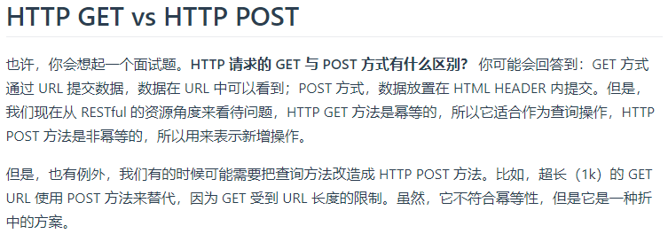

# HTTP方法:

    方法            描述	          是否包含主体    作用
	GET    从服务器端获取一份文档     no               主要用来获取资源
	POST   向服务器发送需要处理的数据  yes               主要用来想服务器发送数据
	PUT    只能完全替代原始资源，PATCH 允许部分修改 yes  
	DELETE 从服务器端删除一份文档        no
	HEAD   只获取服务器端文档的头部,不返回报文主体     no      主要用于确认 URL 的有效性以及资源更新的日期时间
	patch  对资源进行部分修改
	options 查询服务器支持的请求方法   会返回 `Allow: GET, POST, HEAD, OPTIONS` 这样的内容
	TRACE   服务器会将通信路径返回给客户端 通常不会使用 TRACE，并且它容易受到 XST 攻击（Cross-Site Tracing，跨站追踪）

# 状态码

服务器返回的  **响应报文**  中第一行为响应行，包含了状态码

1xx: Informational（信息性状态码）,请求正常处理完毕.
2xx : 处理成功
3xx : 重定向
4xx : 客户端错误
5xx : 服务端错误

- 200	  请求成功.
- **204 No Content** ：请求已经成功处理，但是返回的响应不包含响应主体。一般在只需要从客户端往服务器发送信息，而不需要返回数据时使用
- **206 Partial Content** ：表示客户端进行了范围请求，响应报文包含由 Content-Range 指定范围的实体内容
- **301 Moved Permanently** ：永久性重定向
-  **302 Found** ：临时性重定向
-  **304 Not Modified** ：如果请求报文首部包含一些条件，例如：If-Match，If-Modified-Since，If-None-Match，If-Range，If-Unmodified-Since，如果满足条件，则服务器会返回 304 状态码。你访问的资源未修改，所请求的资源未修改，浏览器读取缓存数据
-  **307 Temporary Redirect** ：临时重定向，与 302 的含义类似，但是 307 要求浏览器不会把重定向请求的 POST 方法改成 GET 方法
-  **400 Bad Request** ：请求语法错误，服务器无法理解
-  **401 Unauthorized** ：未授权
-  **403 Forbidden** ：请求不允许
-  **404 Not Found** 未找到资源.
-  **405  Method Not Allowed** 请求的方法不允许.
-  **500 Internal Server Error** ：服务器正在执行请求时发生错误。
-  **503 Service Unavailable** ：服务器暂时处于超负载或正在进行停机维护，现在无法处理请求。

# HTTPheader

通用header、请求header、响应header和body header

## 通用header

| 首部字段名 | 说明 |
|-----|---- |
| Cache-Control | 控制缓存的行为 |
| Connection | 控制不再转发给代理的首部字段、管理持久连接|
| Date | 创建报文的日期时间 |
| Pragma | 报文指令 |
| Trailer | 报文末端的首部一览 |
| Transfer-Encoding | 指定报文主体的传输编码方式 |
| Upgrade | 升级为其他协议 |
| Via | 代理服务器的相关信息 |
| Warning | 错误通知 |

## 请求header

| 首部字段名 | 说明 |
|-----|---- |
| Accept | 用户代理可处理的媒体类型 |
| Accept-Charset | 优先的字符集 |
| Accept-Encoding | 优先的内容编码 |
| Accept-Language | 优先的语言（自然语言） |
| Authorization | Web 认证信息 |
| Expect | 期待服务器的特定行为 |
| From | 用户的电子邮箱地址 |
| Host | 请求资源所在服务器 |
| If-Match | 比较实体标记（ETag） |
| If-Modified-Since | 比较资源的更新时间 |
| If-None-Match | 比较实体标记（与 If-Match 相反） |
| If-Range | 资源未更新时发送实体 Byte 的范围请求 |
| If-Unmodified-Since | 比较资源的更新时间（与 If-Modified-Since 相反） |
| Max-Forwards | 最大传输逐跳数 |
| Proxy-Authorization | 代理服务器要求客户端的认证信息 |
| Range | 实体的字节范围请求 |
| Referer | 对请求中 URI 的原始获取方 |
| TE | 传输编码的优先级 |
| User-Agent | HTTP 客户端程序的信息 |

## 响应header

| 首部字段名 | 说明 |
|-----|---- |
| Accept-Ranges | 是否接受bytes字节范围请求 |
| Age | 推算资源创建经过时间 |
| ETag | 资源的匹配信息 |
| Location | 令客户端重定向至指定 URI |
| Proxy-Authenticate | 代理服务器对客户端的认证信息 |
| Retry-After | 对再次发起请求的时机要求 |
| Server | HTTP 服务器的安装信息 |
| Vary | 代理服务器缓存的管理信息 |
| WWW-Authenticate | 服务器对客户端的认证信息 |

## 实体header

| 首部字段名 | 说明 |
|-----|---- |
| Allow | 资源可支持的 HTTP 方法 |
| Content-Encoding | http请求的内容的编码方式 |
| Content-Language | 实体主体的自然语言 |
| Content-Length | 实体主体的大小 |
| Content-Location | 替代对应资源的 URI |
| Content-MD5 | 实体主体的报文摘要 |
| Content-Range | 实体主体的位置范围 |
| Content-Type | 实体主体的媒体类型(text/html,text/xml,application/json, image, pdf etc. Also known as MIME type(也称为MIME type)) |
| Expires | 实体主体过期的日期时间 |
| Last-Modified | 资源的最后修改日期时间 |

# http短连接与长连接

当浏览器访问一个包含多张图片的 HTML 页面时，除了请求访问 HTML 页面资源，还会请求图片资源。如果每进行一次 HTTP 通信就要新建一个 TCP 连接，那么开销会很大。

长连接只需要建立一次 TCP 连接就能进行多次 HTTP 通信。

- 从 HTTP/1.1 开始默认是长连接的，如果要断开连接，需要由客户端或者服务器端提出断开，使用 `Connection : close`；
- 在 HTTP/1.1 之前默认是短连接的，如果需要使用长连接，则使用 `Connection : Keep-Alive`

# 内容编码

内容编码将实体主体进行压缩，从而减少传输的数据量。

常用的内容编码有：gzip、compress、deflate、identity。

浏览器发送 Accept-Encoding 首部，其中包含有它所支持的压缩算法，以及各自的优先级。服务器则从中选择一种，使用该算法对响应的消息主体进行压缩，并且发送 Content-Encoding 首部来告知浏览器它选择了哪一种算法。由于该内容协商过程是基于编码类型来选择资源的展现形式的，在响应的 Vary 首部至少要包含 Content-Encoding.

# 范围请求

在请求报文中添加 Range 首部字段指定请求的范围。

```html
GET /z4d4kWk.jpg HTTP/1.1
Host: i.imgur.com
Range: bytes=0-1023
```

请求成功的话服务器返回的响应包含 206 Partial Content 状态码。

```html
HTTP/1.1 206 Partial Content
Content-Range: bytes 0-1023/146515
Content-Length: 1024
...
(binary content)
```

- 在请求成功的情况下，服务器会返回 206 Partial Content 状态码。
- 在请求的范围越界的情况下，服务器会返回 416 Requested Range Not Satisfiable 状态码。
- 在服务器不支持范围请求的情况下，服务器会返回 200 OK 状态码.

# GET 和 POST 比较

GET 用于获取资源，而 POST 用于想服务器发送内容.

GET 的参数是以查询字符串出现在 URL 中，而 POST 的参数存储在实体主体中。不能因为 POST 参数存储在实体主体中就认为它的安全性更高

post可以上传文件,get不能,post可以允许的数据大小比get大.

因为 URL 只支持 ASCII 码，因此 GET 的参数中如果存在中文等字符就需要先进行编码.

```
GET /test/demo_form.asp?name1=value1&name2=value2 HTTP/1.1
```

```
POST /test/demo_form.asp HTTP/1.1
Host: w3schools.com

name1=value1&name2=value2
```

# 幂等性





