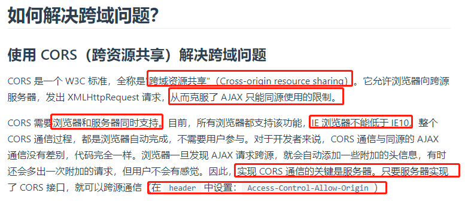
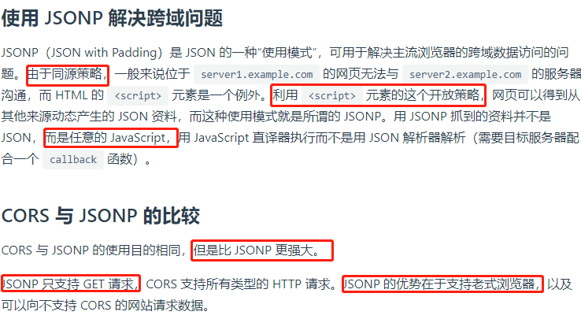

# 什么是跨域问题？

我们平时开发中常常遇到这样的问题,我的接口在一台服务器或者一个port上,而我的前端是在另一台服务器或者另一个端口,前端去获取接口里的数据的时候就会出现跨域的问题.

跨域，指的是浏览器不能执行其他网站的脚本。它是由浏览器的同源策略造成的，是浏览器对 JavaScript 施加的安全限制。

For security reasons browsers prohibit AJAX calls to resources outside the current origin. 

# 什么是同源？

所谓同源是指，域名，协议，端口均相同

- http://www.funtl.com --> http://admin.funtl.com 跨域
- http://www.funtl.com --> http://www.funtl.com 非跨域
- http://www.funtl.com --> http://www.funtl.com:8080 跨域
- http://www.funtl.com --> https://www.funtl.com 跨域

# 使用CORS解决跨域问题

核心就是在服务器端添加一个响应头即可.

# 使用 JSONP 解决跨域问题

jsonp这个名字感觉长的很奇怪,但是不用在意它的名字,我们只需要了解一个现象: 我们通过href或者src去请求下来的js脚本/css文件/图片文件/视频文件都是不存在跨域问题的.只有通过ajax请求下来的数据才存储跨域问题.jsonp就是基于这个原理来解决跨域的.

# nginx代理也可以解决跨域问题