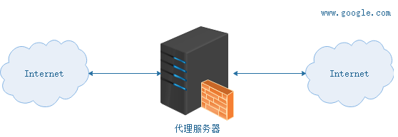

# 什么是代理服务器？

代理服务器，客户机在发送请求时，不会直接发送给目的主机，而是先发送给代理服务器，代理服务接受客户机请求之后，再向主机发出，并接收目的主机返回的数据，存放在代理服务器的硬盘中，再发送给客户机。


# 为什么要使用代理服务器？

    提高访问速度

由于"目标主机"返回的数据会存放在"代理服务器"的硬盘中，因此下一次客户再访问相同的目标主机站点数据时，会直接从"代理服务器"的硬盘中读取，起到了缓存的作用，尤其对于热门站点能明显提高请求速度。

    防火墙作用

由于所有的客户机请求都必须通过代理服务器访问远程站点，因此可在代理服务器上设限，过滤某些不安全信息。

    通过代理服务器访问不能访问的目标站点

互联网上有许多开放的代理服务器，客户机在访问受限时，可通过不受限的代理服务器访问目标站点.

# 什么是正向代理？

正向代理: 客户机必须指定代理服务器,并将本来要直接发送到 Web 服务器上的 Http 请求发送给代理服务器,然后代理服务器帮我们访问我们真正要访问的地址,然后抓取结果,返回给我们.(想一想我们平时使用的各种代理软件就知道了.)



# 什么是反向代理？

反向代理服务器`架设在服务器端`，通过缓冲经常被请求的页面来缓解服务器的工作量，代理服务器将客户机的请求`转发给内部网络上的目标服务器`；并将从服务器上得到的结果返回给 Internet 上请求连接的客户端，此时`代理服务器与目标主机`一起对外表现为一个服务器。


>反向代理方式实际上就是一台负责转发的代理服务器，貌似充当了真正服务器的功能，但实际上并不是，代理服务器只是充当了转发的作用(转发给具体处理业务的tomcat等)，并且从真正的服务器那里取得返回的数据。

## 反向代理有哪些主要应用？

现在许多大型 web 网站都用到反向代理。除了可以防止外网对内网服务器的恶性攻击、缓存以减少服务器的压力和访问安全控制之外，还可以进行负载均衡，将用户请求分配给多个服务器。

## 使用 Nginx 反向代理 Tomcat

>需求

- 两个 tomcat 服务通过 nginx 反向代理
- nginx 服务器：192.168.75.145:80
- tomcat1 服务器：192.168.75.145:9090
- tomcat2 服务器：192.168.75.145:9091

>启动 Tomcat 容器

启动两个 Tomcat 容器，映射端口为 9090 和 9091，docker-compose.yml 如下：

```yml
version: '3'
services:
  tomcat1:
    image: tomcat
    container_name: tomcat1
    ports:
      - 9090:8080

  tomcat2:
    image: tomcat
    container_name: tomcat2
    ports:
      - 9091:8080
```


>配置 Nginx 反向代理

    修改 /usr/local/docker/nginx/conf 目录下的 nginx.conf 配置文件：

```shell
user  nginx;
worker_processes  1;

events {
    worker_connections  1024;
}

http {
    include       mime.types;
    default_type  application/octet-stream;

    sendfile        on;

    keepalive_timeout  65;
    
    # 配置一个代理即 tomcat1 服务器
    upstream tomcatServer1 {
        server 192.168.75.145:9090;
    }

    # 配置一个代理即 tomcat2 服务器
    upstream tomcatServer2 {
        server 192.168.75.145:9091;
    }

    # 配置一个虚拟主机
    server {
        listen 80;
        server_name admin.service.itoken.funtl.com;
        location / {
                # 域名 admin.service.itoken.funtl.com 的请求全部转发到 tomcat_server1 即 tomcat1 服务上
                proxy_pass http://tomcatServer1;
                # 欢迎页面，按照从左到右的顺序查找页面
                index index.jsp index.html index.htm;
        }
    }

    # 配置一个虚拟主机
    server {
        listen 80;
        server_name admin.web.itoken.funtl.com;

        location / {
            # 域名 admin.web.itoken.funtl.com 的请求全部转发到 tomcat_server2 即 tomcat2 服务上
            proxy_pass http://tomcatServer2;
            index index.jsp index.html index.htm;
        }
    }
}
```

    注意：新版 Nginx 的 upstream 配置中的名称不可以有下划线("_")，否则会报 400 错误