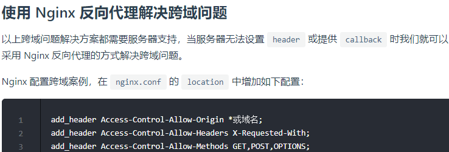
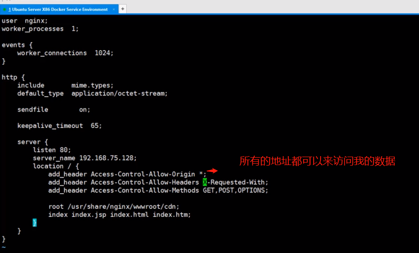
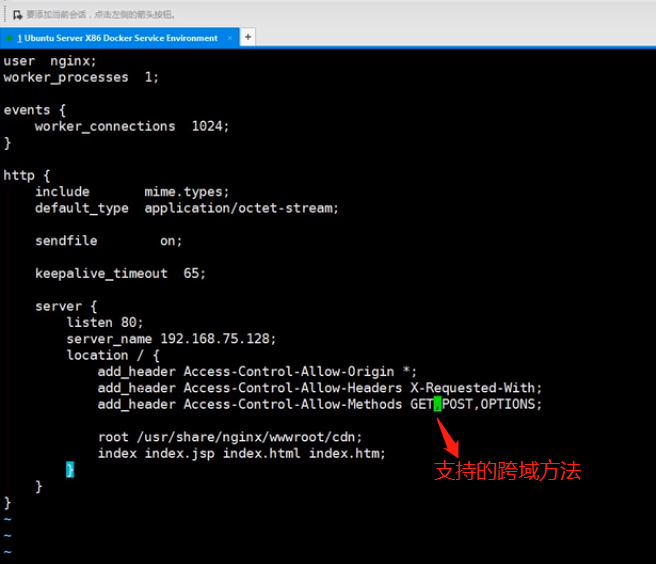

# 什么是跨域问题？

在浏览器端进行 Ajax 请求时会出现跨域问题，那么什么是跨域，如何解决跨域呢？先看浏览器端出现跨域问题的现象，如下图所示:

跨域，指的是浏览器不能执行其他网站的脚本。它是由浏览器的同源策略造成的，是浏览器对 JavaScript 施加的安全限制。

# 什么是同源？

所谓同源是指，域名，协议，端口均相同

- http://www.funtl.com --> http://admin.funtl.com 跨域
- http://www.funtl.com --> http://www.funtl.com 非跨域
- http://www.funtl.com --> http://www.funtl.com:8080 跨域
- http://www.funtl.com --> https://www.funtl.com 跨域

# 使用 CORS（跨资源共享）解决跨域问题

# 使用 JSONP 解决跨域问题

# 使用 Nginx 反向代理解决跨域问题

# SpringBoot配置跨域

