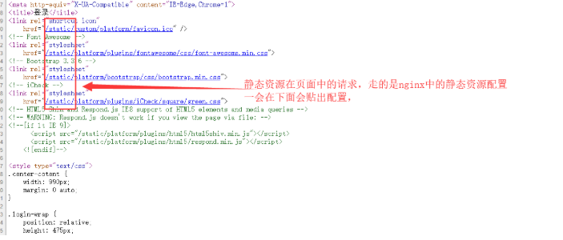
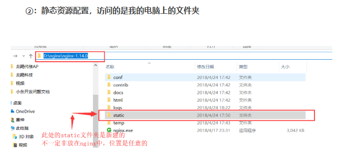
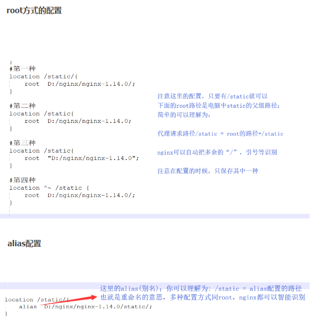

# 动静分离(相当于是一个伪cdn)

```shell
worker_processes  1;

events {
    worker_connections  1024;
}

http {
    include       mime.types;
    default_type  application/octet-stream;

    sendfile        on;

    keepalive_timeout  65;
    
    # 配置一个代理服务器tomcatServer1
    upstream tomcatServer1 {
        server 127.0.0.1:9090;
    }

    server {
        listen 80;
        server_name localhost;
        
        #图片静态内容
        location ~ .*\.(gif|jpg|jpeg|png|bmp|swf)$ {
            root html;
            expires 1h;
            # expires定义用户浏览器缓存的时间为7天，如果静态页面不常更新，
            # 可以设置更长，这样可以节省带宽和缓解服务器的压力
            # expires      7d; 
            # expires 1h;
        }
        
        # 所有静态文件由nginx直接读取不经过tomcat.
        # 页面静态内容
        location ~ .*\.(js|css)$ {
            root html;
            expires 1h;
        }

        #本地动静分离反向代理配置
        #所有jsp页面均交由tomcat处理
        location / {
            # 注意,末尾要加上封号.
            proxy_pass http://tomcatServer1;
            # index index.jsp index.html index.htm;

            proxy_set_header Host $host;
            proxy_set_header X-Real-IP $remote_addr;
            proxy_set_header X-Forwarded-For $proxy_add_x_forwarded_for;
        }
        
        #error_page  404              /404.html;

        # redirect server error pages to the static page /50x.html
        #
        error_page   500 502 503 504  /50x.html;
        location = /50x.html {
            root   html;
        }
    }
}
```

# windows上动静分离-静态资源路径配置



