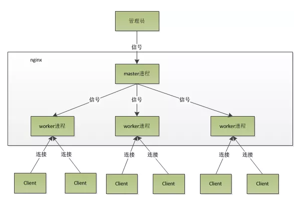
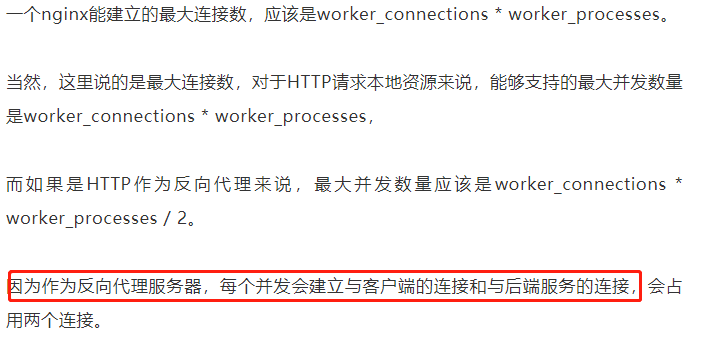
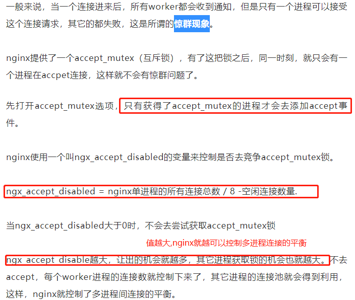
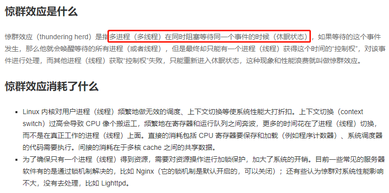
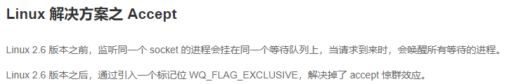
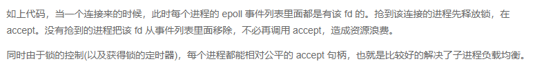
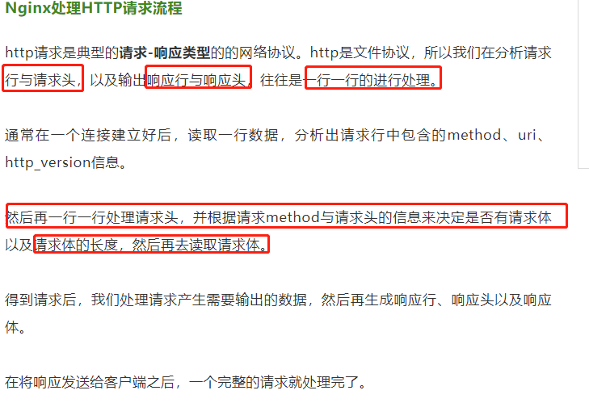

# nginx进程模型

    Nginx默认采用多进程工作方式，Nginx启动后，会运行一个master进程和多个worker进程。

```shell script
ps -ef | grep nginx
root     25684     1  0  2019 ?        00:00:00 nginx: master process sbin/nginx -c conf/nginx.conf
nobody   25685 25684  0  2019 ?        00:00:18 nginx: worker process
```

    master进程来管理worker进程，多个worker进程来处理具体的用户请求.



# master进程

    管理worker进程,向各worker进程转发用户请求.

    master不需要处理网络事件，不负责业务的执行，只会管理worker进程.

# worker进程

    是独立的进程,master进程通过fork()出多个worker进程.

    worker主要任务是处理基本的网络事件，完成具体的任务逻辑。多个worker进程之间是对等的，互相独立的。

>worker进程个数：

- 如果负载以CPU密集型应用为主，一般会设置与机器cpu核数一致或少一个（少的一个核用来处理用户等其他任务）；
- 如果负载以IO密集型为主，如响应大量内容给客户端，则worker数应该为CPU个数的1.5或2倍。  

因为更多的worker数，只会导致进程来竞争cpu资源了，从而带来不必要的上下文切换。而且，nginx为了更好的利用多核特性，具有cpu绑定选项，我们可以将某一个进程绑定在某一个核上，这样就不会因为进程的切换带来cache的失效。

    连接数 worker_connection的设置



# 并发处理

1. 在master进程里面，先创建socket，并绑定监听80端口（所以master进程需要root权限）；
2. 然后再fork出多个worker进程，这样每个worker进程都可以去accept这个socket， 或者使用锁机制，让抢到锁的一个worker进程去accept这个socket.
3. 当一个新连接进来后，而只有抢到锁的一个进程可以accept这个连接进行处理（也是放入epoll中）；
4. 抢到锁的worker进程accept到新连接后，会立即释放锁；然后所有worker进程再次参与抢锁，这样就回到了第二步，进行循环处理并发连接；






