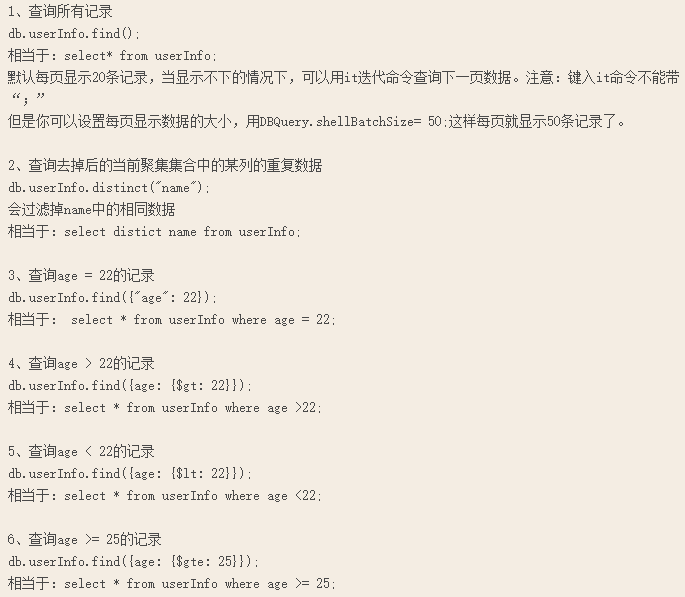
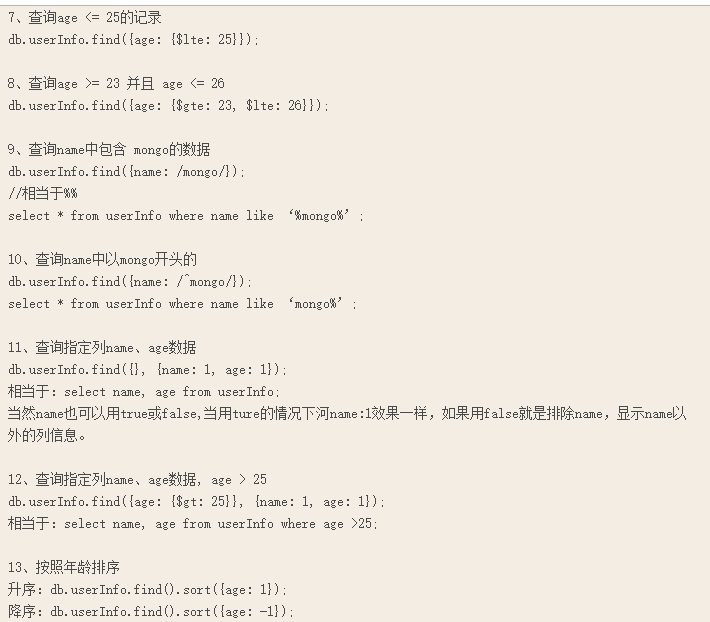
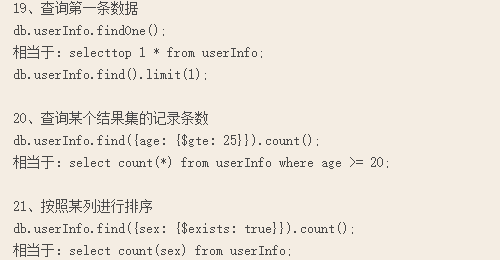
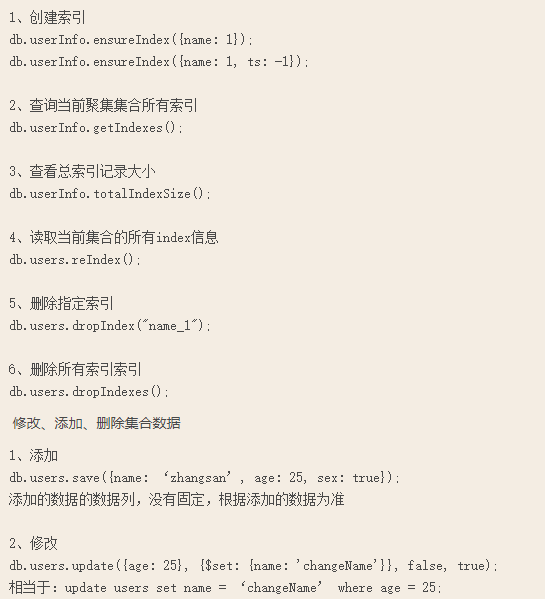
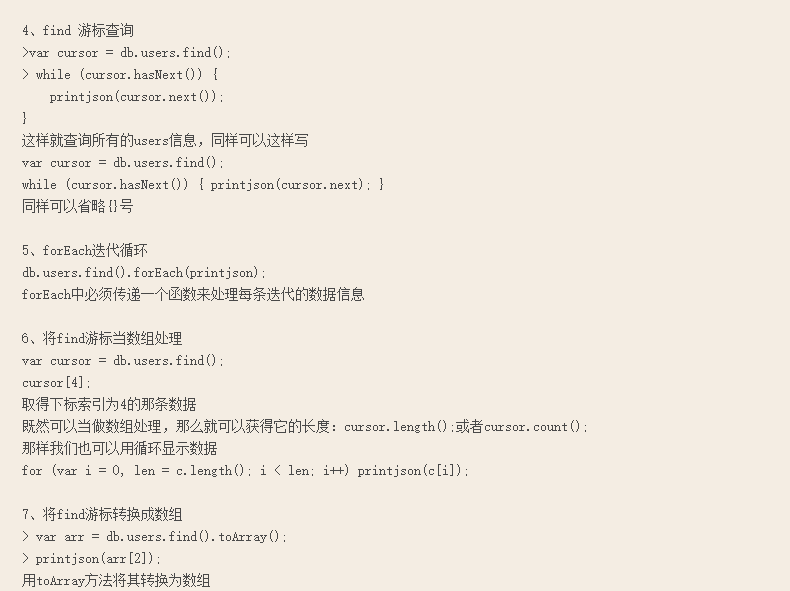

# windows运行MongoDB服务器

我们需要创建一个目录,MongoDB服务器将使用这个目录存储其所有数据. MongoDB默认数据目录路径是c:\data\db。 请注意，如果该目录不存在，启动的时候会报错,所以要事先创造它.

运行MongoDB: `C:\>C:\MongoDB\bin\mongod.exe`

您可以使用mongod.exe的-dbpath选项为数据文件使用不同的路径:`C:\>C:\MongoDB\bin\mongod.exe --dbpath D:\test\mongodb\data`

如果您的路径包含空格，则需要使用双引号:`C:\>C:\MongoDB\bin\mongod.exe --dbpath "D:\test\mongo db data\data\"`

通过使用mongo.exe连接mongod.exe,这里连接的是本机默认的mongodb端口,也可以连接远程host:
mongo ip:port/dbname -u 用户名 -p 密码

# MongoDB基本命令

命令大小写敏感.

```shell
help: 可以看到基本操作命令

show users：显示用户

show dbs:显示数据库列表 
db: 显示当前使用的数据库
use db_name:切换到db_name这个数据库

show collections：显示当前数据库中的集合（集合类似关系数据库中的表） 

db.help()：显示数据库操作命令

db.foo.find()：（由于没有条件，会列出所有数据）,对于当前数据库中的foo集合进行数据查找 
db.foo.find({a : 1})：对于当前数据库中的foo集合进行查找，条件是数据中有一个属性叫a，且a的值为1

MongoDB没有创建数据库的命令，但有类似的命令。如：如果你想创建一个“myTest”的数据库，先运行use myTest命令，之后就做一些操作（如：db.createCollection('user')）,这样就可以创建一个名叫“myTest”的数据库。

删除当前使用数据库: db.dropDatabase();

从指定的机器上复制指定数据库数据到某个数据库db.copyDatabase("mydb", "temp", "127.0.0.1");将127.0.0.1的mydb的数据复制到temp数据库中

7、修复当前数据库: db.repairDatabase();

8、查看当前使用的数据库 db.getName();

9、显示当前db状态: db.stats();

10、当前db版本: db.version();

11、查看当前db的链接机器地址: db.getMongo();

其他
1、查询之前的错误信息
 db.getPrevError();
2、清除错误记录
 db.resetError();
```

# Mongo集合操作

```shell
1、创建一个聚集集合（table）

 db.createCollection(“collName”, {size: 20, capped: 5, max: 100});

2、得到指定名称的聚集集合（table）

 db.getCollection("account");

3、得到当前db的所有聚集集合

 db.getCollectionNames();

4、显示当前db所有聚集索引的状态

 db.printCollectionStats();

db.foo.help()：显示集合foo操作命令，同样有很多的命令，foo指的是当前数据库下，一个叫foo的集合，并非真正意义上的命令  
db.youColl.find().help();

查询当前集合的数据条数  db.yourColl.count();
3、查看数据空间大小 db.userInfo.dataSize();
4、得到当前聚集集合所在的db db.userInfo.getDB();
5、得到当前聚集的状态 db.userInfo.stats();
6、得到聚集集合总大小 db.userInfo.totalSize();
7、聚集集合储存空间大小 db.userInfo.storageSize();
8、Shard版本信息  db.userInfo.getShardVersion()
9、聚集集合重命名 db.userInfo.renameCollection("users"); 将userInfo重命名为users
10、删除当前聚集集合 db.userInfo.drop();
```

# Mongo用户相关

```shell
# 用户相关

1、添加一个用户

 db.addUser("name");

 db.addUser("userName", "pwd123", true); 添加用户、设置密码、是否只读

2、数据库认证、安全模式

 db.auth("userName", "123123");

3、显示当前所有用户

 show users;

4、删除用户

 db.removeUser("userName");
```

# MongoDB集合查询










