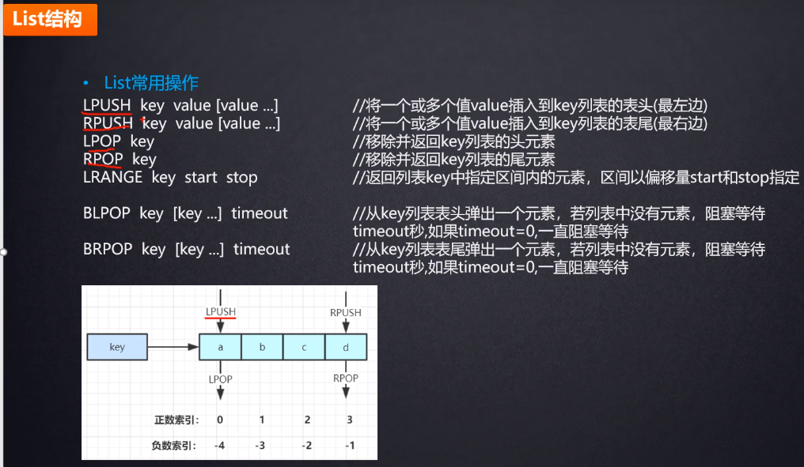
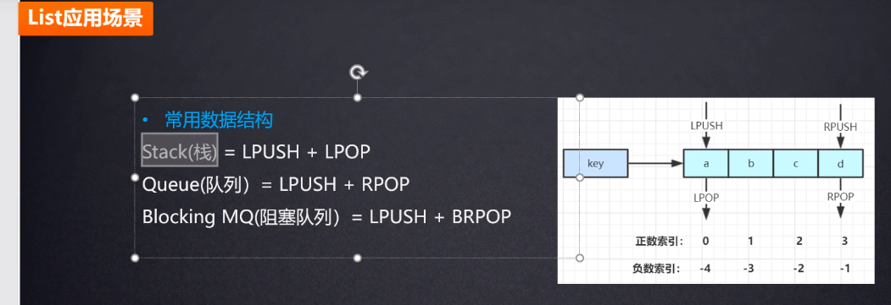

# 列表类型(list)



    List类型(内部使用双向链表实现): 存储一个有序(不是大小有序,而是插入的顺序是有序的)的字符串列表

    向列表两端添加元素的时间复杂度为0(1)，获取越接近两端的元素速度就越快.使用链表实现的代价是通过索引访问元素比较慢.



>阻塞队列: 如果队列里面没有东西,就会阻塞等待,而不会马上返回.


```shell script
# 微信公众号消息流 或者 微博你关注的大v的消息流都可以用list来实现
# 试想一下,如果用mysql数据库技术的话,非常复杂,而且数据库的性能非常低
# 用redis基本不用考虑太多的性能,性能是非常高的,如果单机性能不够
# 可以使用集群架构,集群架构设计的话,绝对可以支持百万/千万级别的并发

# 有很多场景用数据库实现比较麻烦,用redis比较简单.
```

```shell script
# MacTalk发布了消息,消息id是10018,一个用户的id是10001
# 所以就把10018这个消息push用户10001的list里面
lpush msg:10001 10018
# 同样用户10001也关注了备胎说车,这个公众号也发布了一条消息,消息id为10086
# 同样把10086这个消息push用户10001的list里面
lpush msg:10001 10086
# 然后前端通过ajax请求,从后端获取到用户10001队列中的消息id,然后获取消息
lrange msg:10001 0 5
```


```shell script
# 特别是互联网公司的项目,有些场景下,用redis很容易的实现
# 如果不用redis,使用关系数据库的话会比较复杂,同时又要保证性能,这个是很复杂的
# 你又要保证性能,又要设计的合理,直接使用数据库是比较难的
# redis也是可以持久化的,不一定非要数据库,如果把redis做好的话,可以不用数据库

# 新浪微博之前存储用户发的消息就没有放到数据库中,全都是放到redis里面,有上千台redis服务器
# redis很强大.内存中存放的是热数据,更多的数据是持久化到磁盘上.几百个T,甚至上千个T.
```

# 其他场景

1. 列表类型的特性能非常快速地完成关系数据库难以应付的场景：如微博的新鲜事，我们关心的只是最新的内容，使用列表类型存储，即使新鲜事的总数达到几千万个，获取其中最新的100条数据也是极快的(最新鲜的事总是在队列的两端)
2. 在两端插入记录的时间复杂度是0(1)，列表类型也适合用来记录日志，可以保证加入新日志的速度不会受到已有日志数量的影响
3. 借助列表类型，Redis还可以作为队列使用
4. 与散列类型键最多能容纳的字段field数量相同，一个列表类型键最多能容纳2^32-1个元素

# 常用命令

```shell
# 向列表两端增加元素
# LPUSH命令(Left Push)用来向列表左边增加元素，返回值表示增加元素后列表的长度
LPUSH key value [value …]
RPUSH key value [value …]

# 从列表两端弹出元素,
# LPOP命令可以从列表左边弹出一个元素,LPOP命令执行两步操作：将列表左边的元素从列表中移除，返回被移除的元素值
LPOP key
RPOP key

# 上面提到的4个命令可以使用列表类型来模拟栈和队列的操作：
# 如果想当成队列，则搭配使用
LPUSH和RPOP或RPUSH和LPOP

# 如果想把列表当做栈,则搭配使用
LPUSH和LPOP或RPUSH和RPOP

# 取列表中元素的个数,
当键不存在时LLEN会返回0，LLEN的时间复杂度为0(1)，Redis会读取现成的值，而不需要像部分关系数据库（如使用InnoDB存储引擎的MySQL表）那样需要遍历一遍数据表来统计条目数量
LLEN key

# 获得列表片段(包含两端的元素)，start是从Left开始,最left的元素的索引为0.
LRANGE key start stop
# 1. start和end都是正数的情况下,start一定要比end小,如果start比stop大，则会返回空列表,
# 如果stop大于实际的索引范围，则会返回到列表最右边的元素

# LRANGE命令也支持负索引，表示从Right右边开始计算序数,"-1"表示最右边第一个元素，"-2"表示最右边第二个元素,
# 2. 在start和end都是负数的情况下,start也是一定要比end下,如果start比stop大，则会返回空列表,
LRANGE key -2 -1

# 获取列表中的所有元素
# 3. 如果start为0,end可以比start小.
LRANGE numbers 0 -1

# 删除列表中前count个值为value的元素,返回值是实际删除的元素个数
LREM key count value

# 根据count值的不同，LREM命令的执行方式会略有差异：
# 当count＞0时LREM命令会从列表左边开始删除前count个值为value的元素；
# 当count＜0时LREM 命令会从列表右边开始删除前|count|个值为value的元素；
# 当count=0是LREM命令会删除所有值为value的元素

# 从右边开始删除前|-3|个值为"2"的元素
LREM numbers -3 2

# 要将列表类型当作数组来用。LINDEX命令用来返回指定索引的元素，索引从0开始。如：
LINDEX key index

# 如果index是负数,则表示从右边开始，最右边元素的索引是-1。例如：
LINDEX numbers -1

# LSET将索引为index的元素赋值为value
LSET key index value

# 只保留start到end的片段，包含start和end,其他的都删除了
LTRIM key start end

# LTRIM命令常和LPUSH命令一起使用来限制列表中元素的数量，比如记录日志时我们希望只保留最近的100条日志，
则每次加入新元素时调用一次LTRIM命令即可：
LPUSH logs newLog
LTRIM logs 0 99

# 向列表中插入元素
# LINSERT命令首先会在列表中从左到右查找值为pivot的元素，
# 然后根据第二个参数是BEFORE还是AFTER来决定将value插入到该元素的前面还是后面,
# 返回值是插入后列表的元素个数,before是越接近于最left,越先被pop出来.
LINSERT key BEFORE|AFTER pivot value
LINSERT numbers AFTER 7 3

# 将元素从一个列表转到另一个列表R,
# 先执行RPOP命令再执行LPUSH 命令。
# RPOPLPUSH命令会先从source列表类型键的右边弹出一个元素，
# 然后将其加入到destination列表类型键的左边，并返回这个元素的值，整个过程是原子的
RPOPLPUSH source destination
```

>当把列表类型作为队列使用时，RPOPLPUSH命令可以很直观地在多个队列中传递数据。当source和destination相同时，RPOPLPUSH命令会不断地将队尾的元素移到队首，借助这个特性我们可以实现一个网站监控系统：使用一个队列存储需要监控的网址，然后监控程序不断地使用RPOPLPUSH命令循环取出一个网址来测试可用性。这里使用RPOPLPUSH命令的好处在于在程序执行过程中仍然可以不断地向网址列表中加入新网址，而且整个系统容易扩展，允许多个客户端同时处理队列。