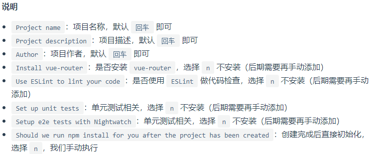
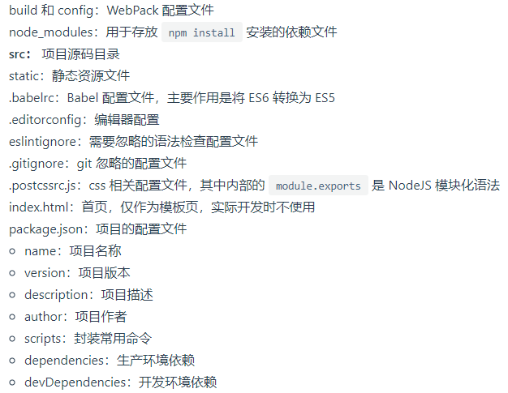
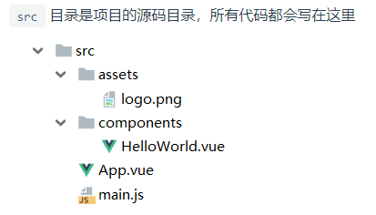
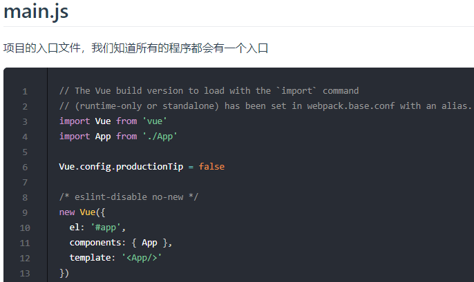
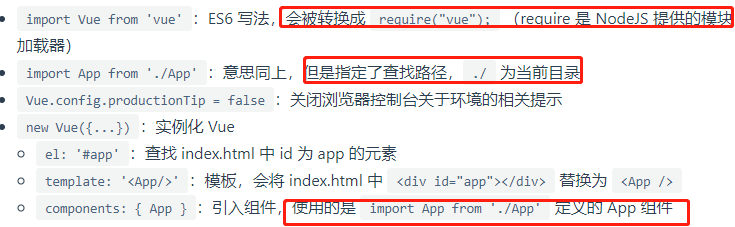
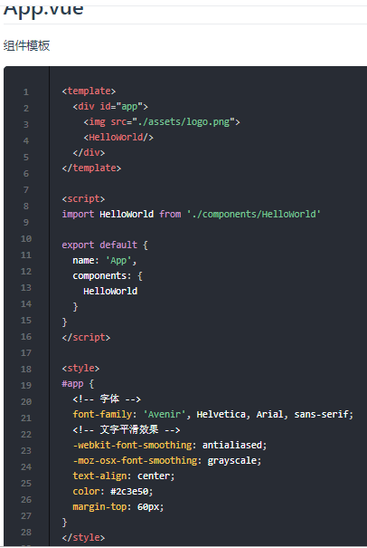
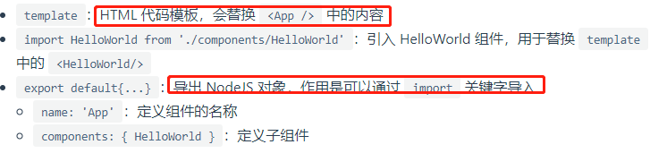
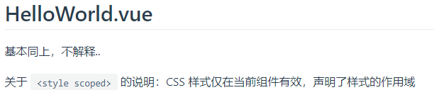
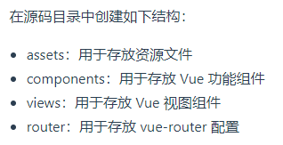

# 安装 vue-cli

>使用 NPM 安装相关组件依赖时可能会遇到权限问题，此时使用 PowerShell 管理员模式运行即可；开始菜单 -> 鼠标右击 -> Windows PowerShell (管理员)

```shell script
# 确保配置环境
node -v
npm -v
# 使用淘宝镜像安装,-g是全局安装,也就是会安装到node的根目录,后面的是使用淘宝镜像加速器
npm install vue-cli -g --registry=https://registry.npm.taobao.org
# 验证是否安装成功
vue list
```

# NPM 相关命令说明

```shell script
# 安装模块到项目目录下
npm install moduleName
# -g 的意思是将模块安装到全局，具体安装到磁盘哪个位置，要看 npm config get prefix 的位置
npm install -g moduleName
# --save 的意思是将模块安装到项目目录下，并在 package 文件的 dependencies 节点写入依赖，-S 为该命令的缩写
npm install -save moduleName
# --save-dev 的意思是将模块安装到项目目录下，并在 package 文件的 devDependencies 节点写入依赖，-D 为该命令的缩写
npm install -save-dev moduleName
# 查看npm配置
npm config list
```

# 第一个 vue-cli 应用程序

>创建一个基于 webpack 模板的 vue 应用程序

```shell script
# 使用 webpack 打包工具初始化一个名为 myvue 的工程
# webpack是打包工具
# 假如我们写了es6语法,或者es7语法,浏览器不认识,就需要webpack帮我们转换es5语法
# 还有一个流行的打包工具叫babel,这里使用webpack
vue init webpack myvue
```




```shell script
# 初始化并运行
cd myvue
# 下载项目各种依赖
npm install --registry=https://registry.npm.taobao.org
# 运行项目(开发环境)
npm run dev
# 安装并运行成功后在浏览器输入：http://localhost:8080
```

# vue-cli 目录结构




# vue-cli src 目录









# 第一个 Vue Element工程项目

```shell script
vue init webpack hello-vue-element
cd hello-vue-element
# 安装 vue-router
# vue-router 是一个插件包，我们需要用 npm/cnpm 来进行安装的
npm install vue-router --save-dev --registry=https://registry.npm.taobao.org
# 安装 element-ui
npm i element-ui -S --registry=https://registry.npm.taobao.org
# 安装 SASS 加载器
npm install sass-loader node-sass --save-dev --registry=https://registry.npm.taobao.org
# 安装依赖
npm install --registry=https://registry.npm.taobao.org
# 安装axios用于通信
npm install axios -s --registry=https://registry.npm.taobao.org
# 安装vuex用于状态管理
npm install vuex --save --registry=https://registry.npm.taobao.org
# 启动工程
npm run dev

# 解决npm报错：Module build failed: TypeError: this.getResolve is not a function
# 是由于sass-loader的版本过高导致的编译错误，当前最高版本是8.x，需要退回到7.3.1,运行：
npm uninstall sass-loader --save-dev #（卸载当前版本）
npm install sass-loader@7.3.1 --save-dev --registry=https://registry.npm.taobao.org
```