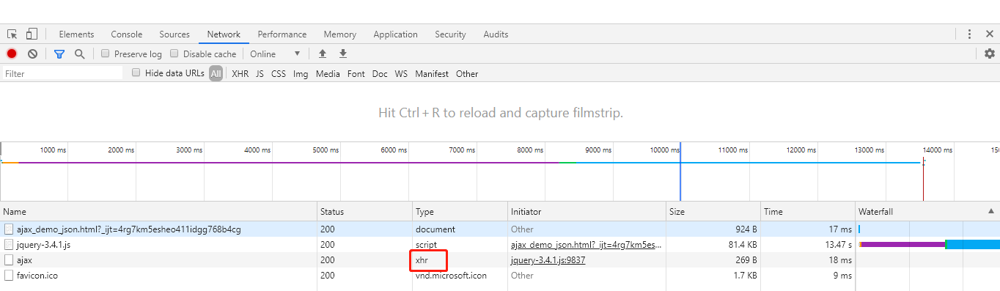

# AJAX(Asynchronous JavaScript And XML)

原生的异步请求是通过XMLHttpRequest来实现的,简称XHR,写起来比较麻烦,主要问题就是不同浏览器需要写不同代码，并且状态和错误处理写起来很麻烦.

从ajax名字看出,ajax和javascript的紧密联系

ajax是在jquery中才被正式命名为ajax的,因为jquery内置了ajax请求的函数$.ajax,比较好用.ajax其实是对XHR的封装.

>用jQuery写AJAX的好处: 不但不需要考虑浏览器问题，代码也能大大简化。

# jQuery中ajax使用

1. jQuery在全局对象jQuery（也就是$）绑定了ajax()函数，可以处理AJAX请求。
2. ajax(url, settings)函数需要接收一个URL和一个可选的settings对象,常用的选项如下：

* async：是否异步执行AJAX请求，默认为true，千万不要指定为false；
* method：发送的Method，缺省为'GET'，可指定为'POST'、'PUT'等；
* contentType：发送POST请求的格式，默认值为'application/x-www-form-urlencoded; charset=UTF-8'，也可以指定为text/plain、application/json；
* data：发送的数据，可以是字符串、数组或object。如果是GET请求，data将被转换成query附加到URL上，如果是POST请求，根据contentType把data序列化成合适的格式；
* headers：发送的额外的HTTP头，必须是一个object；
* dataType：接收的数据格式，可以指定为'html'、'xml'、'json'、'text'等，缺省情况下根据响应的Content-Type猜测。